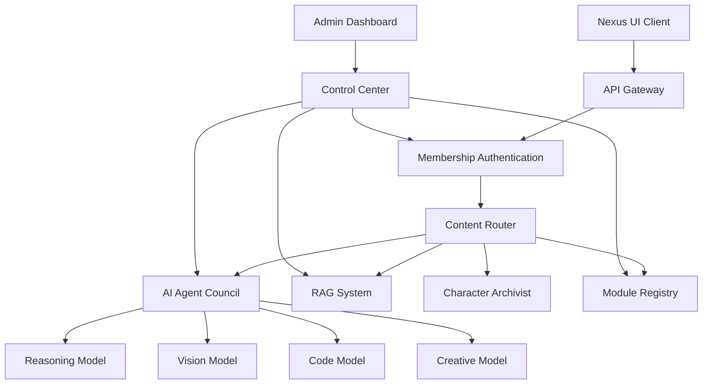

# This file is wrong - control-center_assumptionCONTROL CENTER

---
Note: this explanation is wrong, us the other file name "control-center-corrected" and "the-space-implementation-plan" for correct implementation
Based on your requirements, I'll design a comprehensive backend control center that integrates your RAG system, AI Agent Council, and membership authentication with the Nexus UI.

## 1. System Architecture Overview




## 2. Core Components

### 2.1 API Gateway

The API Gateway serves as the unified entry point for all client requests, handling:

- Request validation and normalization
- Rate limiting and throttling
- Request logging and monitoring
- Authentication verification
- Request routing to appropriate services

**Implementation Technology:** Express.js with API Gateway pattern

```jsx
// api-gateway.js
const express = require('express');
const authMiddleware = require('./middleware/auth');
const contentRouter = require('./routers/content-router');
const membershipService = require('./services/membership');

const app = express();
app.use(express.json({ limit: '50mb' }));
app.use(authMiddleware.verifyMembershipKey);

// Routes
app.use('/api/auth', membershipService.routes);
app.use('/api/content', contentRouter);

// Error handling middleware
app.use((err, req, res, next) => {
  logger.error(`Error: ${err.message}`, { stack: err.stack });
  res.status(err.status || 500).json({
    error: err.message || 'Internal Server Error',
    requestId: req.requestId
  });
});

```

### 2.2 Membership Authentication System

The authentication system implements your invitation-only model:

- Invitation code validation
- PIN-based authentication
- Membership key management
- Session handling
- User management and permissions

**Implementation Technology:** JWT for tokens, MongoDB for user storage

```jsx
// membership-service.js
const jwt = require('jsonwebtoken');
const crypto = require('crypto');
const mongoose = require('mongoose');

const MembershipSchema = new mongoose.Schema({
  email: { type: String, required: true, unique: true },
  hashedPin: { type: String, required: true },
  membershipKey: { type: String, required: true, unique: true },
  invitationCode: { type: String, required: true },
  permissions: [String],
  modules: [String], // Enabled modules for this user
  createdAt: { type: Date, default: Date.now },
  lastLogin: Date
});

// Generate a new membership key
const generateMembershipKey = () => {
  return crypto.randomBytes(24).toString('hex');
};

// Validate invitation
const validateInvitation = async (code, pin, email) => {
  // Implementation details
};

```

### 2.3 Content Router

The content router analyzes incoming requests and directs them to the appropriate processing pipeline:

- Content type detection
- Complexity assessment
- Priority rating calculation
- Model selection and routing
- Response assembly

**Implementation Technology:** Node.js with custom routing logic

```jsx
// content-router.js
const mime = require('mime-types');
const path = require('path');
const fs = require('fs');
const modelCouncil = require('../services/model-council');
const ragSystem = require('../services/rag');
const moduleRegistry = require('../services/module-registry');

// Determine content type and route accordingly
async function routeContent(req, res) {
  const { message, attachments } = req.body;
  const userId = req.user.id;

  // Analyze content
  const contentTypes = detectContentTypes(message, attachments);
  const complexity = assessComplexity(message, contentTypes);
  const priority = calculatePriority(complexity, req.user.tier);

  // Route based on content type and complexity
  let response;
  if (contentTypes.includes('code')) {
    response = await modelCouncil.processWithModel('code', { message, attachments, userId });
  } else if (contentTypes.includes('image')) {
    response = await modelCouncil.processWithModel('vision', { message, attachments, userId });
  } else if (complexity > 7) {
    // Complex queries go to the full council
    response = await modelCouncil.processWithCouncil({ message, attachments, userId });
  } else {
    // Simple text queries use RAG if available
    response = await ragSystem.query(message, userId);
  }

  return response;
}

```

### 2.4 AI Agent Council

The AI Agent Council orchestrates multiple specialized AI models:

- Maintains shared context between models
- Coordinates multi-model reasoning flows
- Implements the "unified consciousness" pattern
- Handles fallbacks and error recovery
- Optimizes for performance and quality

**Implementation Technology:** Custom orchestration layer with model-specific adapters

```jsx
// model-council.js
class AIAgentCouncil {
  constructor() {
    this.models = {};
    this.adapters = {};
    this.contextRepository = new SharedContextRepository();
  }

  registerModel(modelId, modelConfig) {
    // Register a model with the council
    this.models[modelId] = modelConfig;
    this.adapters[modelId] = this.createAdapter(modelConfig);
  }

  async processWithCouncil({message, attachments, userId}) {
    // Initialize shared context
    const sessionId = generateSessionId(userId, message);
    const context = this.contextRepository.createSession(sessionId);

    // Planning phase - decide which models to use and in what order
    const plan = await this.planExecution(message, attachments, context);

    // Execution phase - run the plan
    const results = [];
    for (const step of plan) {
      const result = await this.executeStep(step, context);
      results.push(result);
      context.addResult(step.modelId, result);
    }

    // Integration phase - combine results into coherent response
    const response = await this.integrationModel.combineResults(results, context);

    return response;
  }

  async executeStep(step, context) {
    const model = this.models[step.modelId];
    const adapter = this.adapters[step.modelId];

    // Execute the model with context
    return adapter.execute(step.input, context);
  }
}

```

### 2.5 RAG System Interface

The Retrieval-Augmented Generation system enhances responses with relevant information:

- Document indexing and management
- Vector storage for semantic search
- Query processing and document retrieval
- Result ranking and integration
- Source attribution

**Implementation Technology:** Vector database (Pinecone/Milvus) + LangChain

```jsx
// rag-system.js
const { OpenAIEmbeddings } = require('langchain/embeddings/openai');
const { Pinecone } = require('@pinecone-database/pinecone');
const { Document } = require('langchain/document');
const { VectorDBQAChain } = require('langchain/chains');

class RAGSystem {
  constructor(config) {
    this.embeddings = new OpenAIEmbeddings(config.embeddings);
    this.pinecone = new Pinecone({
      apiKey: config.pinecone.apiKey,
      environment: config.pinecone.environment
    });
    this.indexName = config.pinecone.index;
  }

  async query(question, userId) {
    // Get the Pinecone index
    const index = this.pinecone.Index(this.indexName);

    // Generate embeddings for the question
    const queryEmbedding = await this.embeddings.embedQuery(question);

    // Query Pinecone
    const queryRequest = {
      vector: queryEmbedding,
      topK: 5,
      includeMetadata: true,
      namespace: userId  // Namespace by user for personalization
    };

    const results = await index.query({ queryRequest });

    // Process results and generate response
    const docs = results.matches.map(match =>
      new Document({
        pageContent: match.metadata.text,
        metadata: match.metadata
      })
    );

    // Generate response with documents
    const response = await this.chain.call({
      input_documents: docs,
      question: question,
    });

    return {
      answer: response.text,
      sources: docs.map(doc => doc.metadata.source)
    };
  }
}

```

### 2.6 Module Registry

The Module Registry manages the dynamic loading and configuration of modules:

- Module discovery and registration
- Module lifecycle management
- Configuration and settings storage
- Module isolation and sandboxing
- Interface standardization

**Implementation Technology:** Node.js module system with plugin architecture

```jsx
// module-registry.js
class ModuleRegistry {
  constructor() {
    this.modules = {};
    this.instances = {};
  }

  async registerModule(modulePath) {
    try {
      // Import the module dynamically
      const module = await import(modulePath);

      // Validate module interface
      if (!this.validateModuleInterface(module)) {
        throw new Error(`Module at ${modulePath} does not implement required interface`);
      }

      // Register module definition
      const moduleId = module.metadata.id;
      this.modules[moduleId] = {
        path: modulePath,
        metadata: module.metadata,
        status: 'registered'
      };

      return moduleId;
    } catch (error) {
      logger.error(`Failed to register module from ${modulePath}`, error);
      throw error;
    }
  }

  async initializeModule(moduleId, config = {}) {
    const moduleInfo = this.modules[moduleId];
    if (!moduleInfo) {
      throw new Error(`Module ${moduleId} not registered`);
    }

    try {
      // Import and initialize
      const module = await import(moduleInfo.path);
      const instance = await module.initialize(config);

      // Store the instance
      this.instances[moduleId] = instance;
      this.modules[moduleId].status = 'initialized';

      return instance;
    } catch (error) {
      this.modules[moduleId].status = 'failed';
      this.modules[moduleId].error = error.message;
      throw error;
    }
  }
}

```

### 2.7 Character Archivist Module

The Character Archivist module integrates your existing character archiving functionality:

- Character persona management
- Context building and maintenance
- Knowledge base integration
- Interaction history tracking
- Personality consistency enforcement

**Implementation Technology:** Custom Node.js module with specialized prompting

```jsx
// character-archivist.js
class CharacterArchivist {
  constructor(config) {
    this.baseModel = config.baseModel;
    this.systemPrompt = fs.readFileSync(config.systemPromptPath, 'utf8');
    this.knowledgeBases = config.knowledgeBases || [];
    this.characterTraits = config.characterTraits || {};
  }

  async initialize() {
    // Load knowledge bases
    this.knowledgeBaseVectors = await Promise.all(
      this.knowledgeBases.map(kb => this.loadKnowledgeBase(kb))
    );

    return this;
  }

  async processMessage(message, history = []) {
    // Prepare context
    const context = this.buildContext(history);

    // Retrieve relevant knowledge
    const relevantKnowledge = await this.retrieveKnowledge(message);

    // Build the complete prompt
    const prompt = this.constructPrompt(message, context, relevantKnowledge);

    // Generate response
    const response = await this.generateResponse(prompt);

    return {
      response: response,
      sourcesUsed: relevantKnowledge.sources
    };
  }
}

```

## 3. Admin Control Center

The Admin Control Center provides a comprehensive interface for managing all aspects of the system:

- Dashboard with system metrics
- Model performance monitoring
- User and membership management
- Module configuration and deployment
- System logs and error tracking
- RAG knowledge base management

**Implementation Technology:** React Admin frontend, Express.js backend

```jsx
// admin-routes.js
const express = require('express');
const adminAuth = require('../middleware/admin-auth');
const modelCouncil = require('../services/model-council');
const membershipService = require('../services/membership');
const moduleRegistry = require('../services/module-registry');

const router = express.Router();

// Secure all admin routes
router.use(adminAuth.requireAdmin);

// System dashboard data
router.get('/dashboard', async (req, res) => {
  const metrics = await getSystemMetrics();
  res.json(metrics);
});

// Model management
router.get('/models', async (req, res) => {
  const models = modelCouncil.getRegisteredModels();
  res.json(models);
});

router.post('/models/:modelId/configure', async (req, res) => {
  const { modelId } = req.params;
  const config = req.body;

  try {
    await modelCouncil.configureModel(modelId, config);
    res.json({ success: true });
  } catch (error) {
    res.status(400).json({ error: error.message });
  }
});

// Membership management
router.get('/memberships', async (req, res) => {
  const memberships = await membershipService.getAllMemberships();
  res.json(memberships);
});

router.post('/invitations/create', async (req, res) => {
  const { email, permissions } = req.body;

  try {
    const invitation = await membershipService.createInvitation(email, permissions);
    res.json(invitation);
  } catch (error) {
    res.status(400).json({ error: error.message });
  }
});

```

## 4. Implementation Plan

### 4.1 Phase 1: Core Infrastructure

1. Set up API Gateway and basic server structure
2. Implement Membership Authentication System
3. Create basic Content Router
4. Build Admin Dashboard shell

### 4.2 Phase 2: AI Integration

1. Implement Model Council architecture
2. Integrate RAG capabilities
3. Create Module Registry
4. Build Character Archivist module

### 4.3 Phase 3: Advanced Features

1. Enhance Model Council with "unified consciousness"
2. Implement advanced content routing
3. Add real-time monitoring
4. Integrate comprehensive analytics

### 4.4 Phase 4: Optimization and Scaling

1. Implement caching and performance optimizations
2. Add containerization and orchestration
3. Build auto-scaling capabilities
4. Set up comprehensive monitoring and alerts

## 5. Membership Key Implementation

The Membership Key system provides secure, invitation-only access:

```jsx
// membership-key.js
const crypto = require('crypto');
const { v4: uuidv4 } = require('uuid');

// Generate a new invitation
async function generateInvitation(email, createdBy, permissions = []) {
  // Create invitation code
  const invitationCode = crypto.randomBytes(16).toString('hex');

  // Create temporary PIN
  const pin = generatePin();
  const hashedPin = await bcrypt.hash(pin, 10);

  // Save invitation
  const invitation = await Invitation.create({
    email,
    invitationCode,
    hashedPin,
    createdBy,
    permissions,
    expiresAt: new Date(Date.now() + 7 * 24 * 60 * 60 * 1000) // 7 days
  });

  // Send invitation email with code and PIN
  await sendInvitationEmail(email, invitationCode, pin);

  return invitation;
}

// Activate membership with invitation and PIN
async function activateMembership(email, invitationCode, pin) {
  // Find invitation
  const invitation = await Invitation.findOne({
    email,
    invitationCode,
    expiresAt: { $gt: new Date() }
  });

  if (!invitation) {
    throw new Error('Invalid or expired invitation');
  }

  // Verify PIN
  const pinValid = await bcrypt.compare(pin, invitation.hashedPin);
  if (!pinValid) {
    throw new Error('Invalid PIN');
  }

  // Generate membership key
  const membershipKey = generateMembershipKey();

  // Create user account
  const user = await User.create({
    email,
    membershipKey,
    permissions: invitation.permissions,
    invitedBy: invitation.createdBy
  });

  // Mark invitation as used
  invitation.used = true;
  await invitation.save();

  return { user, membershipKey };
}

// Validate membership key with every request
async function validateMembershipKey(req, res, next) {
  const membershipKey = req.headers['x-membership-key'];

  if (!membershipKey) {
    return res.status(401).json({ error: 'Membership key required' });
  }

  const user = await User.findOne({ membershipKey, active: true });

  if (!user) {
    return res.status(403).json({ error: 'Invalid or inactive membership key' });
  }

  // Set user in request for later use
  req.user = user;

  next();
}

```

## 6. Technical Requirements & Considerations

### 6.1 Infrastructure

- **Deployment**: Docker containers with Kubernetes orchestration
- **Scaling**: Horizontal pod autoscaling based on load
- **Database**: MongoDB for document storage, Redis for caching
- **Vector Storage**: Pinecone or Milvus for embeddings
- **Message Queue**: RabbitMQ for asynchronous processing

### 6.2 Security

- **Authentication**: JWT tokens with short expiration
- **API Security**: Rate limiting, input validation, OWASP protection
- **Data Security**: Encryption at rest and in transit
- **Access Control**: Fine-grained permissions system

### 6.3 Performance

- **Response Time**: <200ms for simple requests, <3s for complex
- **Throughput**: Support for 100+ concurrent users
- **Caching**: Multi-level caching strategy
- **Asynchronous Processing**: Background jobs for intensive tasks

## 7. Connecting the Nexus UI

The Nexus UI will connect to this backend via the API Gateway. The existing `nexusApi.js` service will require minor modifications:

```jsx
// Updated nexusApi.js for Nexus UI
import axios from 'axios';

const API_BASE_URL = process.env.REACT_APP_API_BASE_URL || 'http://localhost:3001';

// Save membership key in local storage
const getMembershipKey = () => {
  return localStorage.getItem('nexus_membership_key');
};

// Configure axios with membership key
const configureAxios = () => {
  axios.interceptors.request.use(
    config => {
      const membershipKey = getMembershipKey();
      if (membershipKey) {
        config.headers['X-Membership-Key'] = membershipKey;
      }
      return config;
    },
    error => Promise.reject(error)
  );
};

configureAxios();

/**
 * Authenticate with membership credentials
 */
export const authenticate = async (email, invitationCode, pin) => {
  try {
    const response = await axios.post(`${API_BASE_URL}/api/auth/activate`, {
      email,
      invitationCode,
      pin
    });

    // Save membership key
    localStorage.setItem('nexus_membership_key', response.data.membershipKey);

    return response.data;
  } catch (error) {
    console.error('Authentication failed:', error);
    throw new Error(error.response?.data?.error || 'Authentication failed');
  }
};

/**
 * Send a message to Nexus backend
 */
export const sendMessage = async (message, attachments = []) => {
  try {
    const response = await axios.post(`${API_BASE_URL}/api/content/process`, {
      message,
      attachments
    });

    return response.data.response;
  } catch (error) {
    console.error('Error sending message to Nexus:', error);
    throw new Error('Failed to communicate with Nexus');
  }
};

// Other API methods remain largely unchanged

```

## 8. Future Enhancements

1. **Federated Learning**: Allow models to learn from user interactions while preserving privacy
2. **Multimodal Generation**: Add capabilities for generating images, audio, and code
3. **Customizable Workflows**: Enable admin-defined processing workflows
4. **API Marketplace**: Allow third-party integration of specialized models and tools
5. **Advanced Analytics**: Implement detailed usage analytics and model performance metrics

This comprehensive backend design provides a powerful, flexible foundation for Nexus, enabling your vision of a unified AI council working as a single entity while maintaining the modularity needed for ongoing development and enhancement.

[Nexus Backend Integration](Nexus%20Backend%20Integration%201de003fcbcad80bf9021ce3abe7ac85e.md)
