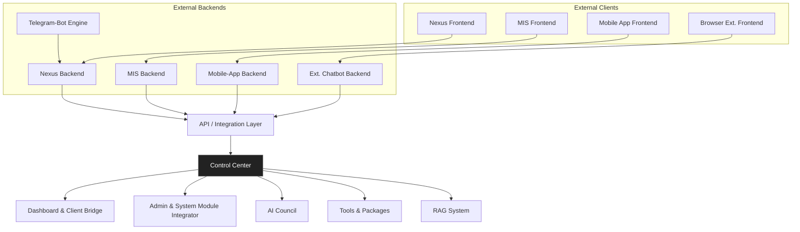

# the-space Flow

---

```
[External Clients]
  • Nexus Frontend
  • MIS Frontend
  • Mobile-App Frontend (proposed)
  • Browser-Extension Frontend
       ↓
[Nexus Backend] ← Telegram-bot engine
       ↓
[Membership Initiation System Backend]
       ↓
[Mobile-App Backend “proposed”] → (shares same API layer)
       ↓
[Browser-Extension Chatbot]  → (shares same API layer)
       ↓
[API / Integration Layer]
  • API control / gateway
  • Integration control
  • System-prompt control
  • Logic control
  • AI router
       ↓
┌───────────────────────────────────────────┐
│           CONTROL CENTER                 │  ←── independent AI “core”
│  (unified backend abstraction layer)     │
│                                           │
│  ┌─────────────────────────────────────┐  │
│  │ Dashboard & Client-Module Bridge   │  │
│  └─────────────────────────────────────┘  │
│                                           │
│  ┌─────────────────────────────────────┐  │
│  │ Admin & System Module Integrator   │  │
│  └─────────────────────────────────────┘  │
│                                           │
│  ┌─────────────────────────────────────┐  │
│  │ AI COUNCIL (multi-agent orchestrator)│ │
│  └─────────────────────────────────────┘  │
│                                           │
│  ┌─────────────────────────────────────┐  │
│  │ TOOLS / PACKAGES (capability library) ││
│  └─────────────────────────────────────┘  │
│                                           │
│  ┌─────────────────────────────────────┐  │
│  │ RAG SYSTEM (KB + memory & storage)  │  │
│  └─────────────────────────────────────┘  │
└───────────────────────────────────────────┘

```

- **Control Center** sits *below* the API/Integration gateway as a completely **separate** backend service.
- It **is not** a sub-component of Nexus (or any other frontend); rather it is the universal hub that all external backends connect to.
- Through the API/Integration layer, Nexus, MIS, Mobile App and Extension each call into the Control Center to:
    1. **Authenticate & authorize** (gating)
    2. **Invoke AI Council** or **RAG** or **Tools**
    3. **Fetch / write** into shared memory/context stores
    4. **Render** integrated responses

---

## 3. The Correct Mental Model

1. **External Modules** (Nexus, MIS, Mobile, Extension, Telegram-bot) — each has its own backend.
2. They all funnel through a single **API/Integration Gateway** that enforces routing, prompts, logic rules and membership gating.
3. That gateway then hands off to the standalone **Control Center** which:
    - **Orchestrates** multi-agent reasoning (AI Council).
    - **Serves** tools & packages (external APIs, LLMs, utilities).
    - **Manages** your RAG datastore (long-term memory, KB).
    - **Exposes** a Dashboard & Admin panel for configuration.
4. Any new external backend you write simply plugs into the same API/Integration → Control Center pipeline, so it automatically inherits:
    - Access to your full AI-toolkit,
    - Centralized logging,
    - Gated membership control,
    - Shared memory contexts.

---

### Suggested Revised Mermaid



— This layout makes clear that **Control Center** is its own service, *not* part of any one frontend or backend. All external modules “dial in” through the API/Integration tier, and then flow into the Control Center’s internal modules.

---

**Bottom line:** Treat the Control Center as the universal brain and toolkit hub. Everything else—Nexus, MIS, mobile, browser extension, bots—are just “heads” that plug into it through a unified API gateway.