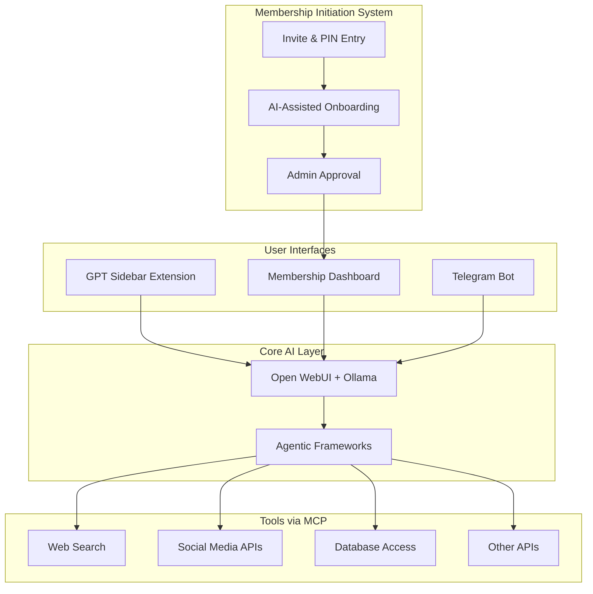

# SpaceWH AI Platform — Open-Source, Agentic, Modular

I reviewed the **sidebar React component** and the MIS onboarding flow. Here is a refined, integrated architecture plan:

---

**Key Components**

- **Membership Initiation System (MIS)**
    - Invitation codes + PIN + AI-driven onboarding (voice/text).
    - Multi-factor authentication.
    - Admin approval before issuing Membership Code.
    - Built with secure Node.js/Python backend + LLM agent (via Ollama/Open WebUI).
- **Membership Dashboard**
    - Accessible **only** after MIS approval + Membership Key validation.
    - Connect/manage user’s Private Bots and WH tools.
- **GPT Sidebar Extension**
    - React sidebar UI (your prototype).
    - Embeds Open WebUI or custom LLM chat iframe.
    - Unlocks chat after Membership Key validation.
    - Can upload files, toggle modes, send/receive messages.
- **Core AI Services**
    - **Local LLMs** via Ollama (Llama 3, Mixtral, etc.).
    - **Open WebUI** as chat frontend/backend.
    - **Agentic Frameworks** (LangChain, CrewAI, AutoGPT) orchestrate workflows.
    - **MCP servers** expose tools (search, social media, DB, APIs).
- **Admin Panel**
    - Generate invites, monitor onboarding, approve members.
    - Manage AI tools, integrations, and user permissions.
- **Social Media & Tool Integrations**
    - Via MCP servers or microservices.
    - OAuth-secured.
    - Modular, replaceable.

---

## **Updated High-Level Architecture (Mermaid)**

---

## **Notes**

- **All open-source / free tech:** Ollama, Open WebUI, React, LangChain, MCP
- **Modular agent design:** Easy to add/remove tools, models
- **Secure, exclusive onboarding:** Multi-factor, AI-verified
- **Extensible UI:** Sidebar + Dashboard + Chatbots
- **Voice onboarding:** Use Whisper or other open-source STT + TTS

---

## **Next Steps**

- Develop MIS backend + AI onboarding flows
- Connect sidebar extension to Open WebUI + membership API
- Build admin panel for invitation and approvals
- Add MCP tools for social, DB, search
- Iteratively integrate agentic workflows

This design unifies your security/onboarding goals with the modular, open-source agentic AI ecosystem using your sidebar UI and future tools.