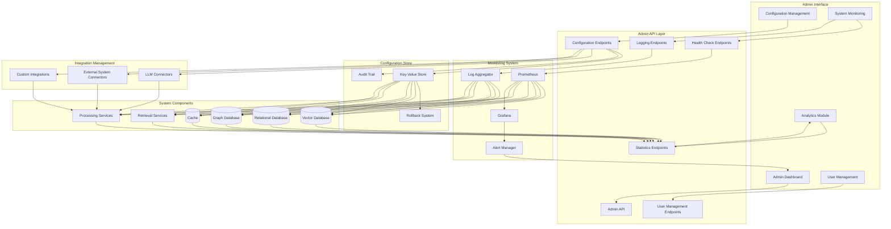

# Administrative System ArchitectureDiagram

---

```mermaid
flowchart TD
    subgraph "Admin Interface"
        AD[Admin Dashboard]
        AM[Analytics Module]
        CM[Configuration Management]
        UM[User Management]
        SM[System Monitoring]
    end
    
    subgraph "Admin API Layer"
        API[Admin API]
        Health[Health Check Endpoints]
        Config[Configuration Endpoints]
        Stats[Statistics Endpoints]
        Users[User Management Endpoints]
        Logs[Logging Endpoints]
    end
    
    subgraph "Monitoring System"
        Prom[Prometheus]
        Graf[Grafana]
        Alert[Alert Manager]
        Log[Log Aggregator]
    end
    
    subgraph "Configuration Store"
        KV[Key-Value Store]
        Audit[Audit Trail]
        Rollback[Rollback System]
    end
    
    subgraph "System Components"
        VecDB[(Vector Database)]
        RelDB[(Relational Database)]
        GraphDB[(Graph Database)]
        Cache[(Cache)]
        Proc[Processing Services]
        Ret[Retrieval Services]
    end
    
    subgraph "Integration Management"
        LLMC[LLM Connectors]
        ExtSys[External System Connectors]
        CustInt[Custom Integrations]
    end
    
    %% Admin Interface to API Layer
    AD --> API
    AM --> Stats
    CM --> Config
    UM --> Users
    SM --> Health
    SM --> Logs
    
    %% API Layer to Monitoring
    Health --> Prom
    Logs --> Log
    
    %% API Layer to Configuration
    Config --> KV
    Config --> Audit
    KV --> Rollback
    
    %% Monitoring to System Components
    Prom --> VecDB
    Prom --> RelDB
    Prom --> GraphDB
    Prom --> Cache
    Prom --> Proc
    Prom --> Ret
    Log --> VecDB
    Log --> RelDB
    Log --> GraphDB
    Log --> Cache
    Log --> Proc
    Log --> Ret
    
    %% Configuration to System Components
    KV --> VecDB
    KV --> RelDB
    KV --> GraphDB
    KV --> Cache
    KV --> Proc
    KV --> Ret
    
    %% Integration Management
    Config --> LLMC
    Config --> ExtSys
    Config --> CustInt
    LLMC --> Proc
    ExtSys --> Proc
    CustInt --> Proc
    
    %% Monitoring and Alerting
    Prom --> Graf
    Graf --> Alert
    Alert --> AD
    
    %% Usage Statistics Flow
    VecDB --> Stats
    RelDB --> Stats
    GraphDB --> Stats
    Cache --> Stats
    Proc --> Stats
    Ret --> Stats
    Stats --> AM
```