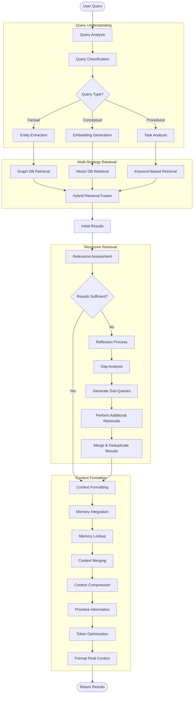

# Advanced Retrieval ProcessDiagram

---

```mermaid
flowchart TD
    Start([User Query]) --> A[Query Analysis]
    A --> B[Query Classification]
    B --> C{Query Type?}
    
    C -->|Factual| D[Entity Extraction]
    C -->|Conceptual| E[Embedding Generation]
    C -->|Procedural| F[Task Analysis]
    
    D --> G[Graph DB Retrieval]
    E --> H[Vector DB Retrieval]
    F --> I[Keyword-Based Retrieval]
    
    G --> J[Hybrid Retrieval Fusion]
    H --> J
    I --> J
    
    J --> K[Initial Results]
    K --> L[Relevance Assessment]
    
    L --> M{Results Sufficient?}
    M -->|Yes| S[Context Formatting]
    M -->|No| N[Reflection Process]
    
    N --> O[Gap Analysis]
    O --> P[Generate Sub-Queries]
    P --> Q[Perform Additional Retrievals]
    Q --> R[Merge & Deduplicate Results]
    R --> S
    
    S --> T[Memory Integration]
    T --> U[Memory Lookup]
    U --> V[Context Merging]
    V --> W[Context Compression]
    
    W --> X[Prioritize Information]
    X --> Y[Token Optimization]
    Y --> Z[Format Final Context]
    Z --> End([Return Results])
    
    subgraph "Query Understanding"
        A
        B
        C
        D
        E
        F
    end
    
    subgraph "Multi-Strategy Retrieval"
        G
        H
        I
        J
    end
    
    subgraph "Recursive Retrieval"
        L
        M
        N
        O
        P
        Q
        R
    end
    
    subgraph "Context Formation"
        S
        T
        U
        V
        W
        X
        Y
        Z
    end
```