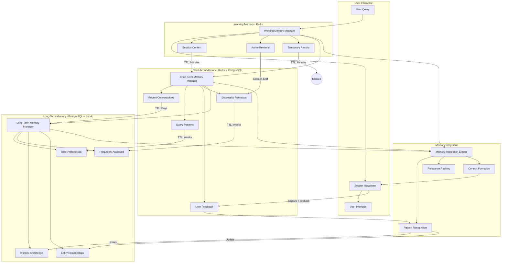

# Cognitive Memory FrameworkDiagram

---

```mermaid
flowchart TD
    subgraph "User Interaction"
        UI[User Interface]
        Query[User Query]
        Response[System Response]
    end
    
    subgraph "Working Memory - Redis"
        WM[Working Memory Manager]
        SC[Session Context]
        AR[Active Retrieval]
        TR[Temporary Results]
    end
    
    subgraph "Short-Term Memory - Redis + PostgreSQL"
        STM[Short-Term Memory Manager]
        RC[Recent Conversations]
        QP[Query Patterns]
        UF[User Feedback]
        SR[Successful Retrievals]
    end
    
    subgraph "Long-Term Memory - PostgreSQL + Neo4j"
        LTM[Long-Term Memory Manager]
        UP[User Preferences]
        FA[Frequently Accessed]
        IK[Inferred Knowledge]
        ER[Entity Relationships]
    end
    
    subgraph "Memory Integration"
        MI[Memory Integration Engine]
        PR[Pattern Recognition]
        RR[Relevance Ranking]
        CF[Context Formation]
    end
    
    %% User Interaction Flow
    Query --> WM
    WM --> Response
    Response --> UI
    
    %% Working Memory Flow
    WM --> SC
    WM --> AR
    WM --> TR
    
    %% Short-Term Memory Flow
    WM --> STM
    STM --> RC
    STM --> QP
    STM --> UF
    STM --> SR
    
    %% Long-Term Memory Flow
    STM --> LTM
    LTM --> UP
    LTM --> FA
    LTM --> IK
    LTM --> ER
    
    %% Memory Integration Flow
    WM --> MI
    STM --> MI
    LTM --> MI
    MI --> PR
    MI --> RR
    MI --> CF
    CF --> Response
    
    %% Time-based Flow (with decay)
    SC -->|TTL: Minutes| STM
    RC -->|TTL: Days| LTM
    QP -->|TTL: Weeks| UP
    SR -->|TTL: Weeks| FA
    
    %% Feedback Loop
    Response -->|Capture Feedback| UF
    UF --> PR
    
    %% Pattern Recognition Flow
    PR -->|Update| IK
    PR -->|Update| ER
    
    %% Working Memory Decay
    TR -->|TTL: Minutes| Discard((Discard))
    AR -->|Session End| SR
```