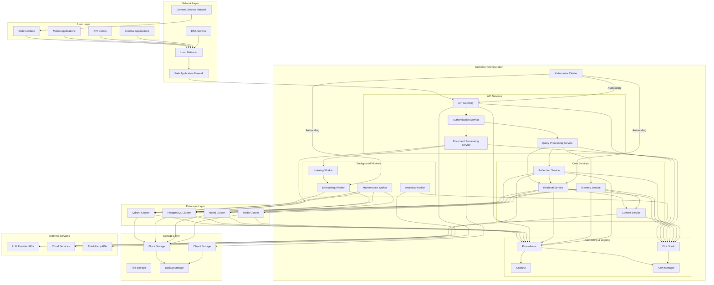

# Deployment ArchitectureDiagram

---

```mermaid
flowchart TD
    subgraph "User Layer"
        WebUI[Web Interface]
        MobApp[Mobile Applications]
        API[API Clients]
        ExtApp[External Applications]
    end
    
    subgraph "Network Layer"
        LB[Load Balancer]
        CDN[Content Delivery Network]
        WAF[Web Application Firewall]
        DNS[DNS Service]
    end
    
    subgraph "Container Orchestration"
        K8S[Kubernetes Cluster]
        
        subgraph "API Services"
            APIGateway[API Gateway]
            AuthService[Authentication Service]
            QueryService[Query Processing Service]
            DocService[Document Processing Service]
        end
        
        subgraph "Core Services"
            RetrievalService[Retrieval Service]
            MemoryService[Memory Service]
            ReflectionService[Reflection Service]
            ContextService[Context Service]
        end
        
        subgraph "Background Workers"
            IndexWorker[Indexing Worker]
            EmbeddingWorker[Embedding Worker]
            MaintenanceWorker[Maintenance Worker]
            AnalyticsWorker[Analytics Worker]
        end
        
        subgraph "Monitoring & Logging"
            Prometheus[Prometheus]
            Grafana[Grafana]
            ELK[ELK Stack]
            Alerts[Alert Manager]
        end
    end
    
    subgraph "Database Layer"
        QdrantService[Qdrant Cluster]
        PostgresService[PostgreSQL Cluster]
        Neo4jService[Neo4j Cluster]
        RedisService[Redis Cluster]
    end
    
    subgraph "Storage Layer"
        ObjectStorage[Object Storage]
        BlockStorage[Block Storage]
        FileStorage[File Storage]
        Backups[Backup Storage]
    end
    
    subgraph "External Services"
        LLMProviders[LLM Provider APIs]
        CloudServices[Cloud Services]
        ThirdPartyAPIs[Third-Party APIs]
    end
    
    %% User Layer to Network Layer
    WebUI --> LB
    MobApp --> LB
    API --> LB
    ExtApp --> LB
    
    %% Network Layer to API Services
    LB --> WAF --> APIGateway
    CDN --> WebUI
    DNS --> LB
    
    %% API Services Flow
    APIGateway --> AuthService
    AuthService --> QueryService
    AuthService --> DocService
    
    %% Core Services Integration
    QueryService --> RetrievalService
    QueryService --> MemoryService
    QueryService --> ReflectionService
    DocService --> IndexWorker
    RetrievalService --> ContextService
    ReflectionService --> RetrievalService
    MemoryService --> ContextService
    
    %% Background Workers
    IndexWorker --> EmbeddingWorker
    EmbeddingWorker --> QdrantService
    EmbeddingWorker --> Neo4jService
    MaintenanceWorker --> QdrantService
    MaintenanceWorker --> PostgresService
    MaintenanceWorker --> Neo4jService
    MaintenanceWorker --> RedisService
    AnalyticsWorker --> ELK
    
    %% Monitoring & Logging
    Prometheus --> Grafana
    Prometheus --> Alerts
    ELK --> Alerts
    
    %% Service to Database Connections
    RetrievalService --> QdrantService
    RetrievalService --> Neo4jService
    MemoryService --> RedisService
    MemoryService --> PostgresService
    ReflectionService --> QdrantService
    DocService --> PostgresService
    
    %% Database to Storage
    QdrantService --> BlockStorage
    PostgresService --> BlockStorage
    Neo4jService --> BlockStorage
    RedisService --> BlockStorage
    BlockStorage --> Backups
    
    %% Document Storage
    DocService --> ObjectStorage
    ObjectStorage --> Backups
    
    %% External Services Integration
    ReflectionService --> LLMProviders
    ContextService --> LLMProviders
    AnalyticsWorker --> CloudServices
    APIGateway --> ThirdPartyAPIs
    
    %% Monitoring Connections
    QdrantService --> Prometheus
    PostgresService --> Prometheus
    Neo4jService --> Prometheus
    RedisService --> Prometheus
    APIGateway --> Prometheus
    RetrievalService --> Prometheus
    MemoryService --> Prometheus
    ReflectionService --> Prometheus
    
    %% Logging Connections
    APIGateway --> ELK
    QueryService --> ELK
    DocService --> ELK
    RetrievalService --> ELK
    MemoryService --> ELK
    ReflectionService --> ELK
    ContextService --> ELK
    
    %% Scaling Services
    K8S -->|Autoscaling| APIGateway
    K8S -->|Autoscaling| RetrievalService
    K8S -->|Autoscaling| EmbeddingWorker
```