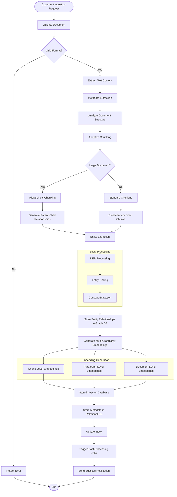

# Document Processing PipelineDiagram

---

```mermaid
flowchart TD
    Start([Document Ingestion Request]) --> A[Validate Document]
    A --> B{Valid Format?}
    B -->|No| C[Return Error]
    C --> End([End])
    
    B -->|Yes| D[Extract Text Content]
    D --> E[Metadata Extraction]
    E --> F[Analyze Document Structure]
    
    F --> G[Adaptive Chunking]
    G --> H{Large Document?}
    H -->|Yes| I[Hierarchical Chunking]
    H -->|No| J[Standard Chunking]
    I --> K[Generate Parent-Child Relationships]
    J --> L[Create Independent Chunks]
    K --> M[Entity Extraction]
    L --> M
    
    M --> N[NER Processing]
    N --> O[Entity Linking]
    O --> P[Concept Extraction]
    
    P --> Q[Store Entity Relationships in Graph DB]
    Q --> R[Generate Multi-Granularity Embeddings]
    
    R --> S[Chunk-Level Embeddings]
    R --> T[Paragraph-Level Embeddings]
    R --> U[Document-Level Embeddings]
    
    S --> V[Store in Vector Database]
    T --> V
    U --> V
    
    V --> W[Store Metadata in Relational DB]
    W --> X[Update Index]
    X --> Y[Trigger Post-Processing Jobs]
    Y --> Z[Send Success Notification]
    Z --> End
    
    subgraph "Entity Processing"
        N
        O
        P
    end
    
    subgraph "Embedding Generation"
        S
        T
        U
    end
```