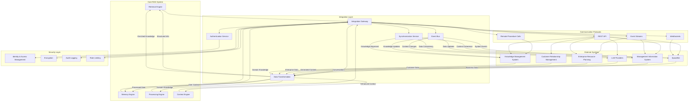

# External Systems Integration ArchitectureDiagram

---

```mermaid
flowchart TD
    subgraph "Core RAG System"
        RE[Retrieval Engine]
        ME[Memory Engine]
        PE[Processing Engine]
        CE[Context Engine]
    end
    
    subgraph "Integration Layer"
        IGW[Integration Gateway]
        Auth[Authentication Service]
        Trans[Data Transformation]
        Sync[Synchronization Service]
        Event[Event Bus]
    end
    
    subgraph "External Systems"
        SB[SpaceBot]
        MIS[Management Information System]
        LLM[LLM Providers]
        ERP[Enterprise Resource Planning]
        CRM[Customer Relationship Management]
        KMS[Knowledge Management System]
    end
    
    subgraph "Communication Protocols"
        REST[REST API]
        WS[WebSockets]
        Events[Event Streams]
        RPC[Remote Procedure Calls]
    end
    
    subgraph "Security Layer"
        IAM[Identity & Access Management]
        Enc[Encryption]
        Audit[Audit Logging]
        Rate[Rate Limiting]
    end
    
    %% Core System to Integration Layer
    RE --> IGW
    ME --> IGW
    PE --> IGW
    CE --> IGW
    
    %% Integration Layer Components
    IGW --> Auth
    IGW --> Trans
    IGW --> Sync
    IGW --> Event
    
    %% Security Integration
    Auth --> IAM
    IGW --> Enc
    IGW --> Audit
    IGW --> Rate
    
    %% Communication Protocols
    IGW --> REST
    IGW --> WS
    IGW --> Events
    IGW --> RPC
    
    %% External Systems Connections
    REST --> SB
    REST --> MIS
    REST --> LLM
    WS --> SB
    Events --> MIS
    Events --> ERP
    RPC --> KMS
    REST --> CRM
    REST --> ERP
    REST --> KMS
    
    %% Bidirectional Flows
    SB -->|Conversations| Trans -->|Processed Data| ME
    MIS -->|Business Data| Trans -->|Structured Info| RE
    LLM -->|Generated Content| Trans -->|Enhanced Context| CE
    ERP -->|Enterprise Data| Trans -->|Domain Knowledge| PE
    CRM -->|Customer Data| Trans -->|User Context| ME
    KMS -->|Domain Knowledge| Trans -->|Enriched Knowledge| RE
    
    %% Event-Driven Integration
    Event -->|System Events| SB
    Event -->|Data Updates| MIS
    Event -->|Context Changes| LLM
    Event -->|Knowledge Updates| KMS
    
    %% Synchronization
    Sync -->|Data Consistency| MIS
    Sync -->|Knowledge Alignment| KMS
    Sync -->|Context Coherence| SB
```