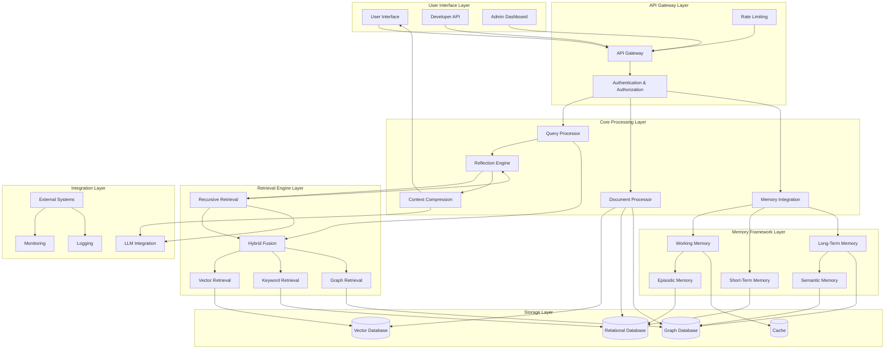

# High-Level System ArchitectureDiagram

---

```mermaid
flowchart TB
    subgraph "User Interface Layer"
        UI[User Interface]
        DevAPI[Developer API]
        AdminUI[Admin Dashboard]
    end

    subgraph "API Gateway Layer"
        Gateway[API Gateway]
        Auth[Authentication & Authorization]
        RateLimit[Rate Limiting]
    end

    subgraph "Core Processing Layer"
        QueryProc[Query Processor]
        DocProc[Document Processor]
        Refl[Reflection Engine]
        MemInt[Memory Integration]
        ConComp[Context Compression]
    end

    subgraph "Retrieval Engine Layer"
        VecRet[Vector Retrieval]
        KeyRet[Keyword Retrieval]
        GraphRet[Graph Retrieval]
        HybFuse[Hybrid Fusion]
        RecursRet[Recursive Retrieval]
    end

    subgraph "Memory Framework Layer"
        WM[Working Memory]
        STM[Short-Term Memory]
        LTM[Long-Term Memory]
        EpMem[Episodic Memory]
        SemMem[Semantic Memory]
    end

    subgraph "Storage Layer"
        VecDB[(Vector Database)]
        RelDB[(Relational Database)]
        GraphDB[(Graph Database)]
        Cache[(Cache)]
    end

    subgraph "Integration Layer"
        LLMInt[LLM Integration]
        ExtInt[External Systems]
        MonitorInt[Monitoring]
        LoggingInt[Logging]
    end

    %% Connect User Interface to Gateway
    UI --> Gateway
    DevAPI --> Gateway
    AdminUI --> Gateway

    %% Connect Gateway to Core Processing
    Gateway --> Auth
    Auth --> QueryProc
    Auth --> DocProc
    Auth --> MemInt
    RateLimit --> Gateway

    %% Connect Core Processing to Retrieval Engine
    QueryProc --> Refl
    Refl --> RecursRet
    QueryProc --> HybFuse
    DocProc --> VecDB
    DocProc --> RelDB
    DocProc --> GraphDB

    %% Connect Retrieval Engine components
    HybFuse --> VecRet
    HybFuse --> KeyRet
    HybFuse --> GraphRet
    RecursRet --> HybFuse
    RecursRet --> Refl

    %% Connect Memory Framework
    MemInt --> WM
    MemInt --> STM
    MemInt --> LTM
    WM --> EpMem
    LTM --> SemMem

    %% Connect Storage Layer
    VecRet --> VecDB
    KeyRet --> RelDB
    GraphRet --> GraphDB
    WM --> Cache
    STM --> RelDB
    LTM --> GraphDB
    EpMem --> RelDB
    SemMem --> GraphDB

    %% Connect Integration Layer
    ConComp --> LLMInt
    RecursRet --> LLMInt
    ExtInt --> MonitorInt
    ExtInt --> LoggingInt
    
    %% Final output flow
    Refl --> ConComp
    ConComp --> UI
```