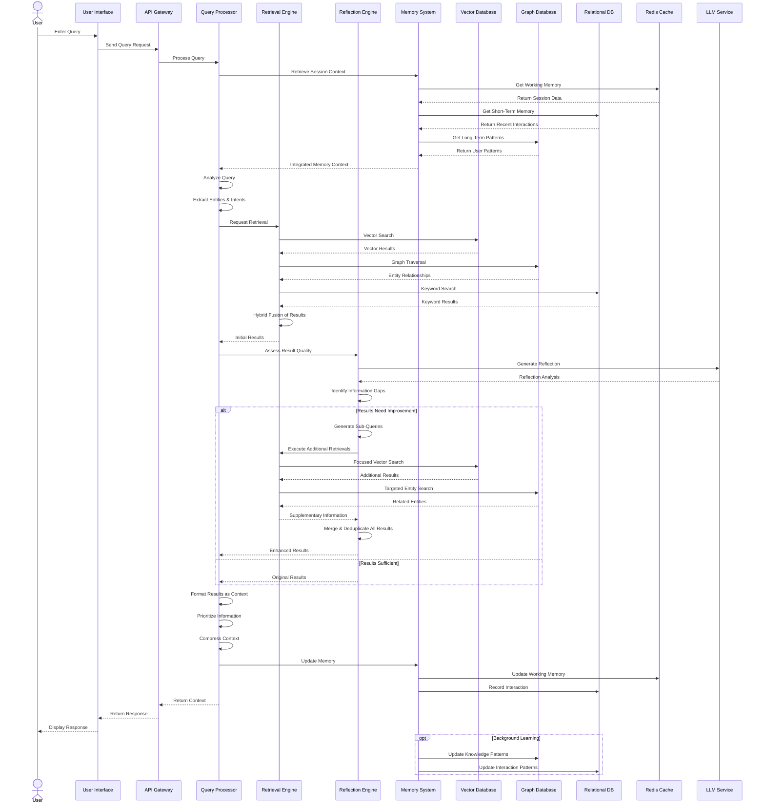

# Implementation Sequence DiagramDiagram

---

```mermaid
sequenceDiagram
    actor User
    participant UI as User Interface
    participant API as API Gateway
    participant QP as Query Processor
    participant RE as Retrieval Engine
    participant Ref as Reflection Engine
    participant Mem as Memory System
    participant VecDB as Vector Database
    participant GraphDB as Graph Database
    participant RelDB as Relational DB
    participant Cache as Redis Cache
    participant LLM as LLM Service

    User->>UI: Enter Query
    UI->>API: Send Query Request
    API->>QP: Process Query
    
    %% Memory Integration
    QP->>Mem: Retrieve Session Context
    Mem->>Cache: Get Working Memory
    Cache-->>Mem: Return Session Data
    Mem->>RelDB: Get Short-Term Memory
    RelDB-->>Mem: Return Recent Interactions
    Mem->>GraphDB: Get Long-Term Patterns
    GraphDB-->>Mem: Return User Patterns
    Mem-->>QP: Integrated Memory Context
    
    %% Query Analysis
    QP->>QP: Analyze Query
    QP->>QP: Extract Entities & Intents
    
    %% Initial Retrieval
    QP->>RE: Request Retrieval
    RE->>VecDB: Vector Search
    VecDB-->>RE: Vector Results
    RE->>GraphDB: Graph Traversal
    GraphDB-->>RE: Entity Relationships
    RE->>RelDB: Keyword Search
    RelDB-->>RE: Keyword Results
    RE->>RE: Hybrid Fusion of Results
    RE-->>QP: Initial Results
    
    %% Reflection Process
    QP->>Ref: Assess Result Quality
    Ref->>LLM: Generate Reflection
    LLM-->>Ref: Reflection Analysis
    Ref->>Ref: Identify Information Gaps
    
    alt Results Need Improvement
        Ref->>Ref: Generate Sub-Queries
        Ref->>RE: Execute Additional Retrievals
        RE->>VecDB: Focused Vector Search
        VecDB-->>RE: Additional Results
        RE->>GraphDB: Targeted Entity Search
        GraphDB-->>RE: Related Entities
        RE-->>Ref: Supplementary Information
        Ref->>Ref: Merge & Deduplicate All Results
        Ref-->>QP: Enhanced Results
    else Results Sufficient
        Ref-->>QP: Original Results
    end
    
    %% Context Preparation
    QP->>QP: Format Results as Context
    QP->>QP: Prioritize Information
    QP->>QP: Compress Context
    
    %% Memory Update
    QP->>Mem: Update Memory
    Mem->>Cache: Update Working Memory
    Mem->>RelDB: Record Interaction
    
    %% Response Generation
    QP-->>API: Return Context
    API-->>UI: Return Response
    UI-->>User: Display Response
    
    %% Asynchronous Learning
    opt Background Learning
        Mem->>GraphDB: Update Knowledge Patterns
        Mem->>RelDB: Update Interaction Patterns
    end
```