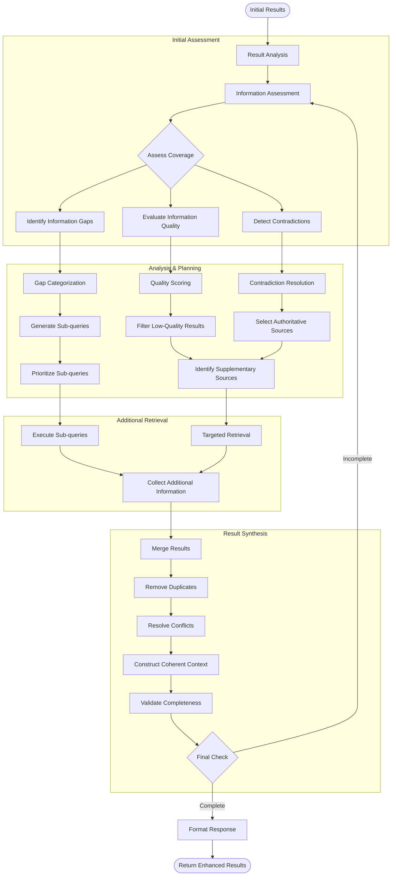

# Reflection Engine ProcessDiagram

---

```mermaid
flowchart TD
    Start([Initial Results]) --> A[Result Analysis]
    A --> B[Information Assessment]
    
    B --> C{Assess Coverage}
    C --> D[Identify Information Gaps]
    C --> E[Evaluate Information Quality]
    C --> F[Detect Contradictions]
    
    D --> G[Gap Categorization]
    E --> H[Quality Scoring]
    F --> I[Contradiction Resolution]
    
    G --> J[Generate Sub-queries]
    H --> K[Filter Low-Quality Results]
    I --> L[Select Authoritative Sources]
    
    J --> M[Prioritize Sub-queries]
    K --> N[Identify Supplementary Sources]
    L --> N
    
    M --> O[Execute Sub-queries]
    N --> P[Targeted Retrieval]
    
    O --> Q[Collect Additional Information]
    P --> Q
    
    Q --> R[Merge Results]
    R --> S[Remove Duplicates]
    S --> T[Resolve Conflicts]
    
    T --> U[Construct Coherent Context]
    U --> V[Validate Completeness]
    V --> W{Final Check}
    
    W -->|Incomplete| B
    W -->|Complete| X[Format Response]
    X --> End([Return Enhanced Results])
    
    subgraph "Initial Assessment"
        A
        B
        C
        D
        E
        F
    end
    
    subgraph "Analysis & Planning"
        G
        H
        I
        J
        K
        L
        M
        N
    end
    
    subgraph "Additional Retrieval"
        O
        P
        Q
    end
    
    subgraph "Result Synthesis"
        R
        S
        T
        U
        V
        W
    end
```