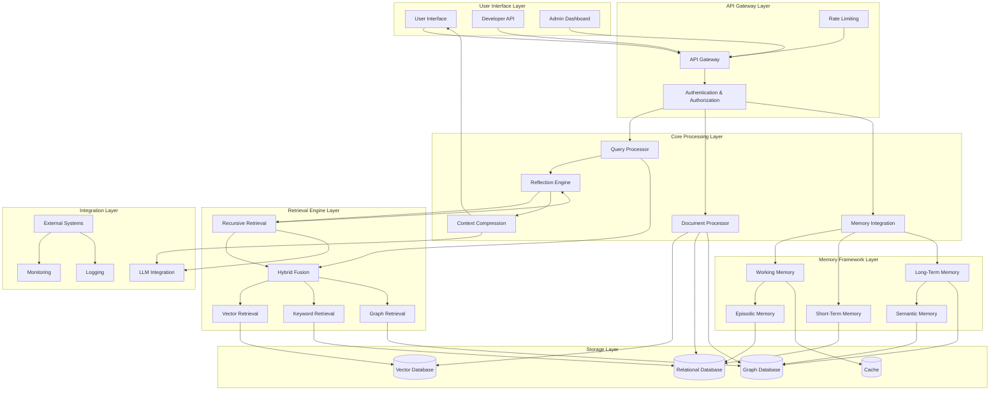

# Superior RAG Development Manual

---

I'll create a comprehensive guide for building a superior RAG (Retrieval-Augmented Generation) system based on the documents you've shared. This will include complete code, setup instructions, and guidelines for working with the system.

# Superior RAG System Development Guide

This guide provides detailed instructions for building a production-ready RAG system that incorporates advanced features like cognitive memory frameworks, hybrid retrieval, reflection engines, and more.

## Project Overview

The Superior RAG system is a comprehensive architecture that enhances LLM capabilities by providing:

- Multi-layered storage with vector, graph, and relational databases
- Cognitive memory framework with working, short-term, and long-term memory
- Advanced retrieval mechanisms including recursive retrieval and reflection
- Sophisticated document processing pipeline
- Comprehensive administration and monitoring tools

## System Architecture

The system is organized into seven layers:

1. **User Interface Layer** - Access points for users, developers, and administrators
2. **API Gateway Layer** - Authentication, rate limiting, and request routing
3. **Core Processing Layer** - Query and document processing, reflection, memory integration
4. **Retrieval Engine Layer** - Multiple retrieval strategies and fusion
5. **Memory Framework Layer** - Different types of memory management
6. **Storage Layer** - Various databases optimized for different data types
7. **Integration Layer** - Connections with external systems

**Superior RAG System Architecture**



---

## Project Setup Instructions

Let's start with the project setup and folder structure. I'll organize the complete code in a way that's easy to understand and implement.

superior-rag/
├── docker/
│   ├── docker-compose.yml
│   ├── qdrant/
│   │   └── Dockerfile
│   ├── neo4j/
│   │   └── Dockerfile
│   ├── postgres/
│   │   └── Dockerfile
│   └── redis/
│       └── Dockerfile
├── src/
│   ├── api/
│   │   ├── **init**.py
│   │   ├── [app.py](http://app.py/)
│   │   ├── routes/
│   │   │   ├── **init**.py
│   │   │   ├── [admin.py](http://admin.py/)
│   │   │   ├── [query.py](http://query.py/)
│   │   │   └── [document.py](http://document.py/)
│   │   └── middleware/
│   │       ├── **init**.py
│   │       ├── [auth.py](http://auth.py/)
│   │       └── rate_limiter.py
│   ├── core/
│   │   ├── **init**.py
│   │   ├── query_processor.py
│   │   ├── document_processor.py
│   │   ├── reflection_engine.py
│   │   ├── memory_integration.py
│   │   └── context_compression.py
│   ├── retrieval/
│   │   ├── **init**.py
│   │   ├── vector_retrieval.py
│   │   ├── keyword_retrieval.py
│   │   ├── graph_retrieval.py
│   │   ├── hybrid_fusion.py
│   │   └── recursive_retrieval.py
│   ├── memory/
│   │   ├── **init**.py
│   │   ├── working_memory.py
│   │   ├── short_term_memory.py
│   │   ├── long_term_memory.py
│   │   ├── episodic_memory.py
│   │   └── semantic_memory.py
│   ├── storage/
│   │   ├── **init**.py
│   │   ├── vector_store.py
│   │   ├── relational_store.py
│   │   ├── graph_store.py
│   │   └── [cache.py](http://cache.py/)
│   ├── integration/
│   │   ├── **init**.py
│   │   ├── llm_integration.py
│   │   ├── external_systems.py
│   │   ├── [monitoring.py](http://monitoring.py/)
│   │   └── [logging.py](http://logging.py/)
│   └── utils/
│       ├── **init**.py
│       ├── [config.py](http://config.py/)
│       ├── [embeddings.py](http://embeddings.py/)
│       └── [helpers.py](http://helpers.py/)
├── ui/
│   ├── admin/
│   │   ├── package.json
│   │   ├── public/
│   │   └── src/
│   └── client/
│       ├── package.json
│       ├── public/
│       └── src/
├── scripts/
│   ├── [setup.sh](http://setup.sh/)
│   ├── [start.sh](http://start.sh/)
│   └── [test.sh](http://test.sh/)
├── tests/
│   ├── unit/
│   ├── integration/
│   └── performance/
├── config/
│   ├── default.yaml
│   ├── development.yaml
│   └── production.yaml
├── [README.md](http://readme.md/)
├── [CONTRIBUTING.md](http://contributing.md/)
├── requirements.txt
├── [setup.py](http://setup.py/)
└── .env.example

Now let's create the core configuration files and Docker setup to get started.

```yaml
version: '3.8'

services:
  # API Service
  api:
    build:
      context: ..
      dockerfile: docker/api/Dockerfile
    ports:
      - "8000:8000"
    environment:
      - ENVIRONMENT=development
      - QDRANT_HOST=qdrant
      - QDRANT_PORT=6333
      - POSTGRES_HOST=postgres
      - POSTGRES_PORT=5432
      - POSTGRES_USER=postgres
      - POSTGRES_PASSWORD=postgres
      - POSTGRES_DB=superior_rag
      - NEO4J_URI=bolt://neo4j:7687
      - NEO4J_USER=neo4j
      - NEO4J_PASSWORD=superior_rag
      - REDIS_HOST=redis
      - REDIS_PORT=6379
      - LLM_API_KEY=${LLM_API_KEY}
    volumes:
      - ../src:/app/src
      - ../config:/app/config
    depends_on:
      - qdrant
      - postgres
      - neo4j
      - redis
    networks:
      - rag_network

  # Vector Database
  qdrant:
    image: qdrant/qdrant:latest
    ports:
      - "6333:6333"
      - "6334:6334"
    volumes:
      - qdrant_data:/qdrant/storage
    networks:
      - rag_network

  # Relational Database
  postgres:
    image: ankane/pgvector:latest
    ports:
      - "5432:5432"
    environment:
      - POSTGRES_USER=postgres
      - POSTGRES_PASSWORD=postgres
      - POSTGRES_DB=superior_rag
    volumes:
      - postgres_data:/var/lib/postgresql/data
    networks:
      - rag_network

  # Graph Database
  neo4j:
    image: neo4j:latest
    ports:
      - "7474:7474"
      - "7687:7687"
    environment:
      - NEO4J_AUTH=neo4j/superior_rag
    volumes:
      - neo4j_data:/data
    networks:
      - rag_network

  # Cache
  redis:
    image: redis:alpine
    ports:
      - "6379:6379"
    volumes:
      - redis_data:/data
    networks:
      - rag_network

  # Admin UI
  admin_ui:
    build:
      context: ../ui/admin
      dockerfile: Dockerfile
    ports:
      - "3000:3000"
    depends_on:
      - api
    networks:
      - rag_network

  # Client UI
  client_ui:
    build:
      context: ../ui/client
      dockerfile: Dockerfile
    ports:
      - "3001:3000"
    depends_on:
      - api
    networks:
      - rag_network

volumes:
  qdrant_data:
  postgres_data:
  neo4j_data:
  redis_data:

networks:
  rag_network:
    driver: bridge
```

Now, let's create the core configuration file and API Dockerfile:

```yaml
FROM python:3.10-slim

WORKDIR /app

# Install system dependencies
RUN apt-get update && apt-get install -y \
    build-essential \
    libpq-dev \
    && rm -rf /var/lib/apt/lists/*

# Copy requirements and install Python dependencies
COPY requirements.txt .
RUN pip install --no-cache-dir -r requirements.txt

# Copy source code and config
COPY src/ /app/src/
COPY config/ /app/config/

# Set Python path
ENV PYTHONPATH=/app

# Expose the API port
EXPOSE 8000

# Command to run the API
CMD ["uvicorn", "src.api.app:app", "--host", "0.0.0.0", "--port", "8000", "--reload"]
```

Now, let's create the main configuration file:

```yaml
# Superior RAG System Configuration

# API settings
api:
  host: "0.0.0.0"
  port: 8000
  debug: true
  title: "Superior RAG API"
  description: "A next-generation Retrieval-Augmented Generation system"
  version: "1.0.0"
  cors:
    allowed_origins: ["*"]
    allowed_methods: ["GET", "POST", "PUT", "DELETE"]
    allowed_headers: ["*"]

# Authentication
auth:
  enabled: true
  api_key_header: "X-API-Key"
  token_expire_minutes: 60
  secret_key: "${AUTH_SECRET_KEY}"

# Rate limiting
rate_limit:
  enabled: true
  max_requests: 100
  time_window_seconds: 60

# Storage configuration
storage:
  # Vector database (Qdrant)
  vector:
    host: "${QDRANT_HOST}"
    port: ${QDRANT_PORT}
    collection_name: "superior_rag"
    vector_size: 768
    distance: "Cosine"
    
  # Relational database (PostgreSQL)
  relational:
    host: "${POSTGRES_HOST}"
    port: ${POSTGRES_PORT}
    user: "${POSTGRES_USER}"
    password: "${POSTGRES_PASSWORD}"
    db: "${POSTGRES_DB}"
    
  # Graph database (Neo4j)
  graph:
    uri: "${NEO4J_URI}"
    user: "${NEO4J_USER}"
    password: "${NEO4J_PASSWORD}"
    
  # Cache (Redis)
  cache:
    host: "${REDIS_HOST}"
    port: ${REDIS_PORT}
    db: 0

# Memory configuration
memory:
  # Working memory (short-lived, high priority)
  working:
    ttl_seconds: 600  # 10 minutes
    
  # Short-term memory
  short_term:
    ttl_days: 7  # 1 week
    
  # Long-term memory
  long_term:
    persistent: true

# Retrieval configuration
retrieval:
  # Default number of documents to retrieve
  default_top_k: 5
  
  # Hybrid retrieval weights
  hybrid:
    vector_weight: 0.6
    keyword_weight: 0.2
    graph_weight: 0.2
    
  # Recursive retrieval
  recursive:
    enabled: true
    max_iterations: 3
    
  # Query transformation
  query_transformation:
    enabled: true
    rewrite_strategies: ["expansion", "decomposition", "hypothetical_doc"]

# Document processing
document_processing:
  # Chunking strategy
  chunking:
    default_chunk_size: 1000
    default_chunk_overlap: 200
    adaptive: true
    
  # Entity extraction
  entity_extraction:
    enabled: true
    spacy_model: "en_core_web_sm"
    
  # Embedding generation
  embeddings:
    model_name: "BAAI/bge-large-en-v1.5"
    cache_enabled: true
    batch_size: 32

# LLM integration
llm:
  provider: "openai"  # options: openai, anthropic, huggingface, local
  model: "gpt-4"
  api_key: "${LLM_API_KEY}"
  max_tokens: 1000
  temperature: 0.0
  timeout_seconds: 30

# Logging configuration
logging:
  level: "INFO"  # DEBUG, INFO, WARNING, ERROR, CRITICAL
  format: "%(asctime)s - %(name)s - %(levelname)s - %(message)s"
  file: "logs/superior_rag.log"
  rotate:
    enabled: true
    max_bytes: 10485760  # 10 MB
    backup_count: 10

# Monitoring
monitoring:
  prometheus:
    enabled: true
    port: 8001
  health_check:
    enabled: true
    path: "/health"
  tracing:
    enabled: false
    provider: "jaeger"
```

Let's create the requirements.txt file with all necessary dependencies:

```
# Core dependencies
fastapi==0.103.1
uvicorn==0.23.2
pydantic==2.3.0
python-dotenv==1.0.0
pyyaml==6.0.1
httpx==0.24.1
starlette==0.27.0
python-multipart==0.0.6

# Database connectors
qdrant-client==1.5.4
psycopg2-binary==2.9.7
neo4j==5.12.0
redis==4.6.0
pgvector==0.2.0

# RAG and NLP
llama-index==0.8.46
langchain==0.0.294
sentence-transformers==2.2.2
openai==0.28.0
spacy==3.6.1
faiss-cpu==1.7.4
unstructured==0.10.16
pypdf==3.16.0
doc2text==0.2.4

# NER and text processing
nltk==3.8.1
beautifulsoup4==4.12.2
lxml==4.9.3

# Monitoring and logging
prometheus-client==0.17.1
python-json-logger==2.0.7
opentelemetry-api==1.20.0
opentelemetry-sdk==1.20.0

# Testing
pytest==7.4.2
pytest-asyncio==0.21.1
httpx==0.24.1
pytest-cov==4.1.0

# Admin tools
celery==5.3.4
flower==2.0.1
SQLAlchemy==2.0.21
alembic==1.12.0

# Security
python-jose==3.3.0
passlib==1.7.4
bcrypt==4.0.1
pyjwt==2.8.0

# Recommended additional dependencies
# Run: python -m spacy download en_core_web_sm 
# after installing these requirements
```

Now, let's create the main API app file:

```python
"""
Superior RAG System - API Application

This module serves as the entry point for the FastAPI application that powers
the Superior RAG system. It sets up the API, middleware, routes, and connections
to the underlying services.
"""

import os
import logging
from fastapi import FastAPI, Depends, Request
from fastapi.middleware.cors import CORSMiddleware
from fastapi.responses import JSONResponse
from contextlib import asynccontextmanager

# Import configuration
from src.utils.config import load_config

# Import middleware
from src.api.middleware.auth import api_key_auth
from src.api.middleware.rate_limiter import RateLimiter

# Import routes
from src.api.routes import admin, query, document

# Configure logging
logging.basicConfig(
    level=logging.INFO,
    format="%(asctime)s - %(name)s - %(levelname)s - %(message)s"
)
logger = logging.getLogger("superior_rag")

# Load configuration
config = load_config()

@asynccontextmanager
async def lifespan(app: FastAPI):
    """
    Context manager for FastAPI application startup and shutdown events.
    """
    # Startup logic: initialize connections, load models, etc.
    logger.info("Starting Superior RAG API...")
    
    # Initialize vector database connection
    from src.storage.vector_store import init_vector_store
    await init_vector_store()
    logger.info("Vector store initialized")
    
    # Initialize relational database connection
    from src.storage.relational_store import init_relational_store
    await init_relational_store()
    logger.info("Relational store initialized")
    
    # Initialize graph database connection
    from src.storage.graph_store import init_graph_store
    await init_graph_store()
    logger.info("Graph store initialized")
    
    # Initialize cache connection
    from src.storage.cache import init_cache
    await init_cache()
    logger.info("Cache initialized")
    
    # Load embedding model
    from src.utils.embeddings import init_embedding_model
    await init_embedding_model()
    logger.info("Embedding model loaded")
    
    # Initialize document processor
    from src.core.document_processor import init_document_processor
    await init_document_processor()
    logger.info("Document processor initialized")
    
    # Initialize memory integration
    from src.core.memory_integration import init_memory_integration
    await init_memory_integration()
    logger.info("Memory integration initialized")
    
    logger.info("Superior RAG API started successfully")
    
    yield
    
    # Shutdown logic: close connections, free resources, etc.
    logger.info("Shutting down Superior RAG API...")
    
    # Close vector database connection
    from src.storage.vector_store import close_vector_store
    await close_vector_store()
    
    # Close relational database connection
    from src.storage.relational_store import close_relational_store
    await close_relational_store()
    
    # Close graph database connection
    from src.storage.graph_store import close_graph_store
    await close_graph_store()
    
    # Close cache connection
    from src.storage.cache import close_cache
    await close_cache()
    
    logger.info("Superior RAG API shut down successfully")

# Create FastAPI application
app = FastAPI(
    title=config["api"]["title"],
    description=config["api"]["description"],
    version=config["api"]["version"],
    lifespan=lifespan
)

# Configure CORS middleware
app.add_middleware(
    CORSMiddleware,
    allow_origins=config["api"]["cors"]["allowed_origins"],
    allow_credentials=True,
    allow_methods=config["api"]["cors"]["allowed_methods"],
    allow_headers=config["api"]["cors"]["allowed_headers"],
)

# Add rate limiting middleware if enabled
if config["rate_limit"]["enabled"]:
    app.add_middleware(
        RateLimiter,
        max_requests=config["rate_limit"]["max_requests"],
        time_window_seconds=config["rate_limit"]["time_window_seconds"]
    )

# Include routers
app.include_router(
    query.router,
    prefix="/api/query",
    tags=["Query"],
    dependencies=[Depends(api_key_auth)] if config["auth"]["enabled"] else []
)

app.include_router(
    document.router,
    prefix="/api/documents",
    tags=["Documents"],
    dependencies=[Depends(api_key_auth)] if config["auth"]["enabled"] else []
)

app.include_router(
    admin.router,
    prefix="/api/admin",
    tags=["Admin"],
    dependencies=[Depends(api_key_auth)] if config["auth"]["enabled"] else []
)

# Health check endpoint (no authentication required)
@app.get("/health", tags=["Health"])
async def health_check():
    """
    Health check endpoint to verify the API is running.
    """
    return {"status": "healthy", "version": config["api"]["version"]}

# Global exception handler
@app.exception_handler(Exception)
async def global_exception_handler(request: Request, exc: Exception):
    """
    Global exception handler to provide consistent error responses.
    """
    logger.error(f"Unhandled exception: {str(exc)}", exc_info=True)
    return JSONResponse(
        status_code=500,
        content={"detail": "An unexpected error occurred. Please try again later."}
    )

if __name__ == "__main__":
    """
    Run the API using Uvicorn when the script is executed directly.
    """
    import uvicorn
    
    host = config["api"]["host"]
    port = config["api"]["port"]
    
    uvicorn.run(
        "src.api.app:app",
        host=host,
        port=port,
        reload=config["api"]["debug"]
    )
```

Let's create the configuration utility:

```python
"""
Configuration utilities for the Superior RAG system.

This module provides functions to load and manage configuration settings
from YAML files and environment variables.
"""

import os
import yaml
import logging
from typing import Dict, Any, List, Union
from pathlib import Path
import re

# Configure logging
logger = logging.getLogger("superior_rag.config")

def load_config() -> Dict[str, Any]:
    """
    Load configuration from YAML files and environment variables.
    
    The configuration is loaded in the following order:
    1. Default configuration (config/default.yaml)
    2. Environment-specific configuration (config/{ENVIRONMENT}.yaml)
    3. Environment variables (override YAML settings)
    
    Returns:
        Dict[str, Any]: The merged configuration dictionary
    """
    # Determine environment
    environment = os.getenv("ENVIRONMENT", "development")
    logger.info(f"Loading configuration for environment: {environment}")
    
    # Define configuration paths
    config_dir = Path(__file__).parent.parent.parent / "config"
    default_config_path = config_dir / "default.yaml"
    env_config_path = config_dir / f"{environment}.yaml"
    
    # Load default configuration
    if not default_config_path.exists():
        logger.warning(f"Default configuration file not found at {default_config_path}")
        config = {}
    else:
        with open(default_config_path, "r") as f:
            config = yaml.safe_load(f)
    
    # Load environment-specific configuration
    if env_config_path.exists():
        with open(env_config_path, "r") as f:
            env_config = yaml.safe_load(f)
            # Deep merge the configurations
            config = deep_merge(config, env_config)
    
    # Override with environment variables
    config = override_from_env(config)
    
    return config

def deep_merge(dict1: Dict[str, Any], dict2: Dict[str, Any]) -> Dict[str, Any]:
    """
    Recursively merge two dictionaries.
    
    If a key exists in both dictionaries and both values are dictionaries,
    the values are merged recursively. Otherwise, the value from dict2 overrides
    the value from dict1.
    
    Args:
        dict1: Base dictionary
        dict2: Dictionary to merge on top of dict1
        
    Returns:
        Dict[str, Any]: The merged dictionary
    """
    result = dict1.copy()
    
    for key, value in dict2.items():
        if key in result and isinstance(result[key], dict) and isinstance(value, dict):
            result[key] = deep_merge(result[key], value)
        else:
            result[key] = value
    
    return result

def override_from_env(config: Dict[str, Any]) -> Dict[str, Any]:
    """
    Override configuration values from environment variables.
    
    Environment variables can override configuration values using the following pattern:
    - A dot in the configuration key is replaced with an underscore
    - All letters are uppercase
    - The key is prefixed with 'SR_' (Superior RAG)
    
    For example, the configuration key 'api.port' can be overridden with
    the environment variable 'SR_API_PORT'.
    
    Additionally, any environment variable references (${VAR_NAME}) in the
    configuration values are replaced with the actual environment variable values.
    
    Args:
        config: The configuration dictionary to override
        
    Returns:
        Dict[str, Any]: The configuration with environment variable overrides
    """
    # First, replace environment variable references in string values
    config = replace_env_vars(config)
    
    # Then, override with environment variables matching the pattern
    for env_var, env_value in os.environ.items():
        if env_var.startswith("SR_"):
            # Remove prefix and convert to lowercase
            key_path = env_var[3:].lower()
            
            # Replace underscores with dots to form the config key path
            key_path = key_path.replace("_", ".")
            
            # Set the value in the config
            set_nested_key(config, key_path, parse_env_value(env_value))
    
    return config

def replace_env_vars(obj: Any) -> Any:
    """
    Replace environment variable references (${VAR_NAME}) in string values.
    
    Args:
        obj: The object to process (can be a dictionary, list, or string)
        
    Returns:
        Any: The processed object with environment variable references replaced
    """
    if isinstance(obj, dict):
        return {k: replace_env_vars(v) for k, v in obj.items()}
    elif isinstance(obj, list):
        return [replace_env_vars(item) for item in obj]
    elif isinstance(obj, str):
        # Find all ${...} patterns in the string
        pattern = r'\${([A-Za-z0-9_]+)}'
        matches = re.findall(pattern, obj)
        
        # Replace each match with the environment variable value or empty string
        result = obj
        for match in matches:
            env_value = os.environ.get(match, "")
            result = result.replace(f"${{{match}}}", env_value)
        
        return result
    else:
        return obj

def set_nested_key(config: Dict[str, Any], key_path: str, value: Any) -> None:
    """
    Set a value in a nested dictionary using a dot-separated key path.
    
    Args:
        config: The configuration dictionary to modify
        key_path: The dot-separated path to the key to set
        value: The value to set at the specified key path
    """
    keys = key_path.split(".")
    current = config
    
    # Navigate to the parent of the final key
    for key in keys[:-1]:
        if key not in current or not isinstance(current[key], dict):
            current[key] = {}
        current = current[key]
    
    # Set the value at the final key
    current[keys[-1]] = value

def parse_env_value(value: str) -> Union[int, float, bool, str]:
    """
    Parse an environment variable value to the appropriate type.
    
    Args:
        value: The string value from the environment variable
        
    Returns:
        Union[int, float, bool, str]: The parsed value
    """
    # Try to parse as integer
    try:
        return int(value)
    except ValueError:
        pass
    
    # Try to parse as float
    try:
        return float(value)
    except ValueError:
        pass
    
    # Check for boolean values
    if value.lower() in ("true", "yes", "1"):
        return True
    elif value.lower() in ("false", "no", "0"):
        return False
    
    # Default to string
    return value

def get_config_value(config: Dict[str, Any], key_path: str, default: Any = None) -> Any:
    """
    Get a value from a nested dictionary using a dot-separated key path.
    
    Args:
        config: The configuration dictionary
        key_path: The dot-separated path to the key to get
        default: The default value to return if the key does not exist
        
    Returns:
        Any: The value at the specified key path, or the default value if not found
    """
    keys = key_path.split(".")
    current = config
    
    # Navigate to the key
    for key in keys:
        if key not in current:
            return default
        current = current[key]
    
    return current
    
    async def process_and_store_document(
        self,
        content: Union[str, BinaryIO, Document],
        metadata: Optional[Dict[str, Any]] = None,
        chunk_size: Optional[int] = None,
        chunk_overlap: Optional[int] = None
    ) -> str:
        """
        Complete pipeline to process and store a document.

        This method runs the entire processing pipeline:
        1. Convert content to Document object
        2. Chunk the document
        3. Extract entities
        4. Generate embeddings
        5. Store the document

        Args:
            content: Document content (string, file-like object, or Document)
            metadata: Optional metadata to attach to the document
            chunk_size: Optional override for default chunk size
            chunk_overlap: Optional override for default chunk overlap

        Returns:
            str: The document ID if successful, empty string otherwise
        """
        try:
            # Convert content to Document if needed
            if isinstance(content, Document):
                document = content
            elif isinstance(content, str):
                # Content is text string
                document = Document(
                    content=content,
                    metadata=metadata or {}
                )
            else:
                # Content is file-like object
                document = await self.process_file(content, metadata)
                
            # Ensure document has an ID
            if document.id is None:
                document.id = str(uuid.uuid4())
                
            # Chunk the document
            document = await self.chunk_document(document, chunk_size, chunk_overlap)
            
            # Extract entities
            document = await self.extract_entities(document)
            
            # Generate embeddings
            document = await self.generate_embeddings(document)
            
            # Store the document
            success = await self.store_document(document)
            
            if success:
                logger.info(f"Successfully processed and stored document {document.id}")
                return document.id
            else:
                logger.error(f"Failed to store document {document.id}")
                return ""
                
        except Exception as e:
            logger.error(f"Error in document processing pipeline: {str(e)}", exc_info=True)
            return ""

    async def delete_document(self, document_id: str) -> bool:
        """
        Delete a document from all storage systems.

        Args:
            document_id: The ID of the document to delete

        Returns:
            bool: True if deletion was successful
        """
        try:
            # Get document metadata to find all chunks
            metadata = await self.relational_store.get_document_metadata(document_id)
            
            if not metadata:
                logger.warning(f"Document {document_id} not found for deletion")
                return False
                
            # Delete from vector store - find chunks with this document_id
            chunk_filter = {"document_id": document_id}
            chunk_deleted = await self.vector_store.delete_by_filter(
                self.vector_store.collection_name, chunk_filter
            )
            
            # Delete from relational store
            metadata_deleted = await self.relational_store.delete_document_metadata(document_id)
            
            # Delete from graph store
            graph_deleted = await self.graph_store.delete_document_entities(document_id)
            
            if not chunk_deleted:
                logger.warning(f"Failed to delete chunks for document {document_id}")
                
            if not metadata_deleted:
                logger.warning(f"Failed to delete metadata for document {document_id}")
                
            if not graph_deleted:
                logger.warning(f"Failed to delete entities for document {document_id}")
                
            success = chunk_deleted and metadata_deleted
            
            if success:
                logger.info(f"Successfully deleted document {document_id}")
            else:
                logger.error(f"Failed to delete document {document_id}")
                
            return success
            
        except Exception as e:
            logger.error(f"Error deleting document: {str(e)}", exc_info=True)
            return False

    async def update_document(
        self,
        document_id: str,
        content: Optional[str] = None,
        metadata: Optional[Dict[str, Any]] = None,
        chunk_size: Optional[int] = None,
        chunk_overlap: Optional[int] = None
    ) -> bool:
        """
        Update an existing document.

        This method:
        1. Deletes the existing document (if found)
        2. Processes and stores the new version

        Args:
            document_id: The ID of the document to update
            content: New document content (optional)
            metadata: New or updated metadata (optional)
            chunk_size: Optional override for default chunk size
            chunk_overlap: Optional override for default chunk overlap

        Returns:
            bool: True if update was successful
        """
        try:
            # Get current document metadata
            current_metadata = await self.relational_store.get_document_metadata(document_id)
            
            if not current_metadata:
                logger.warning(f"Document {document_id} not found for update")
                return False
                
            # If no new content is provided, we need to get the current content
            if content is None:
                # Get a chunk to extract content (not ideal but workable)
                chunks = await self.vector_store.search(
                    collection_name=self.vector_store.collection_name,
                    filters={"document_id": document_id},
                    limit=1000,  # Get all chunks for this document
                    return_vectors=False
                )
                
                if not chunks:
                    logger.error(f"Could not find chunks for document {document_id}")
                    return False
                    
                # Sort chunks by chunk_index if available
                try:
                    chunks = sorted(chunks, key=lambda x: x.get("payload", {}).get("chunk_index", 0))
                except Exception:
                    logger.warning(f"Could not sort chunks for document {document_id}")
                
                # Reconstruct document content from chunks
                content = "\n\n".join([chunk.get("payload", {}).get("text", "") for chunk in chunks])
                
            # Merge metadata if provided
            if metadata:
                merged_metadata = {**current_metadata, **metadata}
            else:
                merged_metadata = current_metadata
                
            # Delete the existing document
            deleted = await self.delete_document(document_id)
            
            if not deleted:
                logger.warning(f"Failed to delete document {document_id} for update")
                # Continue anyway as we'll overwrite it
                
            # Create new document with same ID
            document = Document(
                id=document_id,
                content=content,
                metadata=merged_metadata
            )
            
            # Process and store the new document
            new_id = await self.process_and_store_document(
                document, None, chunk_size, chunk_overlap
            )
            
            success = new_id == document_id
            
            if success:
                logger.info(f"Successfully updated document {document_id}")
            else:
                logger.error(f"Failed to update document {document_id}")
                
            return success
            
        except Exception as e:
            logger.error(f"Error updating document: {str(e)}", exc_info=True)
            return False

# Singleton instance
_document_processor = None

async def init_document_processor():
    """Initialize the document processor singleton."""
    global _document_processor
    if _document_processor is None:
        _document_processor = DocumentProcessor()
    return _document_processor

async def get_document_processor() -> DocumentProcessor:
    """Get the document processor singleton instance."""
    global _document_processor
    if _document_processor is None:
        await init_document_processor()
    return _document_processor
```

I'll continue creating the document processor implementation with the rest of the method.

Let's implement another key component - the vector store interface that will handle interactions with our vector database (Qdrant):

```python
"""
Vector Store Module for Superior RAG System

This module implements the interface to the vector database (Qdrant),
providing methods for storing, retrieving, and searching vectors.
"""

import logging
import asyncio
from typing import Dict, List, Any, Optional, Union, Tuple
import numpy as np

from src.utils.config import load_config

# Configure logging
logger = logging.getLogger("superior_rag.storage.vector")

# Load configuration
config = load_config()

class VectorStore:
    """
    Interface to the vector database (Qdrant).
    
    This class provides methods for:
    - Initializing and managing collections
    - Storing document vectors
    - Performing vector similarity search
    - Hybrid search (vector + keyword)
    - Filtering by metadata
    """

    def __init__(self):
        """Initialize the vector store."""
        self.host = config["storage"]["vector"]["host"]
        self.port = config["storage"]["vector"]["port"]
        self.collection_name = config["storage"]["vector"]["collection_name"]
        self.vector_size = config["storage"]["vector"]["vector_size"]
        self.distance = config["storage"]["vector"]["distance"].lower()
        
        logger.info(f"Initializing vector store at {self.host}:{self.port}")
        
        # Create client
        self._init_client()

    def _init_client(self):
        """Initialize the Qdrant client."""
        try:
            from qdrant_client import QdrantClient
            from qdrant_client.http import models
            
            # Create client
            self.client = QdrantClient(host=self.host, port=self.port)
            
            # Store models for reference
            self.models = models
            
            logger.info("Qdrant client initialized")
            
        except ImportError:
            logger.error("Could not import qdrant_client. Please install it with 'pip install qdrant-client'")
            raise
            
        except Exception as e:
            logger.error(f"Error initializing Qdrant client: {str(e)}")
            raise

    async def init_collection(self, collection_name: Optional[str] = None) -> bool:
        """
        Initialize or validate a collection in Qdrant.

        Args:
            collection_name: Name of the collection (uses default if None)

        Returns:
            bool: True if collection was created or already exists and is valid
        """
        if collection_name is None:
            collection_name = self.collection_name
            
        try:
            # Check if collection already exists
            collections = self.client.get_collections().collections
            collection_names = [c.name for c in collections]
            
            if collection_name in collection_names:
                logger.info(f"Collection '{collection_name}' already exists")
                
                # Validate that it has the expected parameters
                collection_info = self.client.get_collection(collection_name)
                actual_vector_size = collection_info.config.params.vectors.size
                actual_distance = collection_info.config.params.vectors.distance.name.lower()
                
                if actual_vector_size != self.vector_size:
                    logger.warning(f"Collection '{collection_name}' has vector size {actual_vector_size}, expected {self.vector_size}")
                    
                if actual_distance != self.distance:
                    logger.warning(f"Collection '{collection_name}' has distance {actual_distance}, expected {self.distance}")
                    
                return True
                
            # Collection doesn't exist, create it
            distance_model = self._get_distance_model(self.distance)
            
            self.client.create_collection(
                collection_name=collection_name,
                vectors_config=self.models.VectorParams(
                    size=self.vector_size,
                    distance=distance_model
                ),
                optimizers_config=self.models.OptimizersConfigDiff(
                    indexing_threshold=20000  # Optimize for less frequent indexing
                )
            )
            
            # Create payload index for filtering
            self.client.create_payload_index(
                collection_name=collection_name,
                field_name="document_id",
                field_schema=self.models.PayloadSchemaType.KEYWORD
            )
            
            logger.info(f"Created new collection '{collection_name}'")
            return True
            
        except Exception as e:
            logger.error(f"Error initializing collection: {str(e)}")
            return False

    def _get_distance_model(self, distance: str):
        """
        Convert distance string to Qdrant distance enum.

        Args:
            distance: Distance string (cosine, euclid, dot)

        Returns:
            models.Distance: Qdrant distance enum
        """
        distance = distance.lower()
        if distance == "cosine":
            return self.models.Distance.COSINE
        elif distance in ("euclid", "euclidean", "l2"):
            return self.models.Distance.EUCLID
        elif distance in ("dot", "dotproduct"):
            return self.models.Distance.DOT
        else:
            logger.warning(f"Unknown distance '{distance}', using cosine")
            return self.models.Distance.COSINE

    async def store_documents(
        self,
        collection_name: Optional[str],
        documents: List[Dict[str, Any]]
    ) -> bool:
        """
        Store document vectors in the collection.

        Args:
            collection_name: Name of the collection (uses default if None)
            documents: List of document dictionaries with id, vector, and payload

        Returns:
            bool: True if documents were stored successfully
        """
        if collection_name is None:
            collection_name = self.collection_name
            
        try:
            # Prepare points
            points = []
            for doc in documents:
                # Skip documents without vectors
                if "vector" not in doc or doc["vector"] is None:
                    logger.warning(f"Document {doc.get('id', 'unknown')} has no vector, skipping")
                    continue
                    
                # Create point
                point = self.models.PointStruct(
                    id=doc["id"],
                    vector=doc["vector"],
                    payload=doc.get("payload", {})
                )
                points.append(point)
                
            if not points:
                logger.warning("No valid documents to store")
                return False
                
            # Upsert points
            operation_info = self.client.upsert(
                collection_name=collection_name,
                points=points
            )
            
            logger.info(f"Stored {len(points)} documents in collection '{collection_name}'")
            return True
            
        except Exception as e:
            logger.error(f"Error storing documents: {str(e)}")
            return False

    async def search(
        self,
        collection_name: Optional[str] = None,
        query_vector: Optional[List[float]] = None,
        query_filter: Optional[Dict[str, Any]] = None,
        limit: int = 10,
        offset: int = 0,
        return_vectors: bool = False
    ) -> List[Dict[str, Any]]:
        """
        Search for similar vectors in the collection.

        Args:
            collection_name: Name of the collection (uses default if None)
            query_vector: Vector to search for
            query_filter: Filter to apply to the search
            limit: Maximum number of results to return
            offset: Offset for pagination
            return_vectors: Whether to return vectors in the results

        Returns:
            List[Dict[str, Any]]: List of search results
        """
        if collection_name is None:
            collection_name = self.collection_name
            
        try:
            # Convert filter to Qdrant filter
            qdrant_filter = self._convert_filter(query_filter) if query_filter else None
            
            # Search
            search_result = self.client.search(
                collection_name=collection_name,
                query_vector=query_vector,
                query_filter=qdrant_filter,
                limit=limit,
                offset=offset,
                with_vectors=return_vectors
            )
            
            # Convert to dictionary format
            results = []
            for scored_point in search_result:
                result = {
                    "id": scored_point.id,
                    "score": scored_point.score,
                    "payload": scored_point.payload
                }
                
                if return_vectors and hasattr(scored_point, "vector"):
                    result["vector"] = scored_point.vector
                    
                results.append(result)
                
            logger.debug(f"Found {len(results)} results for vector search in '{collection_name}'")
            return results
            
        except Exception as e:
            logger.error(f"Error searching vectors: {str(e)}")
            return []

    async def get_by_id(
        self,
        collection_name: Optional[str],
        doc_id: str,
        return_vector: bool = False
    ) -> Optional[Dict[str, Any]]:
        """
        Get a document by its ID.

        Args:
            collection_name: Name of the collection (uses default if None)
            doc_id: Document ID to retrieve
            return_vector: Whether to return the vector in the result

        Returns:
            Optional[Dict[str, Any]]: Document data or None if not found
        """
        if collection_name is None:
            collection_name = self.collection_name
            
        try:
            # Get document
            results = self.client.retrieve(
                collection_name=collection_name,
                ids=[doc_id],
                with_vectors=return_vector
            )
            
            if not results:
                logger.warning(f"Document {doc_id} not found in collection '{collection_name}'")
                return None
                
            # Convert to dictionary format
            point = results[0]
            result = {
                "id": point.id,
                "payload": point.payload
            }
            
            if return_vector and hasattr(point, "vector"):
                result["vector"] = point.vector
                
            return result
            
        except Exception as e:
            logger.error(f"Error retrieving document by ID: {str(e)}")
            return None

    async def delete_by_ids(
        self,
        collection_name: Optional[str],
        doc_ids: List[str]
    ) -> bool:
        """
        Delete documents by their IDs.

        Args:
            collection_name: Name of the collection (uses default if None)
            doc_ids: List of document IDs to delete

        Returns:
            bool: True if deletion was successful
        """
        if collection_name is None:
            collection_name = self.collection_name
            
        try:
            # Delete documents
            self.client.delete(
                collection_name=collection_name,
                points_selector=self.models.PointIdsList(points=doc_ids)
            )
            
            logger.info(f"Deleted {len(doc_ids)} documents from collection '{collection_name}'")
            return True
            
        except Exception as e:
            logger.error(f"Error deleting documents by IDs: {str(e)}")
            return False

    async def delete_by_filter(
        self,
        collection_name: Optional[str],
        query_filter: Dict[str, Any]
    ) -> bool:
        """
        Delete documents matching a filter.

        Args:
            collection_name: Name of the collection (uses default if None)
            query_filter: Filter to apply for deletion

        Returns:
            bool: True if deletion was successful
        """
        if collection_name is None:
            collection_name = self.collection_name
            
        try:
            # Convert filter to Qdrant filter
            qdrant_filter = self._convert_filter(query_filter)
            
            # Delete documents
            self.client.delete(
                collection_name=collection_name,
                points_selector=self.models.FilterSelector(filter=qdrant_filter)
            )
            
            logger.info(f"Deleted documents matching filter from collection '{collection_name}'")
            return True
            
        except Exception as e:
            logger.error(f"Error deleting documents by filter: {str(e)}")
            return False

    def _convert_filter(self, query_filter: Dict[str, Any]) -> Dict[str, Any]:
        """
        Convert a simple query filter to Qdrant filter format.

        Args:
            query_filter: Simple filter format

        Returns:
            Dict[str, Any]: Qdrant filter format
        """
        if not query_filter:
            return None
            
        conditions = []
        
        for key, value in query_filter.items():
            if key.startswith("payload."):
                # Already in Qdrant format
                field = key
            else:
                # Convert to payload.{key} format
                field = f"payload.{key}"
                
            if isinstance(value, list):
                # Multiple allowed values
                condition = self.models.FieldCondition(
                    key=field,
                    match=self.models.MatchAny(any=value)
                )
            else:
                # Single value
                condition = self.models.FieldCondition(
                    key=field,
                    match=self.models.MatchValue(value=value)
                )
                
            conditions.append(condition)
            
        if len(conditions) == 1:
            return conditions[0]
        else:
            return self.models.Filter(
                must=conditions
            )

    async def count_documents(
        self,
        collection_name: Optional[str] = None,
        query_filter: Optional[Dict[str, Any]] = None
    ) -> int:
        """
        Count documents in the collection.

        Args:
            collection_name: Name of the collection (uses default if None)
            query_filter: Filter to apply for counting

        Returns:
            int: Number of documents matching the filter
        """
        if collection_name is None:
            collection_name = self.collection_name
            
        try:
            # Convert filter to Qdrant filter
            qdrant_filter = self._convert_filter(query_filter) if query_filter else None
            
            # Count documents
            count = self.client.count(
                collection_name=collection_name,
                count_filter=qdrant_filter
            )
            
            return count.count
            
        except Exception as e:
            logger.error(f"Error counting documents: {str(e)}")
            return 0

    async def hybrid_search(
        self,
        collection_name: Optional[str] = None,
        query_text: str = "",
        query_vector: Optional[List[float]] = None,
        sparse_weight: float = 0.2,
        filters: Optional[Dict[str, Any]] = None,
        limit: int = 10
    ) -> List[Dict[str, Any]]:
        """
        Perform hybrid search combining vector and sparse (keyword) search.

        Args:
            collection_name: Name of the collection (uses default if None)
            query_text: Text query for sparse search
            query_vector: Vector for dense search
            sparse_weight: Weight for sparse results (0.0 to 1.0)
            filters: Filter to apply to the search
            limit: Maximum number of results to return

        Returns:
            List[Dict[str, Any]]: List of search results
        """
        if collection_name is None:
            collection_name = self.collection_name
            
        try:
            # Verify if sparse vectors are enabled
            if not hasattr(self.models, "SparseIndexParams"):
                logger.warning("Hybrid search requires Qdrant with sparse vector support (>=v1.1.0)")
                
                # Fallback to normal vector search
                logger.info("Falling back to normal vector search")
                return await self.search(
                    collection_name=collection_name,
                    query_vector=query_vector,
                    query_filter=filters,
                    limit=limit
                )
                
            # Convert filter to Qdrant filter
            qdrant_filter = self._convert_filter(filters) if filters else None
            
            # Generate sparse vector from query text
            from qdrant_client.http.models import SparseVector
            sparse_vector = await self._text_to_sparse_vector(query_text)
            
            # Perform hybrid search
            search_result = self.client.search_batch(
                collection_name=collection_name,
                requests=[
                    self.models.SearchRequest(
                        vector=query_vector,
                        sparse_vector=sparse_vector,
                        limit=limit,
                        params=self.models.SearchParams(
                            hnsw_ef=128,  # Higher value for better recall
                            exact=False   # Approximate search for speed
                        ),
                        with_payload=True,
                        with_vectors=False,
                        score_threshold=0.0,
                        filter=qdrant_filter if qdrant_filter else None
                    )
                ]
            )[0]
            
            # Convert to dictionary format
            results = []
            for scored_point in search_result:
                result = {
                    "id": scored_point.id,
                    "score": scored_point.score,
                    "payload": scored_point.payload
                }
                results.append(result)
                
            logger.debug(f"Found {len(results)} results for hybrid search in '{collection_name}'")
            return results
            
        except Exception as e:
            logger.error(f"Error performing hybrid search: {str(e)}", exc_info=True)
            
            # Fallback to normal vector search
            logger.info("Falling back to normal vector search")
            return await self.search(
                collection_name=collection_name,
                query_vector=query_vector,
                query_filter=filters,
                limit=limit
            )

    async def _text_to_sparse_vector(self, text: str):
        """
        Convert text to sparse vector representation.
        
        This is a simple implementation using TF-IDF like approach.
        In production, you would use a proper sparse encoder.

        Args:
            text: Text to convert

        Returns:
            SparseVector: Sparse vector representation
        """
        try:
            from qdrant_client.http.models import SparseVector
            import re
            from collections import Counter
            
            # Tokenize text
            tokens = re.findall(r'\w+', text.lower())
            
            # Count tokens
            token_counts = Counter(tokens)
            
            # Create sparse vector
            indices = []
            values = []
            
            for i, (token, count) in enumerate(token_counts.items()):
                # Hash token to a 32-bit integer index
                # Note: This is a simple hash function, production systems would use better methods
                index = hash(token) % (2**32-1)
                indices.append(index)
                values.append(float(count))
                
            # Sort by indices
            indices_values = sorted(zip(indices, values), key=lambda x: x[0])
            indices = [idx for idx, _ in indices_values]
            values = [val for _, val in indices_values]
            
            # Create sparse vector
            return SparseVector(
                indices=indices,
                values=values
            )
            
        except Exception as e:
            logger.error(f"Error creating sparse vector: {str(e)}")
            # Return empty sparse vector
            from qdrant_client.http.models import SparseVector
            return SparseVector(indices=[], values=[])

    async def create_sparse_index(self, collection_name: Optional[str] = None) -> bool:
        """
        Create a sparse index for hybrid search.

        Args:
            collection_name: Name of the collection (uses default if None)

        Returns:
            bool: True if index was created successfully
        """
        if collection_name is None:
            collection_name = self.collection_name
            
        try:
            # Check if Qdrant version supports sparse vectors
            if not hasattr(self.models, "SparseIndexParams"):
                logger.warning("Sparse vectors require Qdrant >= v1.1.0")
                return False
                
            # Create sparse index
            self.client.update_collection(
                collection_name=collection_name,
                sparse_vectors_config={
                    "text": self.models.SparseVectorParams(
                        index=self.models.SparseIndexParams(
                            on_disk=True  # Store on disk for larger collections
                        )
                    )
                }
            )
            
            logger.info(f"Created sparse index for collection '{collection_name}'")
            return True
            
        except Exception as e:
            logger.error(f"Error creating sparse index: {str(e)}")
            return False

# Singleton instance
_vector_store = None

async def init_vector_store():
    """Initialize the vector store singleton and create collection."""
    global _vector_store
    if _vector_store is None:
        _vector_store = VectorStore()
        
        # Initialize collection
        await _vector_store.init_collection()
        
    return _vector_store

async def close_vector_store():
    """Close the vector store connection."""
    global _vector_store
    if _vector_store is not None:
        # No explicit close needed for Qdrant HTTP client
        _vector_store = None
        logger.info("Vector store connection closed")

def get_vector_store() -> VectorStore:
    """Get the vector store singleton instance."""
    global _vector_store
    if _vector_store is None:
        raise RuntimeError("Vector store not initialized. Call init_vector_store() first")
    return _vector_store
```

Now let's create the embedding utility to generate and manage embeddings for our RAG system:

```python
"""
Embeddings Utility for Superior RAG System

This module provides functionality for generating text embeddings using
various models, with caching for performance optimization.
"""

import logging
import asyncio
from typing import List, Dict, Any, Optional, Union, Callable
import hashlib
import os
import time
import numpy as np

from src.utils.config import load_config
from src.storage.cache import get_cache

# Configure logging
logger = logging.getLogger("superior_rag.embeddings")

# Load configuration
config = load_config()

class EmbeddingModel:
    """
    Manages text embedding generation with caching.
    
    This class provides methods for generating embeddings from text,
    with built-in caching to avoid redundant computation.
    """

    def __init__(self):
        """Initialize the embedding model."""
        # Load configuration
        self.model_name = config["document_processing"]["embeddings"]["model_name"]
        self.cache_enabled = config["document_processing"]["embeddings"]["cache_enabled"]
        self.batch_size = config["document_processing"]["embeddings"]["batch_size"]
        
        # Cache instance
        self.cache = get_cache() if self.cache_enabled else None
        
        # Cache expiration in seconds (7 days)
        self.cache_ttl = 7 * 24 * 60 * 60
        
        # Initialize model
        self._init_model()
        
        logger.info
Embeddings Utility for Superior RAG System

This module provides functionality for generating text embeddings using
various models, with caching for performance optimization.
"""

import logging
import asyncio
from typing import List, Dict, Any, Optional, Union, Callable
import hashlib
import os
import time
import numpy as np

from src.utils.config import load_config
from src.storage.cache import get_cache

# Configure logging
logger = logging.getLogger("superior_rag.embeddings")

# Load configuration
config = load_config()

class EmbeddingModel:
    """
    Manages text embedding generation with caching.
    
    This class provides methods for generating embeddings from text,
    with built-in caching to avoid redundant computation.
    """

    def __init__(self):
        """Initialize the embedding model."""
        # Load configuration
        self.model_name = config["document_processing"]["embeddings"]["model_name"]
        self.cache_enabled = config["document_processing"]["embeddings"]["cache_enabled"]
        self.batch_size = config["document_processing"]["embeddings"]["batch_size"]
        
        # Cache instance
        self.cache = get_cache() if self.cache_enabled else None
        
        # Cache expiration in seconds (7 days)
        self.cache_ttl = 7 * 24 * 60 * 60
        
        # Initialize model
        self._init_model()
        
        logger.info(f"Embedding model initialized with {self.model_name}")

    def _init_model(self):
        """Initialize the embedding model based on configuration."""
        try:
            if "openai" in self.model_name.lower():
                self._init_openai_model()
            elif "instructor" in self.model_name.lower():
                self._init_instructor_model()
            else:
                # Default to sentence-transformers
                self._init_sentence_transformers_model()
                
        except Exception as e:
            logger.error(f"Error initializing embedding model: {str(e)}", exc_info=True)
            logger.warning("Falling back to sentence-transformers model")
            self._init_sentence_transformers_model()

    def _init_sentence_transformers_model(self):
        """Initialize a sentence-transformers model."""
        try:
            from sentence_transformers import SentenceTransformer
            
            self.model = SentenceTransformer(self.model_name)
            self.embedding_fn = self._generate_sentence_transformers_embedding
            self.embedding_batch_fn = self._generate_sentence_transformers_embeddings_batch
            self.vector_size = self.model.get_sentence_embedding_dimension()
            self.model_type = "sentence_transformers"
            
            logger.info(f"Initialized sentence-transformers model {self.model_name} with dimension {self.vector_size}")
            
        except ImportError:
            logger.error("Could not import sentence_transformers. Please install it with 'pip install sentence-transformers'")
            raise
            
        except Exception as e:
            logger.error(f"Error initializing sentence-transformers model: {str(e)}")
            raise

    def _init_openai_model(self):
        """Initialize an OpenAI embedding model."""
        try:
            import openai
            
            # Get API key from config
            openai.api_key = config["llm"]["api_key"]
            
            # Set model name (default to text-embedding-ada-002 if not specified)
            if self.model_name == "openai":
                self.model_name = "text-embedding-ada-002"
                
            # Set embedding function
            self.embedding_fn = self._generate_openai_embedding
            self.embedding_batch_fn = self._generate_openai_embeddings_batch
            
            # Set vector size based on model
            if "ada" in self.model_name:
                self.vector_size = 1536
            elif "3-small" in self.model_name:
                self.vector_size = 1536
            elif "3-large" in self.model_name:
                self.vector_size = 3072
            else:
                self.vector_size = 1536  # Default
                
            self.model_type = "openai"
            
            logger.info(f"Initialized OpenAI embedding model {self.model_name} with dimension {self.vector_size}")
            
        except ImportError:
            logger.error("Could not import openai. Please install it with 'pip install openai'")
            raise
            
        except Exception as e:
            logger.error(f"Error initializing OpenAI embedding model: {str(e)}")
            raise

    def _init_instructor_model(self):
        """Initialize an InstructorEmbedding model."""
        try:
            from InstructorEmbedding import INSTRUCTOR
            
            self.model = INSTRUCTOR(self.model_name)
            self.embedding_fn = self._generate_instructor_embedding
            self.embedding_batch_fn = self._generate_instructor_embeddings_batch
            
            # Get vector size from model
            sample_text = "Hello, world!"
            sample_embedding = self.model.encode([sample_text])[0]
            self.vector_size = len(sample_embedding)
            
            self.model_type = "instructor"
            
            logger.info(f"Initialized INSTRUCTOR embedding model {self.model_name} with dimension {self.vector_size}")
            
        except ImportError:
            logger.error("Could not import InstructorEmbedding. Please install it with 'pip install InstructorEmbedding'")
            raise
            
        except Exception as e:
            logger.error(f"Error initializing INSTRUCTOR embedding model: {str(e)}")
            raise

    async def get_text_embedding(self, text: str) -> List[float]:
        """
        Generate embedding for a single text.

        Args:
            text: Text to embed

        Returns:
            List[float]: Embedding vector
        """
        if not text or not text.strip():
            # Return zero vector for empty text
            return [0.0] * self.vector_size
            
        # Check cache first if enabled
        if self.cache_enabled:
            cache_key = self._get_cache_key(text)
            cached_embedding = await self.cache.get(cache_key)
            
            if cached_embedding is not None:
                return cached_embedding
        
        # Generate embedding
        try:
            embedding = await self.embedding_fn(text)
            
            # Cache the result if enabled
            if self.cache_enabled:
                await self.cache.set(cache_key, embedding, self.cache_ttl)
                
            return embedding
            
        except Exception as e:
            logger.error(f"Error generating embedding: {str(e)}")
            # Return zero vector on error
            return [0.0] * self.vector_size

    async def get_text_embeddings_batch(
        self, 
        texts: List[str],
        batch_size: Optional[int] = None
    ) -> List[List[float]]:
        """
        Generate embeddings for multiple texts.

        Args:
            texts: List of texts to embed
            batch_size: Optional batch size for processing

        Returns:
            List[List[float]]: List of embedding vectors
        """
        if not texts:
            return []
            
        # Use default batch size if not specified
        if batch_size is None:
            batch_size = self.batch_size
            
        # Filter out empty texts
        valid_texts = []
        empty_indices = []
        
        for i, text in enumerate(texts):
            if text and text.strip():
                valid_texts.append(text)
            else:
                empty_indices.append(i)
                
        # Check cache first if enabled
        cache_hits = {}
        uncached_texts = []
        uncached_indices = []
        
        if self.cache_enabled:
            # Get cache keys for all texts
            cache_keys = [self._get_cache_key(text) for text in valid_texts]
            
            # Get cached embeddings
            for i, (text, cache_key) in enumerate(zip(valid_texts, cache_keys)):
                cached_embedding = await self.cache.get(cache_key)
                
                if cached_embedding is not None:
                    cache_hits[i] = cached_embedding
                else:
                    uncached_texts.append(text)
                    uncached_indices.append(i)
        else:
            uncached_texts = valid_texts
            uncached_indices = list(range(len(valid_texts)))
            
        # Generate embeddings for uncached texts
        generated_embeddings = {}
        
        if uncached_texts:
            # Process in batches
            for i in range(0, len(uncached_texts), batch_size):
                batch_texts = uncached_texts[i:i+batch_size]
                batch_indices = uncached_indices[i:i+batch_size]
                
                try:
                    # Generate embeddings for batch
                    batch_embeddings = await self.embedding_batch_fn(batch_texts)
                    
                    # Store generated embeddings
                    for j, (idx, embedding) in enumerate(zip(batch_indices, batch_embeddings)):
                        generated_embeddings[idx] = embedding
                        
                        # Cache the result if enabled
                        if self.cache_enabled:
                            cache_key = self._get_cache_key(batch_texts[j])
                            await self.cache.set(cache_key, embedding, self.cache_ttl)
                            
                except Exception as e:
                    logger.error(f"Error generating batch embeddings: {str(e)}")
                    
                    # Fill with zero vectors on error
                    for idx in batch_indices:
                        generated_embeddings[idx] = [0.0] * self.vector_size
        
        # Combine cached and generated embeddings
        all_embeddings = []
        
        # Fill valid embeddings
        for i in range(len(valid_texts)):
            if i in cache_hits:
                all_embeddings.append(cache_hits[i])
            elif i in generated_embeddings:
                all_embeddings.append(generated_embeddings[i])
            else:
                # Fallback
                all_embeddings.append([0.0] * self.vector_size)
                
        # Insert zero vectors for empty texts
        result = []
        empty_vec = [0.0] * self.vector_size
        
        valid_idx = 0
        for i in range(len(texts)):
            if i in empty_indices:
                result.append(empty_vec)
            else:
                result.append(all_embeddings[valid_idx])
                valid_idx += 1
                
        return result

    async def _generate_sentence_transformers_embedding(self, text: str) -> List[float]:
        """
        Generate embedding using sentence-transformers.

        Args:
            text: Text to embed

        Returns:
            List[float]: Embedding vector
        """
        embedding = self.model.encode(text, show_progress_bar=False)
        return embedding.tolist()

    async def _generate_sentence_transformers_embeddings_batch(
        self, 
        texts: List[str]
    ) -> List[List[float]]:
        """
        Generate embeddings for a batch of texts using sentence-transformers.

        Args:
            texts: List of texts to embed

        Returns:
            List[List[float]]: List of embedding vectors
        """
        embeddings = self.model.encode(texts, show_progress_bar=False)
        return embeddings.tolist()

    async def _generate_openai_embedding(self, text: str) -> List[float]:
        """
        Generate embedding using OpenAI API.

        Args:
            text: Text to embed

        Returns:
            List[float]: Embedding vector
        """
        import openai
        
        response = await openai.Embedding.acreate(
            model=self.model_name,
            input=text
        )
        
        embedding = response['data'][0]['embedding']
        return embedding

    async def _generate_openai_embeddings_batch(self, texts: List[str]) -> List[List[float]]:
        """
        Generate embeddings for a batch of texts using OpenAI API.

        Args:
            texts: List of texts to embed

        Returns:
            List[List[float]]: List of embedding vectors
        """
        import openai
        
        response = await openai.Embedding.acreate(
            model=self.model_name,
            input=texts
        )
        
        # Extract embeddings from response
        embeddings = [data['embedding'] for data in response['data']]
        return embeddings

    async def _generate_instructor_embedding(self, text: str) -> List[float]:
        """
        Generate embedding using INSTRUCTOR model.

        Args:
            text: Text to embed

        Returns:
            List[float]: Embedding vector
        """
        # Instruction for general-purpose embedding
        instruction = "Represent the document for retrieval:"
        
        # Use a thread to run the synchronous encode method
        embedding = await asyncio.to_thread(
            self.model.encode, [[instruction, text]]
        )
        
        return embedding[0].tolist()

    async def _generate_instructor_embeddings_batch(
        self, 
        texts: List[str]
    ) -> List[List[float]]:
        """
        Generate embeddings for a batch of texts using INSTRUCTOR model.

        Args:
            texts: List of texts to embed

        Returns:
            List[List[float]]: List of embedding vectors
        """
        # Instruction for general-purpose embedding
        instruction = "Represent the document for retrieval:"
        
        # Prepare input format for INSTRUCTOR
        inputs = [[instruction, text] for text in texts]
        
        # Use a thread to run the synchronous encode method
        embeddings = await asyncio.to_thread(
            self.model.encode, inputs
        )
        
        return embeddings.tolist()

    def _get_cache_key(self, text: str) -> str:
        """
        Generate a cache key for a text.

        Args:
            text: Text to generate key for

        Returns:
            str: Cache key
        """
        # Create hash from text and model name
        text_hash = hashlib.md5(text.encode('utf-8')).hexdigest()
        model_hash = hashlib.md5(self.model_name.encode('utf-8')).hexdigest()[:8]
        
        # Combine for final key
        return f"emb:{model_hash}:{text_hash}"

# Singleton instance
_embedding_model = None

async def init_embedding_model():
    """Initialize the embedding model singleton."""
    global _embedding_model
    if _embedding_model is None:
        _embedding_model = EmbeddingModel()
    return _embedding_model

def get_embedding_model() -> EmbeddingModel:
    """Get the embedding model singleton instance."""
    global _embedding_model
    if _embedding_model is None:
        raise RuntimeError("Embedding model not initialized. Call init_embedding_model() first")
    return _embedding_model
```

**Rational Database interface:**

```python
"""
Relational Database Store Module for Superior RAG System

This module implements the interface to the relational database (PostgreSQL),
providing methods for storing, retrieving, and managing structured data.
"""

import logging
import asyncio
from typing import Dict, List, Any, Optional, Union, Tuple
import json

from src.utils.config import load_config

# Configure logging
logger = logging.getLogger("superior_rag.storage.relational")

# Load configuration
config = load_config()

class RelationalStore:
    """
    Interface to the relational database (PostgreSQL).
    
    This class provides methods for:
    - Storing and retrieving document metadata
    - Managing structured data
    - Handling user and session information
    """

    def __init__(self):
        """Initialize the relational store."""
        self.host = config["storage"]["relational"]["host"]
        self.port = config["storage"]["relational"]["port"]
        self.user = config["storage"]["relational"]["user"]
        self.password = config["storage"]["relational"]["password"]
        self.db = config["storage"]["relational"]["db"]
        
        logger.info(f"Initializing relational store at {self.host}:{self.port}")
        
        # Initialize connection pool
        self.pool = None

    async def init_connection_pool(self):
        """Initialize the connection pool."""
        try:
            import asyncpg
            
            # Create connection pool
            self.pool = await asyncpg.create_pool(
                host=self.host,
                port=self.port,
                user=self.user,
                password=self.password,
                database=self.db,
                min_size=5,
                max_size=20
            )
            
            logger.info("Connection pool initialized")
            
            # Initialize database schema
            await self._init_schema()
            
        except ImportError:
            logger.error("Could not import asyncpg. Please install it with 'pip install asyncpg'")
            raise
            
        except Exception as e:
            logger.error(f"Error initializing connection pool: {str(e)}")
            raise

    async def close_connection_pool(self):
        """Close the connection pool."""
        if self.pool:
            await self.pool.close()
            self.pool = None
            logger.info("Connection pool closed")

    async def _init_schema(self):
        """Initialize the database schema if not exists."""
        try:
            async with self.pool.acquire() as conn:
                # Check for pgvector extension
                try:
                    await conn.execute('CREATE EXTENSION IF NOT EXISTS vector;')
                    logger.info("Vector extension enabled")
                except Exception as e:
                    logger.warning(f"Could not enable vector extension: {str(e)}")
                
                # Create documents table
                await conn.execute('''
                    CREATE TABLE IF NOT EXISTS documents (
                        id TEXT PRIMARY KEY,
                        title TEXT,
                        source TEXT,
                        created_at TIMESTAMP WITH TIME ZONE DEFAULT CURRENT_TIMESTAMP,
                        updated_at TIMESTAMP WITH TIME ZONE DEFAULT CURRENT_TIMESTAMP,
                        metadata JSONB DEFAULT '{}'::jsonb
                    );
                ''')
                
                # Create chunks table
                await conn.execute('''
                    CREATE TABLE IF NOT EXISTS chunks (
                        id TEXT PRIMARY KEY,
                        document_id TEXT REFERENCES documents(id) ON DELETE CASCADE,
                        chunk_index INTEGER,
                        content TEXT,
                        metadata JSONB DEFAULT '{}'::jsonb,
                        embedding vector(768) -- This requires pgvector extension
                    );
                ''')
                
                # Create users table
                await conn.execute('''
                    CREATE TABLE IF NOT EXISTS users (
                        id TEXT PRIMARY KEY,
                        email TEXT UNIQUE,
                        name TEXT,
                        created_at TIMESTAMP WITH TIME ZONE DEFAULT CURRENT_TIMESTAMP,
                        last_login TIMESTAMP WITH TIME ZONE,
                        metadata JSONB DEFAULT '{}'::jsonb
                    );
                ''')
                
                # Create sessions table
                await conn.execute('''
                    CREATE TABLE IF NOT EXISTS sessions (
                        id TEXT PRIMARY KEY,
                        user_id TEXT REFERENCES users(id) ON DELETE CASCADE,
                        created_at TIMESTAMP WITH TIME ZONE DEFAULT CURRENT_TIMESTAMP,
                        expires_at TIMESTAMP WITH TIME ZONE,
                        metadata JSONB DEFAULT '{}'::jsonb
                    );
                ''')
                
                # Create interactions table for tracking user-document interactions
                await conn.execute('''
                    CREATE TABLE IF NOT EXISTS interactions (
                        id SERIAL PRIMARY KEY,
                        user_id TEXT REFERENCES users(id) ON DELETE CASCADE,
                        document_id TEXT REFERENCES documents(id) ON DELETE CASCADE,
                        session_id TEXT REFERENCES sessions(id) ON DELETE CASCADE,
                        interaction_type TEXT,
                        timestamp TIMESTAMP WITH TIME ZONE DEFAULT CURRENT_TIMESTAMP,
                        metadata JSONB DEFAULT '{}'::jsonb
                    );
                ''')
                
                logger.info("Database schema initialized")
                
        except Exception as e:
            logger.error(f"Error initializing schema: {str(e)}")
            raise

    async def store_document_metadata(
        self,
        document_id: str,
        metadata: Dict[str, Any]
    ) -> bool:
        """
        Store document metadata in the relational database.

        Args:
            document_id: Document ID
            metadata: Document metadata

        Returns:
            bool: True if successful
        """
        try:
            # Extract common fields from metadata
            title = metadata.get("title", "")
            source = metadata.get("source", "")
            
            # Convert Python dict to JSON string for PostgreSQL
            metadata_json = json.dumps(metadata)
            
            async with self.pool.acquire() as conn:
                # Insert or update document
                await conn.execute('''
                    INSERT INTO documents (id, title, source, metadata, updated_at)
                    VALUES ($1, $2, $3, $4, CURRENT_TIMESTAMP)
                    ON CONFLICT (id)
                    DO UPDATE SET
                        title = $2,
                        source = $3,
                        metadata = $4,
                        updated_at = CURRENT_TIMESTAMP;
                ''', document_id, title, source, metadata_json)
                
            logger.info(f"Stored metadata for document {document_id}")
            return True
            
        except Exception as e:
            logger.error(f"Error storing document metadata: {str(e)}")
            return False

    async def get_document_metadata(
        self,
        document_id: str
    ) -> Optional[Dict[str, Any]]:
        """
        Retrieve document metadata from the relational database.

        Args:
            document_id: Document ID

        Returns:
            Optional[Dict[str, Any]]: Document metadata or None if not found
        """
        try:
            async with self.pool.acquire() as conn:
                # Query document
                row = await conn.fetchrow('''
                    SELECT id, title, source, created_at, updated_at, metadata
                    FROM documents
                    WHERE id = $1;
                ''', document_id)
                
                if not row:
                    logger.warning(f"Document {document_id} not found")
                    return None
                    
                # Convert row to dictionary
                metadata = dict(row)
                
                # Parse JSON metadata
                if "metadata" in metadata and metadata["metadata"]:
                    metadata.update(json.loads(metadata["metadata"]))
                    
                # Format dates
                if "created_at" in metadata:
                    metadata["created_at"] = metadata["created_at"].isoformat()
                if "updated_at" in metadata:
                    metadata["updated_at"] = metadata["updated_at"].isoformat()
                    
                return metadata
                
        except Exception as e:
            logger.error(f"Error retrieving document metadata: {str(e)}")
            return None

    async def delete_document_metadata(self, document_id: str) -> bool:
        """
        Delete document metadata from the relational database.

        Args:
            document_id: Document ID

        Returns:
            bool: True if successful
        """
        try:
            async with self.pool.acquire() as conn:
                # Delete document (chunks will cascade)
                result = await conn.execute('''
                    DELETE FROM documents
                    WHERE id = $1;
                ''', document_id)
                
                # Parse the result to check if a row was deleted
                if "DELETE 0" in result:
                    logger.warning(f"Document {document_id} not found for deletion")
                    return False
                    
                logger.info(f"Deleted metadata for document {document_id}")
                return True
                
        except Exception as e:
            logger.error(f"Error deleting document metadata: {str(e)}")
            return False

    async def store_chunk_metadata(
        self,
        chunk_id: str,
        document_id: str,
        chunk_index: int,
        content: str,
        metadata: Dict[str, Any],
        embedding: Optional[List[float]] = None
    ) -> bool:
        """
        Store chunk metadata and optionally embedding in the relational database.

        Args:
            chunk_id: Chunk ID
            document_id: Parent document ID
            chunk_index: Index of the chunk in the document
            content: Chunk text content
            metadata: Chunk metadata
            embedding: Optional embedding vector

        Returns:
            bool: True if successful
        """
        try:
            # Convert Python dict to JSON string for PostgreSQL
            metadata_json = json.dumps(metadata)
            
            # Format embedding for pgvector if provided
            embedding_param = embedding if embedding is not None else None
            
            async with self.pool.acquire() as conn:
                # Insert or update chunk
                if embedding_param is not None:
                    await conn.execute('''
                        INSERT INTO chunks (id, document_id, chunk_index, content, metadata, embedding)
                        VALUES ($1, $2, $3, $4, $5, $6)
                        ON CONFLICT (id)
                        DO UPDATE SET
                            document_id = $2,
                            chunk_index = $3,
                            content = $4,
                            metadata = $5,
                            embedding = $6;
                    ''', chunk_id, document_id, chunk_index, content, metadata_json, embedding_param)
                else:
                    await conn.execute('''
                        INSERT INTO chunks (id, document_id, chunk_index, content, metadata)
                        VALUES ($1, $2, $3, $4, $5)
                        ON CONFLICT (id)
                        DO UPDATE SET
                            document_id = $2,
                            chunk_index = $3,
                            content = $4,
                            metadata = $5;
                    ''', chunk_id, document_id, chunk_index, content, metadata_json)
                
            logger.info(f"Stored metadata for chunk {chunk_id}")
            return True
            
        except Exception as e:
            logger.error(f"Error storing chunk metadata: {str(e)}")
            return False

    async def get_chunks(
        self,
        document_id: str,
        with_embeddings: bool = False
    ) -> List[Dict[str, Any]]:
        """
        Retrieve chunks for a document from the relational database.

        Args:
            document_id: Document ID
            with_embeddings: Whether to include embeddings in the results

        Returns:
            List[Dict[str, Any]]: List of chunk data
        """
        try:
            async with self.pool.acquire() as conn:
                # Query chunks
                if with_embeddings:
                    rows = await conn.fetch('''
                        SELECT id, document_id, chunk_index, content, metadata, embedding
                        FROM chunks
                        WHERE document_id = $1
                        ORDER BY chunk_index;
                    ''', document_id)
                else:
                    rows = await conn.fetch('''
                        SELECT id, document_id, chunk_index, content, metadata
                        FROM chunks
                        WHERE document_id = $1
                        ORDER BY chunk_index;
                    ''', document_id)
                
                # Convert rows to dictionaries
                chunks = []
                for row in rows:
                    chunk = dict(row)
                    
                    # Parse JSON metadata
                    if "metadata" in chunk and chunk["metadata"]:
                        metadata = json.loads(chunk["metadata"])
                        chunk.update({"metadata": metadata})
                        
                    # Convert embedding to list if present
                    if "embedding" in chunk and chunk["embedding"]:
                        chunk["embedding"] = list(chunk["embedding"])
                        
                    chunks.append(chunk)
                    
                return chunks
                
        except Exception as e:
            logger.error(f"Error retrieving chunks: {str(e)}")
            return []

    async def store_user(
        self,
        user_id: str,
        email: str,
        name: str,
        metadata: Optional[Dict[str, Any]] = None
    ) -> bool:
        """
        Store user information in the relational database.

        Args:
            user_id: User ID
            email: User email
            name: User name
            metadata: Optional user metadata

        Returns:
            bool: True if successful
        """
        try:
            # Initialize metadata if not provided
            if metadata is None:
                metadata = {}
                
            # Convert Python dict to JSON string for PostgreSQL
            metadata_json = json.dumps(metadata)
            
            async with self.pool.acquire() as conn:
                # Insert or update user
                await conn.execute('''
                    INSERT INTO users (id, email, name, metadata)
                    VALUES ($1, $2, $3, $4)
                    ON CONFLICT (id)
                    DO UPDATE SET
                        email = $2,
                        name = $3,
                        metadata = $4;
                ''', user_id, email, name, metadata_json)
                
            logger.info(f"Stored user {user_id}")
            return True
            
        except Exception as e:
            logger.error(f"Error storing user: {str(e)}")
            return False

    async def update_user_last_login(self, user_id: str) -> bool:
        """
        Update the last login timestamp for a user.

        Args:
            user_id: User ID

        Returns:
            bool: True if successful
        """
        try:
            async with self.pool.acquire() as conn:
                # Update user
                result = await conn.execute('''
                    UPDATE users
                    SET last_login = CURRENT_TIMESTAMP
                    WHERE id = $1;
                ''', user_id)
                
                # Parse the result to check if a row was updated
                if "UPDATE 0" in result:
                    logger.warning(f"User {user_id} not found for update")
                    return False
                    
                logger.info(f"Updated last login for user {user_id}")
                return True
                
        except Exception as e:
            logger.error(f"Error updating user last login: {str(e)}")
            return False

    async def create_session(
        self,
        session_id: str,
        user_id: str,
        expires_at: str,
        metadata: Optional[Dict[str, Any]] = None
    ) -> bool:
        """
        Create a new session in the relational database.

        Args:
            session_id: Session ID
            user_id: User ID
            expires_at: Expiration timestamp (ISO format)
            metadata: Optional session metadata

        Returns:
            bool: True if successful
        """
        try:
            # Initialize metadata if not provided
            if metadata is None:
                metadata = {}
                
            # Convert Python dict to JSON string for PostgreSQL
            metadata_json = json.dumps(metadata)
            
            async with self.pool.acquire() as conn:
                # Insert session
                await conn.execute('''
                    INSERT INTO sessions (id, user_id, expires_at, metadata)
                    VALUES ($1, $2, $3, $4);
                ''', session_id, user_id, expires_at, metadata_json)
                
            logger.info(f"Created session {session_id} for user {user_id}")
            return True
            
        except Exception as e:
            logger.error
```

**Graph Database Interface:**

```python
"""
Graph Database Store Module for Superior RAG System

This module implements the interface to the graph database (Neo4j),
providing methods for storing and querying entity relationships.
"""

import logging
import asyncio
from typing import Dict, List, Any, Optional, Union, Tuple, Set

from src.utils.config import load_config

# Configure logging
logger = logging.getLogger("superior_rag.storage.graph")

# Load configuration
config = load_config()

class GraphStore:
    """
    Interface to the graph database (Neo4j).
    
    This class provides methods for:
    - Storing document entities and their relationships
    - Querying entity relationships for knowledge graph retrieval
    - Managing semantic memory for long-term patterns
    """

    def __init__(self):
        """Initialize the graph store."""
        self.uri = config["storage"]["graph"]["uri"]
        self.user = config["storage"]["graph"]["user"]
        self.password = config["storage"]["graph"]["password"]
        
        logger.info(f"Initializing graph store at {self.uri}")
        
        # Initialize driver
        self.driver = None

    async def init_driver(self):
        """Initialize the Neo4j driver."""
        try:
            from neo4j import GraphDatabase
            
            # Create driver
            self.driver = GraphDatabase.driver(
                self.uri,
                auth=(self.user, self.password)
            )
            
            # Test connection
            with self.driver.session() as session:
                result = session.run("RETURN 1 AS num")
                record = result.single()
                if record and record["num"] == 1:
                    logger.info("Neo4j connection successful")
                else:
                    raise Exception("Connection test failed")
                    
            # Initialize constraints and indexes
            await self._init_schema()
            
        except ImportError:
            logger.error("Could not import neo4j. Please install it with 'pip install neo4j'")
            raise
            
        except Exception as e:
            logger.error(f"Error initializing Neo4j driver: {str(e)}")
            raise

    async def close_driver(self):
        """Close the Neo4j driver."""
        if self.driver:
            self.driver.close()
            self.driver = None
            logger.info("Neo4j driver closed")

    async def _init_schema(self):
        """Initialize the graph database schema."""
        try:
            # Define constraints and indexes
            constraints = [
                "CREATE CONSTRAINT document_id IF NOT EXISTS FOR (d:Document) REQUIRE d.id IS UNIQUE",
                "CREATE CONSTRAINT entity_id IF NOT EXISTS FOR (e:Entity) REQUIRE e.id IS UNIQUE",
                "CREATE CONSTRAINT concept_id IF NOT EXISTS FOR (c:Concept) REQUIRE c.id IS UNIQUE",
                "CREATE CONSTRAINT user_id IF NOT EXISTS FOR (u:User) REQUIRE u.id IS UNIQUE"
            ]
            
            indexes = [
                "CREATE INDEX entity_type IF NOT EXISTS FOR (e:Entity) ON (e.type)",
                "CREATE INDEX entity_name IF NOT EXISTS FOR (e:Entity) ON (e.name)",
                "CREATE INDEX
                
             
```

```python
"""
Graph Database Store Module for Superior RAG System

This module implements the interface to the graph database (Neo4j),
providing methods for storing and querying entity relationships.
"""

import logging
import asyncio
from typing import Dict, List, Any, Optional, Union, Tuple, Set

from src.utils.config import load_config

# Configure logging
logger = logging.getLogger("superior_rag.storage.graph")

# Load configuration
config = load_config()

class GraphStore:
    """
    Interface to the graph database (Neo4j).
    
    This class provides methods for:
    - Storing document entities and their relationships
    - Querying entity relationships for knowledge graph retrieval
    - Managing semantic memory for long-term patterns
    """

    def __init__(self):
        """Initialize the graph store."""
        self.uri = config["storage"]["graph"]["uri"]
        self.user = config["storage"]["graph"]["user"]
        self.password = config["storage"]["graph"]["password"]
        
        logger.info(f"Initializing graph store at {self.uri}")
        
        # Initialize driver
        self.driver = None

    async def init_driver(self):
        """Initialize the Neo4j driver."""
        try:
            from neo4j import GraphDatabase
            
            # Create driver
            self.driver = GraphDatabase.driver(
                self.uri,
                auth=(self.user, self.password)
            )
            
            # Test connection
            with self.driver.session() as session:
                result = session.run("RETURN 1 AS num")
                record = result.single()
                if record and record["num"] == 1:
                    logger.info("Neo4j connection successful")
                else:
                    raise Exception("Connection test failed")
                    
            # Initialize constraints and indexes
            await self._init_schema()
            
        except ImportError:
            logger.error("Could not import neo4j. Please install it with 'pip install neo4j'")
            raise
            
        except Exception as e:
            logger.error(f"Error initializing Neo4j driver: {str(e)}")
            raise

    async def close_driver(self):
        """Close the Neo4j driver."""
        if self.driver:
            self.driver.close()
            self.driver = None
            logger.info("Neo4j driver closed")

    async def _init_schema(self):
        """Initialize the graph database schema."""
        try:
            # Define constraints and indexes
            constraints = [
                "CREATE CONSTRAINT document_id IF NOT EXISTS FOR (d:Document) REQUIRE d.id IS UNIQUE",
                "CREATE CONSTRAINT entity_id IF NOT EXISTS FOR (e:Entity) REQUIRE e.id IS UNIQUE",
                "CREATE CONSTRAINT concept_id IF NOT EXISTS FOR (c:Concept) REQUIRE c.id IS UNIQUE",
                "CREATE CONSTRAINT user_id IF NOT EXISTS FOR (u:User) REQUIRE u.id IS UNIQUE"
            ]
            
            indexes = [
                "CREATE INDEX entity_type IF NOT EXISTS FOR (e:Entity) ON (e.type)",
                "CREATE INDEX entity_name IF NOT EXISTS FOR (e:Entity) ON (e.name)",
                "CREATE INDEX document_title IF NOT EXISTS FOR (d:Document) ON (d.title)",
                "CREATE INDEX concept_name IF NOT EXISTS FOR (c:Concept) ON (c.name)"
            ]
            
            # Execute in Neo4j session
            with self.driver.session() as session:
                # Create constraints
                for constraint in constraints:
                    try:
                        session.run(constraint)
                    except Exception as e:
                        logger.warning(f"Could not create constraint: {str(e)}")
                
                # Create indexes
                for index in indexes:
                    try:
                        session.run(index)
                    except Exception as e:
                        logger.warning(f"Could not create index: {str(e)}")
                
            logger.info("Graph database schema initialized")
            
        except Exception as e:
            logger.error(f"Error initializing graph schema: {str(e)}")
            raise

    async def store_document_entities(
        self,
        document_id: str,
        entities: Dict[str, List[str]]
    ) -> bool:
        """
        Store document entities in the graph database.

        Args:
            document_id: Document ID
            entities: Dictionary mapping entity types to entity values

        Returns:
            bool: True if successful
        """
        try:
            # Create document node and entity relationships
            query = """
            // Create or merge document node
            MERGE (d:Document {id: $document_id})
            
            // Set document properties
            SET d.last_updated = timestamp()
            
            // Process each entity
            WITH d
            UNWIND $entities AS entity
            
            // Create or merge entity node
            MERGE (e:Entity {id: entity.id})
            ON CREATE SET e.name = entity.name,
                          e.type = entity.type,
                          e.created_at = timestamp()
            ON MATCH SET e.last_seen = timestamp()
            
            // Create relationship from document to entity
            MERGE (d)-[r:CONTAINS]->(e)
            ON CREATE SET r.count = 1
            ON MATCH SET r.count = r.count + 1,
                         r.last_updated = timestamp()
            
            RETURN count(e) as entity_count
            """
            
            # Prepare entity data
            entity_data = []
            for entity_type, entity_list in entities.items():
                for entity_name in entity_list:
                    # Create unique ID for entity (type + name)
                    entity_id = f"{entity_type.lower()}:{entity_name.lower()}"
                    
                    entity_data.append({
                        "id": entity_id,
                        "name": entity_name,
                        "type": entity_type
                    })
            
            # Execute query
            with self.driver.session() as session:
                result = session.run(
                    query,
                    document_id=document_id,
                    entities=entity_data
                )
                
                summary = result.consume()
                logger.info(f"Stored {len(entity_data)} entities for document {document_id}")
                
                return True
                
        except Exception as e:
            logger.error(f"Error storing document entities: {str(e)}")
            return False

    async def delete_document_entities(self, document_id: str) -> bool:
        """
        Delete document entities from the graph database.

        Args:
            document_id: Document ID

        Returns:
            bool: True if successful
        """
        try:
            # Delete document node and all its relationships
            query = """
            // Match document node
            MATCH (d:Document {id: $document_id})
            
            // Optional match related entities
            OPTIONAL MATCH (d)-[r]->(e)
            
            // Delete relationships
            DELETE r
            
            // Delete document
            DELETE d
            
            RETURN count(d) as deleted_count
            """
            
            # Execute query
            with self.driver.session() as session:
                result = session.run(query, document_id=document_id)
                record = result.single()
                
                if record and record["deleted_count"] > 0:
                    logger.info(f"Deleted document {document_id} and its relationships from graph")
                    return True
                else:
                    logger.warning(f"Document {document_id} not found in graph")
                    return False
                
        except Exception as e:
            logger.error(f"Error deleting document entities: {str(e)}")
            return False

    async def find_related_entities(
        self,
        entity_names: List[str],
        entity_types: Optional[List[str]] = None,
        limit: int = 10
    ) -> List[Dict[str, Any]]:
        """
        Find entities related to the given entities.

        Args:
            entity_names: List of entity names to search for
            entity_types: Optional list of entity types to filter by
            limit: Maximum number of results to return

        Returns:
            List[Dict[str, Any]]: List of related entities with their relationships
        """
        try:
            # Build query
            type_filter = ""
            if entity_types:
                type_filter = "AND e.type IN $entity_types"
                
            query = f"""
            // Match entities by name (case-insensitive)
            MATCH (e:Entity)
            WHERE toLower(e.name) IN $entity_names_lower
            {type_filter}
            
            // Find related entities through documents
            MATCH (e)<-[:CONTAINS]-(d:Document)-[:CONTAINS]->(related:Entity)
            WHERE related <> e
            
            // Count co-occurrences
            WITH related, count(d) AS co_occurrences, collect(distinct d.id) AS documents
            
            // Return top related entities
            RETURN related.id AS id,
                   related.name AS name,
                   related.type AS type,
                   co_occurrences,
                   documents
            ORDER BY co_occurrences DESC
            LIMIT $limit
            """
            
            # Execute query
            entity_names_lower = [name.lower() for name in entity_names]
            
            with self.driver.session() as session:
                result = session.run(
                    query,
                    entity_names_lower=entity_names_lower,
                    entity_types=entity_types,
                    limit=limit
                )
                
                # Convert records to dictionaries
                related_entities = []
                for record in result:
                    related_entities.append({
                        "id": record["id"],
                        "name": record["name"],
                        "type": record["type"],
                        "co_occurrences": record["co_occurrences"],
                        "documents": record["documents"]
                    })
                    
                logger.info(f"Found {len(related_entities)} entities related to {entity_names}")
                return related_entities
                
        except Exception as e:
            logger.error(f"Error finding related entities: {str(e)}")
            return []

    async def find_entity_documents(
        self,
        entity_names: List[str],
        entity_types: Optional[List[str]] = None,
        limit: int = 10
    ) -> List[str]:
        """
        Find documents containing the given entities.

        Args:
            entity_names: List of entity names to search for
            entity_types: Optional list of entity types to filter by
            limit: Maximum number of results to return

        Returns:
            List[str]: List of document IDs
        """
        try:
            # Build query
            type_filter = ""
            if entity_types:
                type_filter = "AND e.type IN $entity_types"
                
            query = f"""
            // Match entities by name (case-insensitive)
            MATCH (e:Entity)
            WHERE toLower(e.name) IN $entity_names_lower
            {type_filter}
            
            // Find documents containing these entities
            MATCH (e)<-[r:CONTAINS]-(d:Document)
            
            // Group by document and count entities matched
            WITH d, count(distinct e) AS entity_matches
            
            // Return documents sorted by how many entities they match
            RETURN d.id AS document_id, entity_matches
            ORDER BY entity_matches DESC
            LIMIT $limit
            """
            
            # Execute query
            entity_names_lower = [name.lower() for name in entity_names]
            
            with self.driver.session() as session:
                result = session.run(
                    query,
                    entity_names_lower=entity_names_lower,
                    entity_types=entity_types,
                    limit=limit
                )
                
                # Extract document IDs
                document_ids = [record["document_id"] for record in result]
                
                logger.info(f"Found {len(document_ids)} documents containing entities {entity_names}")
                return document_ids
                
        except Exception as e:
            logger.error(f"Error finding entity documents: {str(e)}")
            return []

    async def store_entity_relationship(
        self,
        source_entity: Dict[str, str],
        target_entity: Dict[str, str],
        relationship_type: str,
        properties: Optional[Dict[str, Any]] = None
    ) -> bool:
        """
        Store a relationship between two entities.

        Args:
            source_entity: Source entity with 'name' and 'type' keys
            target_entity: Target entity with 'name' and 'type' keys
            relationship_type: Type of relationship (e.g., "RELATED_TO", "IS_A")
            properties: Optional properties for the relationship

        Returns:
            bool: True if successful
        """
        try:
            # Create entity IDs
            source_id = f"{source_entity['type'].lower()}:{source_entity['name'].lower()}"
            target_id = f"{target_entity['type'].lower()}:{target_entity['name'].lower()}"
            
            # Initialize properties if not provided
            if properties is None:
                properties = {}
                
            # Ensure relationship_type is uppercase and has no spaces
            relationship_type = relationship_type.upper().replace(" ", "_")
            
            # Build query
            query = f"""
            // Merge source entity
            MERGE (source:Entity {{id: $source_id}})
            ON CREATE SET source.name = $source_name,
                          source.type = $source_type,
                          source.created_at = timestamp()
            
            // Merge target entity
            MERGE (target:Entity {{id: $target_id}})
            ON CREATE SET target.name = $target_name,
                          target.type = $target_type,
                          target.created_at = timestamp()
            
            // Create relationship
            MERGE (source)-[r:{relationship_type}]->(target)
            
            // Set relationship properties
            SET r += $properties,
                r.last_updated = timestamp()
            
            RETURN type(r) as relationship
            """
            
            # Execute query
            with self.driver.session() as session:
                result = session.run(
                    query,
                    source_id=source_id,
                    source_name=source_entity["name"],
                    source_type=source_entity["type"],
                    target_id=target_id,
                    target_name=target_entity["name"],
                    target_type=target_entity["type"],
                    properties=properties
                )
                
                record = result.single()
                if record and record["relationship"] == relationship_type:
                    logger.info(f"Stored relationship {relationship_type} between entities")
                    return True
                else:
                    logger.warning(f"Failed to store relationship {relationship_type}")
                    return False
                
        except Exception as e:
            logger.error(f"Error storing entity relationship: {str(e)}")
            return False

    async def find_path_between_entities(
        self,
        start_entity: Dict[str, str],
        end_entity: Dict[str, str],
        max_depth: int = 3
    ) -> List[Dict[str, Any]]:
        """
        Find paths between two entities in the graph.

        Args:
            start_entity: Start entity with 'name' and 'type' keys
            end_entity: End entity with 'name' and 'type' keys
            max_depth: Maximum path length to search

        Returns:
            List[Dict[str, Any]]: List of paths with their constituent entities and relationships
        """
        try:
            # Create entity IDs
            start_id = f"{start_entity['type'].lower()}:{start_entity['name'].lower()}"
            end_id = f"{end_entity['type'].lower()}:{end_entity['name'].lower()}"
            
            # Build query
            query = f"""
            // Match start and end entities
            MATCH (start:Entity {{id: $start_id}}), (end:Entity {{id: $end_id}})
            
            // Find paths between them
            MATCH path = shortestPath((start)-[*1..{max_depth}]-(end))
            
            // Return path details
            RETURN path,
                   length(path) AS path_length,
                   [node IN nodes(path) | node.name] AS entity_names,
                   [relationship IN relationships(path) | type(relationship)] AS relationship_types
            
            // Order by path length (shortest first)
            ORDER BY path_length
            LIMIT 5
            """
            
            # Execute query
            with self.driver.session() as session:
                result = session.run(
                    query,
                    start_id=start_id,
                    end_id=end_id
                )
                
                # Extract path information
                paths = []
                for record in result:
                    path_info = {
                        "length": record["path_length"],
                        "entity_names": record["entity_names"],
                        "relationship_types": record["relationship_types"]
                    }
                    paths.append(path_info)
                    
                logger.info(f"Found {len(paths)} paths between entities")
                return paths
                
        except Exception as e:
            logger.error(f"Error finding paths between entities: {str(e)}")
            return []

    async def create_or_update_concept(
        self,
        concept_name: str,
        entities: List[Dict[str, str]],
        definition: Optional[str] = None,
        properties: Optional[Dict[str, Any]] = None
    ) -> bool:
        """
        Create or update a concept in the knowledge graph.

        Concepts are higher-level abstractions that group related entities.

        Args:
            concept_name: Name of the concept
            entities: List of entities to associate with the concept
            definition: Optional concept definition
            properties: Optional additional properties

        Returns:
            bool: True if successful
        """
        try:
            # Create concept ID
            concept_id = f"concept:{concept_name.lower()}"
            
            # Initialize properties if not provided
            if properties is None:
                properties = {}
                
            # Add definition to properties if provided
            if definition:
                properties["definition"] = definition
                
            # Build query
            query = """
            // Create or merge concept node
            MERGE (c:Concept {id: $concept_id})
            ON CREATE SET c.name = $concept_name,
                          c.created_at = timestamp()
            
            // Update concept properties
            SET c += $properties,
                c.last_updated = timestamp()
            
            // Process each entity
            WITH c
            UNWIND $entities AS entity
            
            // Find entity node
            MATCH (e:Entity {id: entity.id})
            
            // Create relationship from concept to entity
            MERGE (c)-[r:INCLUDES]->(e)
            ON CREATE SET r.created_at = timestamp()
            SET r.last_updated = timestamp()
            
            RETURN count(e) as entity_count
            """
            
            # Prepare entity data
            entity_data = []
            for entity in entities:
                # Create entity ID
                entity_id = f"{entity['type'].lower()}:{entity['name'].lower()}"
                entity_data.append({"id": entity_id})
            
            # Execute query
            with self.driver.session() as session:
                result = session.run(
                    query,
                    concept_id=concept_id,
                    concept_name=concept_name,
                    properties=properties,
                    entities=entity_data
                )
                
                record = result.single()
                if record:
                    logger.info(f"Created/updated concept {concept_name} with {record['entity_count']} entities")
                    return True
                else:
                    logger.warning(f"Failed to create/update concept {concept_name}")
                    return False
                
        except Exception as e:
            logger.error(f"Error creating/updating concept: {str(e)}")
            return False

    async def get_entity_summary(
        self,
        entity_name: str,
        entity_type: Optional[str] = None
    ) -> Optional[Dict[str, Any]]:
        """
        Get a summary of an entity from the knowledge graph.

        Args:
            entity_name: Name of the entity
            entity_type: Optional entity type for disambiguation

        Returns:
            Optional[Dict[str, Any]]: Entity summary or None if not found
        """
        try:
            # Build query conditions
            conditions = "toLower(e.name) = toLower($entity_name)"
            if entity_type:
                conditions += " AND e.type = $entity_type"
                
            # Build query
            query = f"""
            // Match entity
            MATCH (e:Entity)
            WHERE {conditions}
            
            // Get related documents
            OPTIONAL MATCH (e)<-[r1:CONTAINS]-(d:Document)
            
            // Get related entities
            OPTIONAL MATCH (e)<-[:CONTAINS]-(d2:Document)-[:CONTAINS]->(related:Entity)
            WHERE related <> e
            
            // Get concepts that include this entity
            OPTIONAL MATCH (c:Concept)-[:INCLUDES]->(e)
            
            // Return entity summary
            RETURN e.id AS id,
                   e.name AS name,
                   e.type AS type,
                   count(distinct d) AS document_count,
                   collect(distinct d.id) AS document_ids,
                   collect(distinct {{name: related.name, type: related.type}}) AS related_entities,
                   collect(distinct c.name) AS concepts
            """
            
            # Execute query
            with self.driver.session() as session:
                result = session.run(
                    query,
                    entity_name=entity_name,
                    entity_type=entity_type
                )
                
                record = result.single()
                if not record:
                    logger.warning(f"Entity {entity_name} not found")
                    return None
                    
                # Process record
                summary = {
                    "id": record["id"],
                    "name": record["name"],
                    "type": record["type"],
                    "document_count": record["document_count"],
                    "document_ids": record["document_ids"],
                    "related_entities": [dict(e) for e in record["related_entities"]],
                    "concepts": record["concepts"]
                }
                
                logger.info(f"Retrieved summary for entity {entity_name}")
                return summary
                
        except Exception as e:
            logger.error(f"Error getting entity summary: {str(e)}")
            return None

# Singleton instance
_graph_store = None

async def init_graph_store():
    """Initialize the graph store singleton and connect to the database."""
    global _graph_store
    if _graph_store is None:
        _graph_store = GraphStore()
        await _graph_store.init_driver()
    return _graph_store

async def close_graph_store():
    """Close the graph store connection."""
    global _graph_store
    if _graph_store is not None:
        await _graph_store.close_driver()
        _graph_store = None
        logger.info("Graph store connection closed")

def get_graph_store() -> GraphStore:
    """Get the graph store singleton instance."""
    global _graph_store
    if _graph_store is None:
        raise RuntimeError("Graph store not initialized. Call init_graph_store() first")
    return _graph_store
    
```

**Cache Database Interface:**

```python
"""
Cache Module for Superior RAG System

This module implements the interface to the cache system (Redis),
providing methods for storing and retrieving temporary data with TTL.
"""

import logging
import asyncio
import json
import pickle
from typing import Dict, List, Any, Optional, Union, Tuple

from src.utils.config import load_config

# Configure logging
logger = logging.getLogger("superior_rag.storage.cache")

# Load configuration
config = load_config()

class Cache:
    """
    Interface to the cache system (Redis).
    
    This class provides methods for:
    - Storing and retrieving data with TTL
    - Managing working memory for query context
    - Caching common queries and results
    """

    def __init__(self):
        """Initialize the cache."""
        self.host = config["storage"]["cache"]["host"]
        self.port = config["storage"]["cache"]["port"]
        self.db = config["storage"]["cache"]["db"]
        
        logger.info(f"Initializing cache at {self.host}:{self.port}")
        
        # Initialize Redis client
        self.redis = None

    async def init_client(self):
        """Initialize the Redis client."""
        try:
            import redis.asyncio as redis
            
            # Create Redis client
            self.redis = redis.Redis(
                host=self.host,
                port=self.port,
                db=self.db,
                decode_responses=False  # Allow binary data
            )
            
            # Test connection
            await self.redis.ping()
            logger.info("Redis connection successful")
            
        except ImportError:
            logger.error("Could not import redis. Please install it with 'pip install redis'")
            raise
            
        except Exception as e:
            logger.error(f"Error initializing Redis client: {str(e)}")
            raise

    async def close_client(self):
        """Close the Redis client."""
        if self.redis:
            await self.redis.close()
            self.redis = None
            logger.info("Redis client closed")

    async def get(self, key: str) -> Any:
        """
        Get a value from the cache.

        Args:
            key: Cache key

        Returns:
            Any: Cached value or None if not found
        """
        try:
            if not self.redis:
                logger.warning("Redis client not initialized")
                return None
                
            # Get value from Redis
            value = await self.redis.get(key)
            
            if value is None:
                return None
                
            # Deserialize value
            return self._deserialize(value)
            
        except Exception as e:
            logger.error(f"Error getting value from cache: {str(e)}")
            return None

    async def set(
        self,
        key: str,
        value: Any,
        ttl: Optional[int] = None
    ) -> bool:
        """
        Set a value in the cache.

        Args:
            key: Cache key
            value: Value to cache
            ttl: Optional time-to-live in seconds

        Returns:
            bool: True if successful
        """
        try:
            if not self.redis:
                logger.warning("Redis client not initialized")
                return False
                
            # Serialize value
            serialized = self._serialize(value)
            
            # Set value in Redis
            if ttl is not None:
                await self.redis.setex(key, ttl, serialized)
            else:
                await self.redis.set(key, serialized)
                
            return True
            
        except Exception as e:
            logger.error(f"Error setting value in cache: {str(e)}")
            return False

    async def delete(self, key: str) -> bool:
        """
        Delete a value from the cache.

        Args:
            key: Cache key

        Returns:
            bool: True if successful
        """
        try:
            if not self.redis:
                logger.warning("Redis client not initialized")
                return False
                
            # Delete key from Redis
            result = await self.redis.delete(key)
            return result > 0
            
        except Exception as e:
            logger.error(f"Error deleting value from cache: {str(e)}")
            return False

    async def exists(self, key: str) -> bool:
        """
        Check if a key exists in the cache.

        Args:
            key: Cache key

        Returns:
            bool: True if key exists
        """
        try:
            if not self.redis:
                logger.warning("Redis client not initialized")
                return False
                
            # Check if key exists in Redis
            result = await self.redis.exists(key)
            return result > 0
            
        except Exception as e:
            logger.error(f"Error checking key existence in cache: {str(e)}")
            return False

    async def get_ttl(self, key: str) -> Optional[int]:
        """
        Get the remaining TTL for a key.

        Args:
            key: Cache key

        Returns:
            Optional[int]: Remaining TTL in seconds, None if key doesn't exist,
                          -1 if key exists but has no TTL
        """
        try:
            if not self.redis:
                logger.warning("Redis client not initialized")
                return None
                
            # Get TTL from Redis
            ttl = await self.redis.ttl(key)
            return ttl
            
        except Exception as e:
            logger.error(f"Error getting TTL from cache: {str(e)}")
            return None

    async def set_hash(
        self,
        key: str,
        mapping: Dict[str, Any],
        ttl: Optional[int] = None
    ) -> bool:
        """
        Set a hash in the cache.

        Args:
            key: Cache key
            mapping: Dictionary of field-value pairs
            ttl: Optional time-to-live in seconds

        Returns:
            bool: True if successful
        """
        try:
            if not self.redis:
                logger.warning("Redis client not initialized")
                return False
                
            # Serialize values in mapping
            serialized_mapping = {k: self._serialize(v) for k, v in mapping.items()}
            
            # Set hash in Redis
            await self.redis.hset(key, mapping=serialized_mapping)
            
            # Set TTL if provided
            if ttl is not None:
                await self.redis.expire(key, ttl)
                
            return True
            
        except Exception as e:
            logger.error(f"Error setting hash in cache: {str(e)}")
            return False

    async def get_hash(self, key: str) -> Dict[str, Any]:
        """
        Get a hash from the cache.

        Args:
            key: Cache key

        Returns:
            Dict[str, Any]: Dictionary of field-value pairs
        """
        try:
            if not self.redis:
                logger.warning("Redis client not initialized")
                return {}
                
            # Get hash from Redis
            hash_data = await self.redis.hgetall(key)
            
            if not hash_data:
                return {}
                
            # Deserialize values
            return {k.decode('utf-8') if isinstance(k, bytes) else k: 
                    self._deserialize(v) for k, v in hash_data.items()}
            
        except Exception as e:
            logger.error(f"Error getting hash from cache: {str(e)}")
            return {}

    async def get_hash_field(
        self,
        key: str,
        field: str
    ) -> Optional[Any]:
        """
        Get a field from a hash in the cache.

        Args:
            key: Cache key
            field: Hash field

        Returns:
            Optional[Any]: Field value or None if not found
        """
        try:
            if not self.redis:
                logger.warning("Redis client not initialized")
                return None
                
            # Get field from hash in Redis
            value = await self.redis.hget(key, field)
            
            if value is None:
                return None
                
            # Deserialize value
      
           """
Cache Module for Superior RAG System

This module implements the interface to the cache system (Redis),
providing methods for storing and retrieving temporary data with TTL.
"""

import logging
import asyncio
import json
import pickle
from typing import Dict, List, Any, Optional, Union, Tuple

from src.utils.config import load_config

# Configure logging
logger = logging.getLogger("superior_rag.storage.cache")

# Load configuration
config = load_config()

class Cache:
    """
    Interface to the cache system (Redis).
    
    This class provides methods for:
    - Storing and retrieving data with TTL
    - Managing working memory for query context
    - Caching common queries and results
    """

    def __init__(self):
        """Initialize the cache."""
        self.host = config["storage"]["cache"]["host"]
        self.port = config["storage"]["cache"]["port"]
        self.db = config["storage"]["cache"]["db"]
        
        logger.info(f"Initializing cache at {self.host}:{self.port}")
        
        # Initialize Redis client
        self.redis = None

    async def init_client(self):
        """Initialize the Redis client."""
        try:
            import redis.asyncio as redis
            
            # Create Redis client
            self.redis = redis.Redis(
                host=self.host,
                port=self.port,
                db=self.db,
                decode_responses=False  # Allow binary data
            )
            
            # Test connection
            await self.redis.ping()
            logger.info("Redis connection successful")
            
        except ImportError:
            logger.error("Could not import redis. Please install it with 'pip install redis'")
            raise
            
        except Exception as e:
            logger.error(f"Error initializing Redis client: {str(e)}")
            raise

    async def close_client(self):
        """Close the Redis client."""
        if self.redis:
            await self.redis.close()
            self.redis = None
            logger.info("Redis client closed")

    async def get(self, key: str) -> Any:
        """
        Get a value from the cache.

        Args:
            key: Cache key

        Returns:
            Any: Cached value or None if not found
        """
        try:
            if not self.redis:
                logger.warning("Redis client not initialized")
                return None
                
            # Get value from Redis
            value = await self.redis.get(key)
            
            if value is None:
                return None
                
            # Deserialize value
            return self._deserialize(value)
            
        except Exception as e:
            logger.error(f"Error getting value from cache: {str(e)}")
            return None

    async def set(
        self,
        key: str,
        value: Any,
        ttl: Optional[int] = None
    ) -> bool:
        """
        Set a value in the cache.

        Args:
            key: Cache key
            value: Value to cache
            ttl: Optional time-to-live in seconds

        Returns:
            bool: True if successful
        """
        try:
            if not self.redis:
                logger.warning("Redis client not initialized")
                return False
                
            # Serialize value
            serialized = self._serialize(value)
            
            # Set value in Redis
            if ttl is not None:
                await self.redis.setex(key, ttl, serialized)
            else:
                await self.redis.set(key, serialized)
                
            return True
            
        except Exception as e:
            logger.error(f"Error setting value in cache: {str(e)}")
            return False

    async def delete(self, key: str) -> bool:
        """
        Delete a value from the cache.

        Args:
            key: Cache key

        Returns:
            bool: True if successful
        """
        try:
            if not self.redis:
                logger.warning("Redis client not initialized")
                return False
                
            # Delete key from Redis
            result = await self.redis.delete(key)
            return result > 0
            
        except Exception as e:
            logger.error(f"Error deleting value from cache: {str(e)}")
            return False

    async def exists(self, key: str) -> bool:
        """
        Check if a key exists in the cache.

        Args:
            key: Cache key

        Returns:
            bool: True if key exists
        """
        try:
            if not self.redis:
                logger.warning("Redis client not initialized")
                return False
                
            # Check if key exists in Redis
            result = await self.redis.exists(key)
            return result > 0
            
        except Exception as e:
            logger.error(f"Error checking key existence in cache: {str(e)}")
            return False

    async def get_ttl(self, key: str) -> Optional[int]:
        """
        Get the remaining TTL for a key.

        Args:
            key: Cache key

        Returns:
            Optional[int]: Remaining TTL in seconds, None if key doesn't exist,
                          -1 if key exists but has no TTL
        """
        try:
            if not self.redis:
                logger.warning("Redis client not initialized")
                return None
                
            # Get TTL from Redis
            ttl = await self.redis.ttl(key)
            return ttl
            
        except Exception as e:
            logger.error(f"Error getting TTL from cache: {str(e)}")
            return None

    async def set_hash(
        self,
        key: str,
        mapping: Dict[str, Any],
        ttl: Optional[int] = None
    ) -> bool:
        """
        Set a hash in the cache.

        Args:
            key: Cache key
            mapping: Dictionary of field-value pairs
            ttl: Optional time-to-live in seconds

        Returns:
            bool: True if successful
        """
        try:
            if not self.redis:
                logger.warning("Redis client not initialized")
                return False
                
            # Serialize values in mapping
            serialized_mapping = {k: self._serialize(v) for k, v in mapping.items()}
            
            # Set hash in Redis
            await self.redis.hset(key, mapping=serialized_mapping)
            
            # Set TTL if provided
            if ttl is not None:
                await self.redis.expire(key, ttl)
                
            return True
            
        except Exception as e:
            logger.error(f"Error setting hash in cache: {str(e)}")
            return False

    async def get_hash(self, key: str) -> Dict[str, Any]:
        """
        Get a hash from the cache.

        Args:
            key: Cache key

        Returns:
            Dict[str, Any]: Dictionary of field-value pairs
        """
        try:
            if not self.redis:
                logger.warning("Redis client not initialized")
                return {}
                
            # Get hash from Redis
            hash_data = await self.redis.hgetall(key)
            
            if not hash_data:
                return {}
                
            # Deserialize values
            return {k.decode('utf-8') if isinstance(k, bytes) else k: 
                    self._deserialize(v) for k, v in hash_data.items()}
            
        except Exception as e:
            logger.error(f"Error getting hash from cache: {str(e)}")
            return {}

    async def get_hash_field(
        self,
        key: str,
        field: str
    ) -> Optional[Any]:
        """
        Get a field from a hash in the cache.

        Args:
            key: Cache key
            field: Hash field

        Returns:
            Optional[Any]: Field value or None if not found
        """
        try:
            if not self.redis:
                logger.warning("Redis client not initialized")
                return None
                
            # Get field from hash in Redis
            value = await self.redis.hget(key, field)
            
            if value is None:
                return None
                
            # Deserialize value
            return self._deserialize(value)
            
        except Exception as e:
            logger.error(f"Error getting hash field from cache: {str(e)}")
            return None

    async def delete_hash_field(
        self,
        key: str,
        field: str
    ) -> bool:
        """
        Delete a field from a hash in the cache.

        Args:
            key: Cache key
            field: Hash field

        Returns:
            bool: True if successful
        """
        try:
            if not self.redis:
                logger.warning("Redis client not initialized")
                return False
                
            # Delete field from hash in Redis
            result = await self.redis.hdel(key, field)
            return result > 0
            
        except Exception as e:
            logger.error(f"Error deleting hash field from cache: {str(e)}")
            return False

    async def increment(
        self,
        key: str,
        amount: int = 1,
        ttl: Optional[int] = None
    ) -> Optional[int]:
        """
        Increment a counter in the cache.

        Args:
            key: Cache key
            amount: Amount to increment by
            ttl: Optional time-to-live in seconds for new keys

        Returns:
            Optional[int]: New value or None if operation failed
        """
        try:
            if not self.redis:
                logger.warning("Redis client not initialized")
                return None
                
            # Increment counter in Redis
            if amount == 1:
                value = await self.redis.incr(key)
            else:
                value = await self.redis.incrby(key, amount)
                
            # Set TTL if provided and this is a new key
            if ttl is not None and value == amount:
                await self.redis.expire(key, ttl)
                
            return value
            
        except Exception as e:
            logger.error(f"Error incrementing counter in cache: {str(e)}")
            return None

    async def add_to_set(
        self,
        key: str,
        *values: Any,
        ttl: Optional[int] = None
    ) -> bool:
        """
        Add values to a set in the cache.

        Args:
            key: Cache key
            *values: Values to add to the set
            ttl: Optional time-to-live in seconds

        Returns:
            bool: True if successful
        """
        try:
            if not self.redis:
                logger.warning("Redis client not initialized")
                return False
                
            if not values:
                return True
                
            # Serialize values
            serialized_values = [self._serialize(v) for v in values]
            
            # Add to set in Redis
            await self.redis.sadd(key, *serialized_values)
            
            # Set TTL if provided
            if ttl is not None:
                await self.redis.expire(key, ttl)
                
            return True
            
        except Exception as e:
            logger.error(f"Error adding to set in cache: {str(e)}")
            return False

    async def is_member_of_set(
        self,
        key: str,
        value: Any
    ) -> bool:
        """
        Check if a value is a member of a set in the cache.

        Args:
            key: Cache key
            value: Value to check

        Returns:
            bool: True if value is a member of the set
        """
        try:
            if not self.redis:
                logger.warning("Redis client not initialized")
                return False
                
            # Serialize value
            serialized = self._serialize(value)
            
            # Check membership in Redis
            result = await self.redis.sismember(key, serialized)
            return bool(result)
            
        except Exception as e:
            logger.error(f"Error checking set membership in cache: {str(e)}")
            return False

    async def get_set_members(self, key: str) -> List[Any]:
        """
        Get all members of a set from the cache.

        Args:
            key: Cache key

        Returns:
            List[Any]: Set members
        """
        try:
            if not self.redis:
                logger.warning("Redis client not initialized")
                return []
                
            # Get set members from Redis
            members = await self.redis.smembers(key)
            
            if not members:
                return []
                
            # Deserialize members
            return [self._deserialize(m) for m in members]
            
        except Exception as e:
            logger.error(f"Error getting set members from cache: {str(e)}")
            return []

    async def store_session_context(
        self,
        session_id: str,
        context: Dict[str, Any],
        ttl: int = 3600  # 1 hour default
    ) -> bool:
        """
        Store session context in the cache.

        Args:
            session_id: Session ID
            context: Session context data
            ttl: Time-to-live in seconds

        Returns:
            bool: True if successful
        """
        key = f"session:{session_id}:context"
        return await self.set_hash(key, context, ttl)

    async def get_session_context(
        self,
        session_id: str
    ) -> Dict[str, Any]:
        """
        Get session context from the cache.

        Args:
            session_id: Session ID

        Returns:
            Dict[str, Any]: Session context data
        """
        key = f"session:{session_id}:context"
        return await self.get_hash(key)

    async def update_session_context(
        self,
        session_id: str,
        updates: Dict[str, Any],
        ttl: int = 3600  # 1 hour default
    ) -> bool:
        """
        Update session context in the cache.

        Args:
            session_id: Session ID
            updates: Context updates
            ttl: Time-to-live in seconds

        Returns:
            bool: True if successful
        """
        try:
            if not self.redis:
                logger.warning("Redis client not initialized")
                return False
                
            key = f"session:{session_id}:context"
            
            # Get existing context
            existing = await self.get_hash(key)
            
            # Merge updates
            merged = {**existing, **updates}
            
            # Store updated context
            return await self.set_hash(key, merged, ttl)
            
        except Exception as e:
            logger.error(f"Error updating session context in cache: {str(e)}")
            return False

    async def cache_query_results(
        self,
        query: str,
        results: List[Dict[str, Any]],
        ttl: int = 300  # 5 minutes default
    ) -> bool:
        """
        Cache query results.

        Args:
            query: Query string
            results: Query results
            ttl: Time-to-live in seconds

        Returns:
            bool: True if successful
        """
        try:
            # Generate cache key from query
            key = f"query:{self._hash_string(query)}"
            
            # Store results
            return await self.set(key, results, ttl)
            
        except Exception as e:
            logger.error(f"Error caching query results: {str(e)}")
            return False

    async def get_cached_query_results(
        self,
        query: str
    ) -> Optional[List[Dict[str, Any]]]:
        """
        Get cached query results.

        Args:
            query: Query string

        Returns:
            Optional[List[Dict[str, Any]]]: Cached results or None if not found
        """
        try:
            # Generate cache key from query
            key = f"query:{self._hash_string(query)}"
            
            # Get cached results
            return await self.get(key)
            
        except Exception as e:
            logger.error(f"Error getting cached query results: {str(e)}")
            return None

    def _serialize(self, value: Any) -> bytes:
        """
        Serialize a value for storage in Redis.

        Args:
            value: Value to serialize

        Returns:
            bytes: Serialized value
        """
        try:
            # Simple types can be JSON serialized
            if isinstance(value, (str, int, float, bool, list, dict)) and not any(
                isinstance(v, (bytes, bytearray)) for v in value
            ) if isinstance(value, (list, dict)) else False:
                # Add type marker for proper deserialization
                json_data = {"_type": "json", "data": value}
                return json.dumps(json_data).encode('utf-8')
            else:
                # Complex types need pickle
                pickle_data = {"_type": "pickle", "data": pickle.dumps(value)}
                return pickle.dumps(pickle_data)
        except Exception:
            # Fallback to pickle for any serialization errors
            pickle_data = {"_type": "pickle", "data": pickle.dumps(value)}
            return pickle.dumps(pickle_data)

    def _deserialize(self, value: bytes) -> Any:
        """
        Deserialize a value from Redis.

        Args:
            value: Serialized value

        Returns:
            Any: Deserialized value
        """
        try:
            # Try to deserialize as JSON first
            try:
                data = json.loads(value.decode('utf-8'))
                if isinstance(data, dict) and data.get("_type") == "json":
                    return data["data"]
            except (json.JSONDecodeError, UnicodeDecodeError):
                pass
                
            # Try to deserialize as pickle
            try:
                data = pickle.loads(value)
                if isinstance(data, dict) and data.get("_type") == "pickle":
                    return pickle.loads(data["data"])
                return data  # For backward compatibility
            except pickle.UnpicklingError:
                pass
                
            # Return raw value as fallback
            return value
            
        except Exception as e:
            logger.error(f"Error deserializing value: {str(e)}")
            return None

    def _hash_string(self, s: str) -> str:
        """
        Create a hash from a string for use as a cache key.

        Args:
            s: String to hash

        Returns:
            str: Hash string
        """
        import hashlib
        return hashlib.md5(s.encode('utf-8')).hexdigest()

# Singleton instance
_cache = None

async def init_cache():
    """Initialize the cache singleton and connect to Redis."""
    global _cache
    if _cache is None:
        _cache = Cache()
        await _cache.init_client()
    return _cache

async def close_cache():
    """Close the cache connection."""
    global _cache
    if _cache is not None:
        await _cache.close_client()
        _cache = None
        logger.info("Cache connection closed")

def get_cache() -> Cache:
    """Get the cache singleton instance."""
    global _cache
    if _cache is None:
        raise RuntimeError("Cache not initialized. Call init_cache() first")
    return _cache
```

**Hybrid Fusion Retrieval:**

```python
"""
Hybrid Fusion Retrieval Module for Superior RAG System

This module implements a retrieval mechanism that combines multiple retrieval strategies
(vector, keyword, graph) to provide more robust and accurate results.
"""

import logging
import asyncio
from typing import Dict, List, Any, Optional, Union, Tuple
from collections import defaultdict

from src.utils.config import load_config
from src.retrieval.vector_retrieval import get_vector_retriever
from src.retrieval.keyword_retrieval import get_keyword_retriever
from src.retrieval.graph_retrieval import get_graph_retriever
from src.core.reflection_engine import RetrievalResult

# Configure logging
logger = logging.getLogger("superior_rag.retrieval.hybrid_fusion")

# Load configuration
config = load_config()

class HybridFusionRetriever:
    """
    Combines multiple retrieval strategies for better results.
    
    This retriever:
    1. Performs parallel retrievals using vector, keyword, and graph retrievers
    2. Combines results using configurable fusion methods
    3. Weights strategies based on query type analysis
    """

    def __init__(self):
        """Initialize the hybrid fusion retriever."""
        # Get individual retrievers
        self.vector_retriever = get_vector_retriever()
        self.keyword_retriever = get_keyword_retriever()
        self.graph_retriever = get_graph_retriever()
        
        # Load configuration
        self.default_top_k = config["retrieval"]["default_top_k"]
        
        # Strategy weights (configurable)
        self.weights = {
            "vector": config["retrieval"]["hybrid"]["vector_weight"],
            "keyword": config["retrieval"]["hybrid"]["keyword_weight"],
            "graph": config["retrieval"]["hybrid"]["graph_weight"]
        }
        
        logger.info(f"Hybrid Fusion Retriever initialized with weights: {self.weights}")

    async def retrieve(
        self,
        query: str,
        filters: Optional[Dict[str, Any]] = None,
        top_k: Optional[int] = None,
        fusion_method: str = "rrf"
    ) -> List[RetrievalResult]:
        """
        Retrieve documents using a combination of retrieval strategies.

        Args:
            query: The search query
            filters: Optional metadata filters to apply to the search
            top_k: Number of results to return (defaults to config value)
            fusion_method: Method to use for combining results
                          ("rrf", "weighted", "interleaving")

        Returns:
            List[RetrievalResult]: The combined retrieval results
        """
        if top_k is None:
            top_k = self.default_top_k
            
        try:
            # Analyze query to adjust weights
            query_weights = await self._analyze_query(query)
            
            # Run retrievals in parallel
            tasks = [
                self._vector_retrieve(query, filters, top_k * 2, query_weights["vector"]),
                self._keyword_retrieve(query, filters, top_k * 2, query_weights["keyword"]),
                self._graph_retrieve(query, filters, top_k * 2, query_weights["graph"])
            ]
            
            results = await asyncio.gather(*tasks)
            
            # Combine results
            vector_results, keyword_results, graph_results = results
            
            # Apply fusion method
            if fusion_method == "rrf":
                combined_results = self._reciprocal_rank_fusion(
                    [vector_results, keyword_results, graph_results],
                    query_weights
                )
            elif fusion_method == "weighted":
                combined_results = self._weighted_fusion(
                    [vector_results, keyword_results, graph_results],
                    query_weights
                )
            elif fusion_method == "interleaving":
                combined_results = self._interleaving_fusion(
                    [vector_results, keyword_results, graph_results],
                    query_weights
                )
            else:
                logger.warning(f"Unknown fusion method '{fusion_method}', using RRF")
                combined_results = self._reciprocal_rank_fusion(
                    [vector_results, keyword_results, graph_results],
                    query_weights
                )
                
            # Return top results
            logger.info(f"Hybrid retrieval found {len(combined_results)} results for query: {query}")
            return combined_results[:top_k]
            
        except Exception as e:
            logger.error(f"Error during hybrid retrieval: {str(e)}", exc_info=True)
            
            # Fallback to vector retrieval
            logger.info("Falling back to standard vector retrieval")
            return await self.vector_retriever.retrieve(query, filters, top_k)

    async def _vector_retrieve(
        self,
        query: str,
        filters: Optional[Dict[str, Any]],
        top_k: int,
        weight: float
    ) -> List[RetrievalResult]:
        """
        Perform vector retrieval with weighted scores.

        Args:
            query: The search query
            filters: Optional metadata filters
            top_k: Number of results to retrieve
            weight: Weight to apply to scores

        Returns:
            List[RetrievalResult]: Vector retrieval results with weighted scores
        """
        try:
            # Skip if weight is zero
            if weight <= 0:
                return []
                
            # Perform vector retrieval
            results = await self.vector_retriever.retrieve(query, filters, top_k)
            
            # Apply weight to scores
            for i in range(len(results)):
                results[i].score *= weight
                
            return results
            
        except Exception as e:
            logger.error(f"Error in vector retrieval: {str(e)}")
            return []

    async def _keyword_retrieve(
        self,
        query: str,
        filters: Optional[Dict[str, Any]],
        top_k: int,
        weight: float
    ) -> List[RetrievalResult]:
        """
        Perform keyword retrieval with weighted scores.

        Args:
            query: The search query
            filters: Optional metadata filters
            top_k: Number of results to retrieve
            weight: Weight to apply to scores

        Returns:
            List[RetrievalResult]: Keyword retrieval results with weighted scores
        """
        try:
            # Skip if weight is zero
            if weight <= 0:
                return []
                
            # Perform keyword retrieval
            results = await self.keyword_retriever.retrieve(query, filters, top_k)
            
            # Apply weight to scores
            for i in range(len(results)):
                results[i].score *= weight
                
            return results
            
        except Exception as e:
            logger.error(f"Error in keyword retrieval: {str(e)}")
            return []

    async def _graph_retrieve(
        self,
        query: str,
        filters: Optional[Dict[str, Any]],
        top_k: int,
        weight: float
    ) -> List[RetrievalResult]:
        """
        Perform graph retrieval with weighted scores.

        Args:
            query: The search query
            filters: Optional metadata filters
            top_k: Number of results to retrieve
            weight: Weight to apply to scores

        Returns:
            List[RetrievalResult]: Graph retrieval results with weighted scores
        """
        try:
            # Skip if weight is zero
            if weight <= 0:
                return []
                
            # Perform graph retrieval
            results = await self.graph_retriever.retrieve(query, filters, top_k)
            
            # Apply weight to scores
            for i in range(len(results)):
                results[i].score *= weight
                
            return results
            
        except Exception as e:
            logger.error(f"Error in graph retrieval: {str(e)}")
            return []

    async def _analyze_query(self, query: str) -> Dict[str, float]:
        """
        Analyze the query to determine optimal weights for each retrieval strategy.

        Args:
            query: The search query

        Returns:
            Dict[str, float]: Adjusted weights for each strategy
        """
        # Start with default weights
        weights = dict(self.weights)
        
        try:
            # Simple heuristics for query analysis
            query_lower = query.lower()
            
            # Check for entity-focused queries (names, specific terms)
            entity_indicators = ["who", "person", "company", "organization", 
                                "where", "location", "when", "date"]
            
            # Check for concept-focused queries (abstract, relational)
            concept_indicators = ["relationship between", "how", "why", "explain", 
                                 "compare", "difference", "similar to", "related to"]
            
            # Check for keyword-focused queries (exact terms, quotes)
            keyword_indicators = ['"', "'", "exact", "specifically", "verbatim"]
            
            # Count indicators
            entity_count = sum(1 for indicator in entity_indicators if indicator in query_lower)
            concept_count = sum(1 for indicator in concept_indicators if indicator in query_lower)
            keyword_count = sum(1 for indicator in keyword_indicators if indicator in query_lower)
            
            # Adjust weights based on query type
            if entity_count > concept_count and entity_count > keyword_count:
                # Entity-focused query: boost graph retrieval
                weights["graph"] += 0.2
                weights["vector"] -= 0.1
                weights["keyword"] -= 0.1
                
            elif concept_count > entity_count and concept_count > keyword_count:
                # Concept-focused query: boost vector retrieval
                weights["vector"] += 0.2
                weights["graph"] -= 0.1
                weights["keyword"] -= 0.1
                
            elif keyword_count > entity_count and keyword_count > concept_count:
                # Keyword-focused query: boost keyword retrieval
                weights["keyword"] += 0.2
                weights["vector"] -= 0.1
                weights["graph"] -= 0.1
            
            # Check for question types
            if query_lower.startswith(("what ", "which ")):
                # Factual questions benefit from a balance
                weights = {k: v + 0.05 for k, v in weights.items()}
                
            # Ensure weights are non-negative
            weights = {k: max(0.0, v) for k, v in weights.items()}
            
            # Normalize weights to sum to 1
            total = sum(weights.values())
            if total > 0:
                weights = {k: v / total for k, v in weights.items()}
                
            logger.debug(f"Adjusted weights for query '{query}': {weights}")
            return weights
            
        except Exception as e:
            logger.error(f"Error analyzing query: {str(e)}")
            # Return default weights on error
            return self.weights

    def _reciprocal_rank_fusion(
        self,
        result_lists: List[List[RetrievalResult]],
        weights: Dict[str, float]
    ) -> List[RetrievalResult]:
        """
        Combine results using Reciprocal Rank Fusion algorithm.

        RRF gives diminishing value to lower-ranked results and combines
        scores across multiple result sets.

        Args:
            result_lists: Lists of retrieval results from different strategies
            weights: Weights for each strategy

        Returns:
            List[RetrievalResult]: Combined and re-ranked results
        """
        # Constant k in RRF formula (prevents division by zero and dampens impact of high ranks)
        k = 60
        
        # Track scores by document ID
        rrf_scores = defaultdict(float)
        results_by_id = {}
        
        # List of strategy names
        strategies = ["vector", "keyword", "graph"]
        
        # Process each result list
        for strategy_idx, result_list in enumerate(result_lists):
            strategy = strategies[strategy_idx]
            strategy_weight = weights[strategy]
            
            # Skip if no results or zero weight
            if not result_list or strategy_weight <= 0:
                continue
                
            # Calculate RRF score for each result
            for rank, result in enumerate(result_list):
                # Store result for later access
                results_by_id[result.id] = result
                
                # Calculate RRF score: 1 / (k + rank)
                rrf
                
                """
Hybrid Fusion Retrieval Module for Superior RAG System

This module implements a retrieval mechanism that combines multiple retrieval strategies
(vector, keyword, graph) to provide more robust and accurate results.
"""

import logging
import asyncio
from typing import Dict, List, Any, Optional, Union, Tuple
from collections import defaultdict

from src.utils.config import load_config
from src.retrieval.vector_retrieval import get_vector_retriever
from src.retrieval.keyword_retrieval import get_keyword_retriever
from src.retrieval.graph_retrieval import get_graph_retriever
from src.core.reflection_engine import RetrievalResult

# Configure logging
logger = logging.getLogger("superior_rag.retrieval.hybrid_fusion")

# Load configuration
config = load_config()

class HybridFusionRetriever:
    """
    Combines multiple retrieval strategies for better results.
    
    This retriever:
    1. Performs parallel retrievals using vector, keyword, and graph retrievers
    2. Combines results using configurable fusion methods
    3. Weights strategies based on query type analysis
    """

    def __init__(self):
        """Initialize the hybrid fusion retriever."""
        # Get individual retrievers
        self.vector_retriever = get_vector_retriever()
        self.keyword_retriever = get_keyword_retriever()
        self.graph_retriever = get_graph_retriever()
        
        # Load configuration
        self.default_top_k = config["retrieval"]["default_top_k"]
        
        # Strategy weights (configurable)
        self.weights = {
            "vector": config["retrieval"]["hybrid"]["vector_weight"],
            "keyword": config["retrieval"]["hybrid"]["keyword_weight"],
            "graph": config["retrieval"]["hybrid"]["graph_weight"]
        }
        
        logger.info(f"Hybrid Fusion Retriever initialized with weights: {self.weights}")

    async def retrieve(
        self,
        query: str,
        filters: Optional[Dict[str, Any]] = None,
        top_k: Optional[int] = None,
        fusion_method: str = "rrf"
    ) -> List[RetrievalResult]:
        """
        Retrieve documents using a combination of retrieval strategies.

        Args:
            query: The search query
            filters: Optional metadata filters to apply to the search
            top_k: Number of results to return (defaults to config value)
            fusion_method: Method to use for combining results
                          ("rrf", "weighted", "interleaving")

        Returns:
            List[RetrievalResult]: The combined retrieval results
        """
        if top_k is None:
            top_k = self.default_top_k
            
        try:
            # Analyze query to adjust weights
            query_weights = await self._analyze_query(query)
            
            # Run retrievals in parallel
            tasks = [
                self._vector_retrieve(query, filters, top_k * 2, query_weights["vector"]),
                self._keyword_retrieve(query, filters, top_k * 2, query_weights["keyword"]),
                self._graph_retrieve(query, filters, top_k * 2, query_weights["graph"])
            ]
            
            results = await asyncio.gather(*tasks)
            
            # Combine results
            vector_results, keyword_results, graph_results = results
            
            # Apply fusion method
            if fusion_method == "rrf":
                combined_results = self._reciprocal_rank_fusion(
                    [vector_results, keyword_results, graph_results],
                    query_weights
                )
            elif fusion_method == "weighted":
                combined_results = self._weighted_fusion(
                    [vector_results, keyword_results, graph_results],
                    query_weights
                )
            elif fusion_method == "interleaving":
                combined_results = self._interleaving_fusion(
                    [vector_results, keyword_results, graph_results],
                    query_weights
                )
            else:
                logger.warning(f"Unknown fusion method '{fusion_method}', using RRF")
                combined_results = self._reciprocal_rank_fusion(
                    [vector_results, keyword_results, graph_results],
                    query_weights
                )
                
            # Return top results
            logger.info(f"Hybrid retrieval found {len(combined_results)} results for query: {query}")
            return combined_results[:top_k]
            
        except Exception as e:
            logger.error(f"Error during hybrid retrieval: {str(e)}", exc_info=True)
            
            # Fallback to vector retrieval
            logger.info("Falling back to standard vector retrieval")
            return await self.vector_retriever.retrieve(query, filters, top_k)

    async def _vector_retrieve(
        self,
        query: str,
        filters: Optional[Dict[str, Any]],
        top_k: int,
        weight: float
    ) -> List[RetrievalResult]:
        """
        Perform vector retrieval with weighted scores.

        Args:
            query: The search query
            filters: Optional metadata filters
            top_k: Number of results to retrieve
            weight: Weight to apply to scores

        Returns:
            List[RetrievalResult]: Vector retrieval results with weighted scores
        """
        try:
            # Skip if weight is zero
            if weight <= 0:
                return []
                
            # Perform vector retrieval
            results = await self.vector_retriever.retrieve(query, filters, top_k)
            
            # Apply weight to scores
            for i in range(len(results)):
                results[i].score *= weight
                
            return results
            
        except Exception as e:
            logger.error(f"Error in vector retrieval: {str(e)}")
            return []

    async def _keyword_retrieve(
        self,
        query: str,
        filters: Optional[Dict[str, Any]],
        top_k: int,
        weight: float
    ) -> List[RetrievalResult]:
        """
        Perform keyword retrieval with weighted scores.

        Args:
            query: The search query
            filters: Optional metadata filters
            top_k: Number of results to retrieve
            weight: Weight to apply to scores

        Returns:
            List[RetrievalResult]: Keyword retrieval results with weighted scores
        """
        try:
            # Skip if weight is zero
            if weight <= 0:
                return []
                
            # Perform keyword retrieval
            results = await self.keyword_retriever.retrieve(query, filters, top_k)
            
            # Apply weight to scores
            for i in range(len(results)):
                results[i].score *= weight
                
            return results
            
        except Exception as e:
            logger.error(f"Error in keyword retrieval: {str(e)}")
            return []

    async def _graph_retrieve(
        self,
        query: str,
        filters: Optional[Dict[str, Any]],
        top_k: int,
        weight: float
    ) -> List[RetrievalResult]:
        """
        Perform graph retrieval with weighted scores.

        Args:
            query: The search query
            filters: Optional metadata filters
            top_k: Number of results to retrieve
            weight: Weight to apply to scores

        Returns:
            List[RetrievalResult]: Graph retrieval results with weighted scores
        """
        try:
            # Skip if weight is zero
            if weight <= 0:
                return []
                
            # Perform graph retrieval
            results = await self.graph_retriever.retrieve(query, filters, top_k)
            
            # Apply weight to scores
            for i in range(len(results)):
                results[i].score *= weight
                
            return results
            
        except Exception as e:
            logger.error(f"Error in graph retrieval: {str(e)}")
            return []

    async def _analyze_query(self, query: str) -> Dict[str, float]:
        """
        Analyze the query to determine optimal weights for each retrieval strategy.

        Args:
            query: The search query

        Returns:
            Dict[str, float]: Adjusted weights for each strategy
        """
        # Start with default weights
        weights = dict(self.weights)
        
        try:
            # Simple heuristics for query analysis
            query_lower = query.lower()
            
            # Check for entity-focused queries (names, specific terms)
            entity_indicators = ["who", "person", "company", "organization", 
                                "where", "location", "when", "date"]
            
            # Check for concept-focused queries (abstract, relational)
            concept_indicators = ["relationship between", "how", "why", "explain", 
                                 "compare", "difference", "similar to", "related to"]
            
            # Check for keyword-focused queries (exact terms, quotes)
            keyword_indicators = ['"', "'", "exact", "specifically", "verbatim"]
            
            # Count indicators
            entity_count = sum(1 for indicator in entity_indicators if indicator in query_lower)
            concept_count = sum(1 for indicator in concept_indicators if indicator in query_lower)
            keyword_count = sum(1 for indicator in keyword_indicators if indicator in query_lower)
            
            # Adjust weights based on query type
            if entity_count > concept_count and entity_count > keyword_count:
                # Entity-focused query: boost graph retrieval
                weights["graph"] += 0.2
                weights["vector"] -= 0.1
                weights["keyword"] -= 0.1
                
            elif concept_count > entity_count and concept_count > keyword_count:
                # Concept-focused query: boost vector retrieval
                weights["vector"] += 0.2
                weights["graph"] -= 0.1
                weights["keyword"] -= 0.1
                
            elif keyword_count > entity_count and keyword_count > concept_count:
                # Keyword-focused query: boost keyword retrieval
                weights["keyword"] += 0.2
                weights["vector"] -= 0.1
                weights["graph"] -= 0.1
            
            # Check for question types
            if query_lower.startswith(("what ", "which ")):
                # Factual questions benefit from a balance
                weights = {k: v + 0.05 for k, v in weights.items()}
                
            # Ensure weights are non-negative
            weights = {k: max(0.0, v) for k, v in weights.items()}
            
            # Normalize weights to sum to 1
            total = sum(weights.values())
            if total > 0:
                weights = {k: v / total for k, v in weights.items()}
                
            logger.debug(f"Adjusted weights for query '{query}': {weights}")
            return weights
            
        except Exception as e:
            logger.error(f"Error analyzing query: {str(e)}")
            # Return default weights on error
            return self.weights

    def _reciprocal_rank_fusion(
        self,
        result_lists: List[List[RetrievalResult]],
        weights: Dict[str, float]
    ) -> List[RetrievalResult]:
        """
        Combine results using Reciprocal Rank Fusion algorithm.

        RRF gives diminishing value to lower-ranked results and combines
        scores across multiple result sets.

        Args:
            result_lists: Lists of retrieval results from different strategies
            weights: Weights for each strategy

        Returns:
            List[RetrievalResult]: Combined and re-ranked results
        """
        # Constant k in RRF formula (prevents division by zero and dampens impact of high ranks)
        k = 60
        
        # Track scores by document ID
        rrf_scores = defaultdict(float)
        results_by_id = {}
        
        # List of strategy names
        strategies = ["vector", "keyword", "graph"]
        
        # Process each result list
        for strategy_idx, result_list in enumerate(result_lists):
            strategy = strategies[strategy_idx]
            strategy_weight = weights[strategy]
            
            # Skip if no results or zero weight
            if not result_list or strategy_weight <= 0:
                continue
                
            # Calculate RRF score for each result
            for rank, result in enumerate(result_list):
                # Store result for later access
                results_by_id[result.id] = result
                
                # Calculate RRF score: 1 / (k + rank)
                rrf_score = 1.0 / (k + rank + 1)  # +1 to start rank at 1 instead of 0
                
                # Apply strategy weight
                rrf_score *= strategy_weight
                
                # Add to total score for this document
                rrf_scores[result.id] += rrf_score
        
        # Create combined results
        combined_results = []
        
        # Sort document IDs by RRF score
        sorted_ids = sorted(rrf_scores.keys(), key=lambda x: rrf_scores[x], reverse=True)
        
        # Create final results
        for doc_id in sorted_ids:
            result = results_by_id[doc_id]
            
            # Update score to RRF score
            result.score = rrf_scores[doc_id]
            
            # Add to combined results
            combined_results.append(result)
            
        return combined_results

    def _weighted_fusion(
        self,
        result_lists: List[List[RetrievalResult]],
        weights: Dict[str, float]
    ) -> List[RetrievalResult]:
        """
        Combine results using weighted sum of scores.

        This method normalizes scores within each result list and then
        combines them with strategy weights.

        Args:
            result_lists: Lists of retrieval results from different strategies
            weights: Weights for each strategy

        Returns:
            List[RetrievalResult]: Combined and re-ranked results
        """
        # Track scores by document ID
        weighted_scores = defaultdict(float)
        results_by_id = {}
        
        # List of strategy names
        strategies = ["vector", "keyword", "graph"]
        
        # Process each result list
        for strategy_idx, result_list in enumerate(result_lists):
            strategy = strategies[strategy_idx]
            strategy_weight = weights[strategy]
            
            # Skip if no results or zero weight
            if not result_list or strategy_weight <= 0:
                continue
                
            # Normalize scores within this result list
            max_score = max([r.score for r in result_list]) if result_list else 1.0
            if max_score <= 0:
                max_score = 1.0
                
            # Calculate weighted score for each result
            for result in result_list:
                # Store result for later access
                results_by_id[result.id] = result
                
                # Normalize score and apply strategy weight
                normalized_score = (result.score / max_score) * strategy_weight
                
                # Add to total score for this document
                weighted_scores[result.id] += normalized_score
        
        # Create combined results
        combined_results = []
        
        # Sort document IDs by weighted score
        sorted_ids = sorted(weighted_scores.keys(), key=lambda x: weighted_scores[x], reverse=True)
        
        # Create final results
        for doc_id in sorted_ids:
            result = results_by_id[doc_id]
            
            # Update score to weighted score
            result.score = weighted_scores[doc_id]
            
            # Add to combined results
            combined_results.append(result)
            
        return combined_results

    def _interleaving_fusion(
        self,
        result_lists: List[List[RetrievalResult]],
        weights: Dict[str, float]
    ) -> List[RetrievalResult]:
        """
        Combine results using round-robin interleaving.

        This method takes results from each strategy in turn, weighted
        by the strategy weights.

        Args:
            result_lists: Lists of retrieval results from different strategies
            weights: Weights for each strategy

        Returns:
            List[RetrievalResult]: Combined and re-ranked results
        """
        # List of strategy names
        strategies = ["vector", "keyword", "graph"]
        
        # Calculate number of results to take from each strategy
        # based on weights
        total_results = sum(len(rl) for rl in result_lists)
        max_results = min(100, total_results)  # Cap at reasonable number
        
        # Calculate slots for each strategy
        strategy_slots = {}
        for strategy_idx, strategy in enumerate(strategies):
            strategy_weight = weights[strategy]
            result_list = result_lists[strategy_idx]
            
            # Skip if no results or zero weight
            if not result_list or strategy_weight <= 0:
                strategy_slots[strategy] = 0
                continue
                
            # Calculate slots based on weight
            slots = int(max_results * strategy_weight)
            # Ensure at least one slot if weight > 0
            strategy_slots[strategy] = max(1, slots)
        
        # Track seen document IDs to avoid duplicates
        seen_ids = set()
        
        # Create combined results using interleaving
        combined_results = []
        
        # Initialize pointers for each result list
        pointers = [0, 0, 0]
        
        # Interleave results
        while len(combined_results) < max_results:
            # Round-robin through strategies
            for strategy_idx, strategy in enumerate(strategies):
                # Skip if no slots for this strategy
                if strategy_slots[strategy] <= 0:
                    continue
                    
                result_list = result_lists[strategy_idx]
                pointer = pointers[strategy_idx]
                
                # Skip if we've exhausted this result list
                if pointer >= len(result_list):
                    continue
                    
                # Get next result from this strategy
                result = result_list[pointer]
                pointers[strategy_idx] += 1
                
                # Skip if we've already included this document
                if result.id in seen_ids:
                    continue
                    
                # Add to combined results
                combined_results.append(result)
                seen_ids.add(result.id)
                
                # Decrement slots for this strategy
                strategy_slots[strategy] -= 1
                
                # Break if we've reached the limit
                if len(combined_results) >= max_results:
                    break
                    
            # Break if we haven't added any new results in this round
            if all(pointer >= len(result_list) for pointer, result_list in zip(pointers, result_lists)):
                break
                
        return combined_results

    async def retrieve_with_explanation(
        self,
        query: str,
        filters: Optional[Dict[str, Any]] = None,
        top_k: Optional[int] = None
    ) -> Tuple[List[RetrievalResult], Dict[str, Any]]:
        """
        Retrieve documents with detailed explanation of the fusion process.

        Args:
            query: The search query
            filters: Optional metadata filters
            top_k: Number of results to return

        Returns:
            Tuple[List[RetrievalResult], Dict[str, Any]]: Results and explanation
        """
        if top_k is None:
            top_k = self.default_top_k
            
        try:
            # Analyze query to adjust weights
            query_weights = await self._analyze_query(query)
            
            # Run retrievals in parallel
            tasks = [
                self._vector_retrieve(query, filters, top_k, query_weights["vector"]),
                self._keyword_retrieve(query, filters, top_k, query_weights["keyword"]),
                self._graph_retrieve(query, filters, top_k, query_weights["graph"])
            ]
            
            results = await asyncio.gather(*tasks)
            
            # Combine results
            vector_results, keyword_results, graph_results = results
            
            # Apply fusion using RRF
            combined_results = self._reciprocal_rank_fusion(
                [vector_results, keyword_results, graph_results],
                query_weights
            )
            
            # Create explanation
            explanation = {
                "query_analysis": {
                    "query": query,
                    "adjusted_weights": query_weights
                },
                "retrieval_stats": {
                    "vector": {
                        "count": len(vector_results),
                        "top_results": [
                            {"id": r.id, "score": r.score, "content_preview": r.content[:100]}
                            for r in vector_results[:3]
                        ] if vector_results else []
                    },
                    "keyword": {
                        "count": len(keyword_results),
                        "top_results": [
                            {"id": r.id, "score": r.score, "content_preview": r.content[:100]}
                            for r in keyword_results[:3]
                        ] if keyword_results else []
                    },
                    "graph": {
                        "count": len(graph_results),
                        "top_results": [
                            {"id": r.id, "score": r.score, "content_preview": r.content[:100]}
                            for r in graph_results[:3]
                        ] if graph_results else []
                    }
                },
                "fusion": {
                    "method": "reciprocal_rank_fusion",
                    "total_results": len(combined_results),
                    "strategy_contribution": {
                        "vector_only": len([r for r in combined_results if r.id in {vr.id for vr in vector_results} and 
                                          r.id not in {kr.id for kr in keyword_results} and 
                                          r.id not in {gr.id for gr in graph_results}]),
                        "keyword_only": len([r for r in combined_results if r.id not in {vr.id for vr in vector_results} and 
                                           r.id in {kr.id for kr in keyword_results} and 
                                           r.id not in {gr.id for gr in graph_results}]),
                        "graph_only": len([r for r in combined_results if r.id not in {vr.id for vr in vector_results} and 
                                         r.id not in {kr.id for kr in keyword_results} and 
                                         r.id in {gr.id for gr in graph_results}]),
                        "multiple_strategies": len([r for r in combined_results if sum([
                            r.id in {vr.id for vr in vector_results},
                            r.id in {kr.id for kr in keyword_results},
                            r.id in {gr.id for gr in graph_results}
                        ]) > 1])
                    }
                }
            }
            
            return combined_results[:top_k], explanation
            
        except Exception as e:
            logger.error(f"Error during retrieval with explanation: {str(e)}", exc_info=True)
            
            # Fallback to vector retrieval
            results = await self.vector_retriever.retrieve(query, filters, top_k)
            
            # Simple explanation for fallback
            explanation = {
                "error": str(e),
                "fallback": "Used vector retrieval due to error in hybrid fusion"
            }
            
            return results, explanation

# Singleton instance
_hybrid_fusion_retriever = None

def get_hybrid_fusion_retriever() -> HybridFusionRetriever:
    """Get the hybrid fusion retriever singleton instance."""
    global _hybrid_fusion_retriever
    if _hybrid_fusion_retriever is None:
        _hybrid_fusion_retriever = HybridFusionRetriever()
    return _hybrid_fusion_retriever
```

**Query Processor Component:**

```python
"""
Query Processor Module for Superior RAG System

This module processes user queries, performs query analysis and transformation,
and coordinates the retrieval and response generation process.
"""

import logging
import asyncio
from typing import Dict, List, Any, Optional, Union, Tuple
import re
import json
import uuid
from datetime import datetime

from src.utils.config import load_config
from src.retrieval.hybrid_fusion import get_hybrid_fusion_retriever
from src.core.reflection_engine import get_reflection_engine, RetrievalResult
from src.core.memory_integration import get_memory_integration
from src.core.context_compression import get_context_compression
from src.integration.llm_integration import get_llm_client
from src.storage.cache import get_cache

# Configure logging
logger = logging.getLogger("superior_rag.core.query_processor")

# Load configuration
config = load_config()

class QueryProcessor:
    """
    Processes user queries and coordinates the retrieval and response process.
    
    This processor:
    1. Analyzes and transforms user queries
    2. Coordinates the retrieval process
    3. Integrates memory to provide context
    4. Compresses context for LLM consumption
    5. Manages the response generation process
    """

    def __init__(self):
        """Initialize the query processor."""
        # Get component instances
        self.retriever = get_hybrid_fusion_retriever()
        self.reflection_engine = get_reflection_engine()
        self.memory_integration = get_memory_integration()
        self.context_compression = get_context_compression()
        self.llm_client = get_llm_client()
        self.cache = get_cache()
        
        # Load query transformation config
        self.query_transformation_enabled = config["retrieval"]["query_transformation"]["enabled"]
        self.rewrite_strategies = config["retrieval"]["query_transformation"]["rewrite_strategies"]
        
        logger.info("Query Processor initialized")

    async def process_query(
        self,
        query: str,
        user_id: Optional[str] = None,
        session_id: Optional[str] = None,
        filters: Optional[Dict[str, Any]] = None,
        use_reflection: bool = True,
        use_memory: bool = True
    ) -> Dict[str, Any]:
        """
        Process a user query and generate a response.

        Args:
            query: The user query
            user_id: Optional user ID for personalization
            session_id: Optional session ID for context
            filters: Optional metadata filters to apply to the search
            use_reflection: Whether to use the reflection engine
            use_memory: Whether to integrate memory

        Returns:
            Dict[str, Any]: Response containing answer and metadata
        """
        try:
            # Initialize response object
            response = {
                "query_id": str(uuid.uuid4()),
                "timestamp": datetime.now().isoformat(),
                "query": query,
                "answer": None,
                "context": [],
                "metadata": {}
            }
            
            # Start tracking processing time
            start_time = datetime.now()
            
            # Step 1: Check cache for identical query
            cached_response = None
            if user_id and session_id:
                cache_key = f"response:{user_id}:{self._hash_string(query)}"
                cached_response = await self.cache.get(cache_key)
                
                if cached_response:
                    logger.info(f"Cache hit for query: {query}")
                    # Update usage timestamp but return cached response
                    await self.cache.set(cache_key, cached_response, 3600)  # 1 hour TTL
                    return cached_response
            
            # Step 2: Query analysis and transformation
            transformed_query, query_analysis = await self._analyze_and_transform_query(query)
            response["metadata"]["query_analysis"] = query_analysis
            
            # Step 3: Integrate memory for context if enabled
            memory_context = {}
            if use_memory and user_id and session_id:
                memory_context = await self.memory_integration.get_context(user_id, session_id, query)
                response["metadata"]["memory_context"] = {
                    "used": True,
                    "size": len(str(memory_context))
                }
            
            # Step 4: Retrieve relevant documents
            retrieval_results, retrieval_metadata = await self._retrieve_documents(
                transformed_query if transformed_query else query,
                filters,
                use_reflection,
                memory_context
            )
            
            # Record retrieval metadata
            response["metadata"]["retrieval"] = retrieval_metadata
            
            # Step 5: Compress context
            context, compression_metadata = await self.context_compression.compress(
                retrieval_results,
                query,
                memory_context
            )
            
            # Record compression metadata
            response["metadata"]["compression"] = compression_metadata
            
            # Store context in response
            response["context"] = context
            
            # Step 6: Generate answer
            answer = await self._generate_answer(query, context, memory_context)
            response["answer"] = answer
            
            # Step 7: Update memory if enabled
            if use_memory and user_id and session_id:
                await self.memory_integration.update_memory(
                    user_id,
                    session_id,
                    query,
                    answer,
                    retrieval_results[:3]  # Store top 3 results in memory
                )
            
            # Step 8: Cache response
            if user_id and session_id:
                cache_key = f"response:{user_id}:{self._hash_string(query)}"
                await self.cache.set(cache_key, response, 3600)  # 1 hour TTL
            
            # Record total processing time
            end_time = datetime.now()
            response["metadata"]["processing_time_ms"] = (end_time - start_time).total_seconds() * 1000
            
            return response
            
        except Exception as e:
            logger.error(f"Error processing query: {str(e)}", exc_info=True)
            
            # Return error response
            return {
                "query_id": str(uuid.uuid4()),
                "timestamp": datetime.now().isoformat(),
                "query": query,
                "answer": "I'm sorry, but I encountered an error while processing your query. Please try again or rephrase your question.",
                "context": [],
                "metadata": {
                    "error": str(e)
                }
            }

    async def _analyze_and_transform_query(
        self,
        query: str
    ) -> Tuple[Optional[str], Dict[str, Any]]:
        """
        Analyze the query and potentially transform it.

        Args:
            query: The original user query

        Returns:
            Tuple[Optional[str], Dict[str, Any]]: Transformed query and analysis metadata
        """
        # Initialize analysis metadata
        analysis = {
            "original_query": query,
            "transformed": False,
            "transformation_type": None,
            "query_type": None
        }
        
        try:
            # Query type analysis
            query_type = self._classify_query_type(query)
            analysis["query_type"] = query_type
            
            # Only transform if enabled
            if not self.query_transformation_enabled:
                return None, analysis
                
            # Select transformation strategy based on query type
            if query_type == "factual" and "expansion" in self.rewrite_strategies:
                transformed_query = await self._expand_query(query)
                analysis["transformed"] = True
                analysis["transformation_type"] = "expansion"
                
            elif query_type == "conceptual" and "decomposition" in self.rewrite_strategies:
                transformed_query = await self._decompose_query(query)
                analysis["transformed"] = True
                analysis["transformation_type"] = "decomposition"
                
            elif query_type
```

```python
"""
Query Processor Module for Superior RAG System

This module processes user queries, performs query analysis and transformation,
and coordinates the retrieval and response generation process.
"""

import logging
import asyncio
from typing import Dict, List, Any, Optional, Union, Tuple
import re
import json
import uuid
from datetime import datetime
import hashlib

from src.utils.config import load_config
from src.retrieval.hybrid_fusion import get_hybrid_fusion_retriever
from src.core.reflection_engine import get_reflection_engine, RetrievalResult
from src.core.memory_integration import get_memory_integration
from src.core.context_compression import get_context_compression
from src.integration.llm_integration import get_llm_client
from src.storage.cache import get_cache

# Configure logging
logger = logging.getLogger("superior_rag.core.query_processor")

# Load configuration
config = load_config()

class QueryProcessor:
    """
    Processes user queries and coordinates the retrieval and response process.
    
    This processor:
    1. Analyzes and transforms user queries
    2. Coordinates the retrieval process
    3. Integrates memory to provide context
    4. Compresses context for LLM consumption
    5. Manages the response generation process
    """

    def __init__(self):
        """Initialize the query processor."""
        # Get component instances
        self.retriever = get_hybrid_fusion_retriever()
        self.reflection_engine = get_reflection_engine()
        self.memory_integration = get_memory_integration()
        self.context_compression = get_context_compression()
        self.llm_client = get_llm_client()
        self.cache = get_cache()
        
        # Load query transformation config
        self.query_transformation_enabled = config["retrieval"]["query_transformation"]["enabled"]
        self.rewrite_strategies = config["retrieval"]["query_transformation"]["rewrite_strategies"]
        
        logger.info("Query Processor initialized")

    async def process_query(
        self,
        query: str,
        user_id: Optional[str] = None,
        session_id: Optional[str] = None,
        filters: Optional[Dict[str, Any]] = None,
        use_reflection: bool = True,
        use_memory: bool = True
    ) -> Dict[str, Any]:
        """
        Process a user query and generate a response.

        Args:
            query: The user query
            user_id: Optional user ID for personalization
            session_id: Optional session ID for context
            filters: Optional metadata filters to apply to the search
            use_reflection: Whether to use the reflection engine
            use_memory: Whether to integrate memory

        Returns:
            Dict[str, Any]: Response containing answer and metadata
        """
        try:
            # Initialize response object
            response = {
                "query_id": str(uuid.uuid4()),
                "timestamp": datetime.now().isoformat(),
                "query": query,
                "answer": None,
                "context": [],
                "metadata": {}
            }
            
            # Start tracking processing time
            start_time = datetime.now()
            
            # Step 1: Check cache for identical query
            cached_response = None
            if user_id and session_id:
                cache_key = f"response:{user_id}:{self._hash_string(query)}"
                cached_response = await self.cache.get(cache_key)
                
                if cached_response:
                    logger.info(f"Cache hit for query: {query}")
                    # Update usage timestamp but return cached response
                    await self.cache.set(cache_key, cached_response, 3600)  # 1 hour TTL
                    return cached_response
            
            # Step 2: Query analysis and transformation
            transformed_query, query_analysis = await self._analyze_and_transform_query(query)
            response["metadata"]["query_analysis"] = query_analysis
            
            # Step 3: Integrate memory for context if enabled
            memory_context = {}
            if use_memory and user_id and session_id:
                memory_context = await self.memory_integration.get_context(user_id, session_id, query)
                response["metadata"]["memory_context"] = {
                    "used": True,
                    "size": len(str(memory_context))
                }
            
            # Step 4: Retrieve relevant documents
            retrieval_results, retrieval_metadata = await self._retrieve_documents(
                transformed_query if transformed_query else query,
                filters,
                use_reflection,
                memory_context
            )
            
            # Record retrieval metadata
            response["metadata"]["retrieval"] = retrieval_metadata
            
            # Step 5: Compress context
            context, compression_metadata = await self.context_compression.compress(
                retrieval_results,
                query,
                memory_context
            )
            
            # Record compression metadata
            response["metadata"]["compression"] = compression_metadata
            
            # Store context in response
            response["context"] = context
            
            # Step 6: Generate answer
            answer = await self._generate_answer(query, context, memory_context)
            response["answer"] = answer
            
            # Step 7: Update memory if enabled
            if use_memory and user_id and session_id:
                await self.memory_integration.update_memory(
                    user_id,
                    session_id,
                    query,
                    answer,
                    retrieval_results[:3]  # Store top 3 results in memory
                )
            
            # Step 8: Cache response
            if user_id and session_id:
                cache_key = f"response:{user_id}:{self._hash_string(query)}"
                await self.cache.set(cache_key, response, 3600)  # 1 hour TTL
            
            # Record total processing time
            end_time = datetime.now()
            response["metadata"]["processing_time_ms"] = (end_time - start_time).total_seconds() * 1000
            
            return response
            
        except Exception as e:
            logger.error(f"Error processing query: {str(e)}", exc_info=True)
            
            # Return error response
            return {
                "query_id": str(uuid.uuid4()),
                "timestamp": datetime.now().isoformat(),
                "query": query,
                "answer": "I'm sorry, but I encountered an error while processing your query. Please try again or rephrase your question.",
                "context": [],
                "metadata": {
                    "error": str(e)
                }
            }

    async def _analyze_and_transform_query(
        self,
        query: str
    ) -> Tuple[Optional[str], Dict[str, Any]]:
        """
        Analyze the query and potentially transform it.

        Args:
            query: The original user query

        Returns:
            Tuple[Optional[str], Dict[str, Any]]: Transformed query and analysis metadata
        """
        # Initialize analysis metadata
        analysis = {
            "original_query": query,
            "transformed": False,
            "transformation_type": None,
            "query_type": None
        }
        
        try:
            # Query type analysis
            query_type = self._classify_query_type(query)
            analysis["query_type"] = query_type
            
            # Only transform if enabled
            if not self.query_transformation_enabled:
                return None, analysis
                
            # Select transformation strategy based on query type
            if query_type == "factual" and "expansion" in self.rewrite_strategies:
                transformed_query = await self._expand_query(query)
                analysis["transformed"] = True
                analysis["transformation_type"] = "expansion"
                
            elif query_type == "conceptual" and "decomposition" in self.rewrite_strategies:
                transformed_query = await self._decompose_query(query)
                analysis["transformed"] = True
                analysis["transformation_type"] = "decomposition"
                
            elif query_type == "procedural" and "hypothetical_doc" in self.rewrite_strategies:
                transformed_query = await self._create_hypothetical_doc_query(query)
                analysis["transformed"] = True
                analysis["transformation_type"] = "hypothetical_doc"
                
            else:
                # No transformation applied
                return None, analysis
                
            # Record the transformed query
            analysis["transformed_query"] = transformed_query
            
            logger.info(f"Transformed query '{query}' -> '{transformed_query}'")
            return transformed_query, analysis
            
        except Exception as e:
            logger.error(f"Error transforming query: {str(e)}")
            return None, analysis

    def _classify_query_type(self, query: str) -> str:
        """
        Classify the query type based on content and structure.

        Args:
            query: The user query

        Returns:
            str: Query type ("factual", "conceptual", or "procedural")
        """
        query_lower = query.lower()
        
        # Check for factual query indicators
        factual_indicators = ["what is", "who is", "when did", "where is", "how many", "which", "define"]
        if any(query_lower.startswith(indicator) for indicator in factual_indicators) or "?" in query:
            return "factual"
            
        # Check for procedural query indicators
        procedural_indicators = ["how to", "how do i", "steps", "process", "procedure", "guide", "tutorial"]
        if any(indicator in query_lower for indicator in procedural_indicators):
            return "procedural"
            
        # Default to conceptual
        return "conceptual"

    async def _expand_query(self, query: str) -> str:
        """
        Expand a query with additional relevant terms.

        Args:
            query: The original query

        Returns:
            str: Expanded query
        """
        prompt = f"""
        Your task is to expand the following search query by adding relevant terms and synonyms.
        The expanded query will be used for retrieval in a RAG system, so focus on maximizing recall.
        Do not change the original meaning or intent of the query.
        
        Original Query: {query}
        
        Please provide only the expanded query without any explanations or additional formatting.
        """
        
        try:
            response = await self.llm_client.generate(prompt)
            
            # Clean and validate the response
            expanded_query = response.strip()
            
            # Ensure we don't get back something too long
            if len(expanded_query) > len(query) * 3:
                expanded_query = expanded_query[:len(query) * 3]
                
            return expanded_query
            
        except Exception as e:
            logger.error(f"Error expanding query: {str(e)}")
            return query  # Return original query on error

    async def _decompose_query(self, query: str) -> str:
        """
        Decompose a complex query into component parts.

        Args:
            query: The original query

        Returns:
            str: Decomposed query
        """
        prompt = f"""
        Your task is to decompose the following complex query into a more searchable format.
        Break down complex questions into core aspects or sub-questions.
        The decomposed query will be used for retrieval in a RAG system.
        
        Original Query: {query}
        
        Please provide only the decomposed query without any explanations or additional formatting.
        """
        
        try:
            response = await self.llm_client.generate(prompt)
            
            # Clean and validate the response
            decomposed_query = response.strip()
            
            # Ensure we don't get back something too long
            if len(decomposed_query) > len(query) * 3:
                decomposed_query = decomposed_query[:len(query) * 3]
                
            return decomposed_query
            
        except Exception as e:
            logger.error(f"Error decomposing query: {str(e)}")
            return query  # Return original query on error

    async def _create_hypothetical_doc_query(self, query: str) -> str:
        """
        Transform a query into a hypothetical document description.

        Args:
            query: The original query

        Returns:
            str: Hypothetical document query
        """
        prompt = f"""
        Your task is to transform the following query into a description of a hypothetical document that would perfectly answer it.
        This technique helps improve retrieval by framing the query in terms of the ideal response.
        
        Original Query: {query}
        
        Please provide only the hypothetical document description without any explanations or additional formatting.
        Begin with "A document that explains" or similar phrasing.
        """
        
        try:
            response = await self.llm_client.generate(prompt)
            
            # Clean and validate the response
            hypothetical_query = response.strip()
            
            # Ensure it starts properly
            if not any(hypothetical_query.lower().startswith(prefix) for prefix in 
                     ["a document", "the document", "document", "an article", "a guide"]):
                hypothetical_query = "A document that explains " + hypothetical_query
                
            return hypothetical_query
            
        except Exception as e:
            logger.error(f"Error creating hypothetical document query: {str(e)}")
            return query  # Return original query on error

    async def _retrieve_documents(
        self,
        query: str,
        filters: Optional[Dict[str, Any]],
        use_reflection: bool,
        memory_context: Dict[str, Any]
    ) -> Tuple[List[RetrievalResult], Dict[str, Any]]:
        """
        Retrieve relevant documents for the query.

        Args:
            query: The processed query
            filters: Optional metadata filters
            use_reflection: Whether to use the reflection engine
            memory_context: Memory context for the query

        Returns:
            Tuple[List[RetrievalResult], Dict[str, Any]]: Retrieval results and metadata
        """
        metadata = {
            "original_query": query,
            "use_reflection": use_reflection,
            "retrieval_time_ms": 0,
            "initial_results_count": 0,
            "final_results_count": 0
        }
        
        try:
            # Start timing
            start_time = datetime.now()
            
            # Perform initial retrieval
            initial_results = await self.retriever.retrieve(
                query=query,
                filters=filters,
                fusion_method="rrf"  # Use reciprocal rank fusion by default
            )
            
            metadata["initial_results_count"] = len(initial_results)
            
            # Apply reflection if enabled
            if use_reflection and initial_results:
                context = {"conversation_history": memory_context.get("conversation_history", [])}
                
                # Enhance retrieval with reflection
                final_results = await self.reflection_engine.enhance_retrieval(
                    query=query,
                    initial_results=initial_results,
                    context=context
                )
                
                metadata["reflection_applied"] = True
                metadata["final_results_count"] = len(final_results)
            else:
                final_results = initial_results
                metadata["reflection_applied"] = False
                metadata["final_results_count"] = len(final_results)
            
            # Calculate retrieval time
            end_time = datetime.now()
            metadata["retrieval_time_ms"] = (end_time - start_time).total_seconds() * 1000
            
            # Add source information to metadata
            if final_results:
                source_summary = {}
                for result in final_results:
                    source = result.source
                    if source not in source_summary:
                        source_summary[source] = 0
                    source_summary[source] += 1
                    
                metadata["source_summary"] = source_summary
            
            return final_results, metadata
            
        except Exception as e:
            logger.error(f"Error retrieving documents: {str(e)}")
            return [], {"error": str(e)}

    async def _generate_answer(
        self,
        query: str,
        context: List[Dict[str, Any]],
        memory_context: Dict[str, Any]
    ) -> str:
        """
        Generate an answer based on the query and retrieved context.

        Args:
            query: The original user query
            context: The compressed context
            memory_context: Memory context for the query

        Returns:
            str: Generated answer
        """
        try:
            # Format context for prompt
            formatted_context = "\n\n".join([
                f"[{i+1}] {ctx.get('content', '')} (Source: {ctx.get('metadata', {}).get('source', 'unknown')})"
                for i, ctx in enumerate(context)
            ])
            
            # Format conversation history if available
            conversation_history = ""
            if "conversation_history" in memory_context and memory_context["conversation_history"]:
                history = memory_context["conversation_history"][-5:]  # Last 5 turns
                conversation_history = "\n".join([
                    f"User: {turn.get('user', '')}\nAssistant: {turn.get('assistant', '')}"
                    for turn in history
                ])
                
                conversation_history = f"\nPrevious conversation:\n{conversation_history}\n"
            
            # Create prompt for answer generation
            prompt = f"""
            You are a helpful assistant answering a user query based on retrieved information.
            Use the provided context to answer the question accurately and thoroughly.
            If the context doesn't contain the information needed to answer the question, say so clearly.
            Don't make up information that isn't supported by the context.
            
            {conversation_history}
            
            User Query: {query}
            
            Context Information:
            {formatted_context}
            
            Please provide a clear, comprehensive answer based only on the above context.
            """
            
            # Generate answer
            answer = await self.llm_client.generate(prompt)
            
            return answer.strip()
            
        except Exception as e:
            logger.error(f"Error generating answer: {str(e)}")
            return "I'm sorry, but I encountered an error while generating an answer. Please try again or rephrase your question."

    def _hash_string(self, s: str) -> str:
        """
        Create a hash from a string.

        Args:
            s: String to hash

        Returns:
            str: Hash string
        """
        return hashlib.md5(s.encode('utf-8')).hexdigest()

# Singleton instance
_query_processor = None

async def init_query_processor():
    """Initialize the query processor singleton."""
    global _query_processor
    if _query_processor is None:
        _query_processor = QueryProcessor()
    return _query_processor

def get_query_processor() -> QueryProcessor:
    """Get the query processor singleton instance."""
    global _query_processor
    if _query_processor is None:
        raise RuntimeError("Query processor not initialized. Call init_query_processor() first.")
    return _query_processor
```

**Context Compression Module:**

```python
"""
Context Compression Module for Superior RAG System

This module handles the compression of retrieved context to optimize token usage
when sending to the LLM, while preserving important information.
"""

import logging
import asyncio
from typing import Dict, List, Any, Optional, Union, Tuple
import re

from src.utils.config import load_config
from src.core.reflection_engine import RetrievalResult
from src.integration.llm_integration import get_llm_client

# Configure logging
logger = logging.getLogger("superior_rag.core.context_compression")

# Load configuration
config = load_config()

class ContextCompression:
    """
    Compresses retrieval results for optimal LLM usage.
    
    This class provides methods for:
    - Token optimization of retrieved documents
    - Information density analysis
    - Hierarchical summarization
    - Context organization and formatting
    """

    def __init__(self):
        """Initialize the context compression module."""
        self.llm_client = get_llm_client()
        
        # Get LLM configuration
        self.max_llm_tokens = config["llm"]["max_tokens"]
        
        # Compression configuration
        # (Assuming this might be added to the configuration later)
        self.token_estimation_ratio = 4.0  # Rough estimate: 1 token ≈ 4 characters
        self.max_context_tokens = 4000  # Reserve space for prompt and response
        self.min_chunk_size = 100  # Minimum context chunk size in tokens
        
        logger.info("Context Compression initialized")

    async def compress(
        self,
        retrieval_results: List[RetrievalResult],
        query: str,
        memory_context: Optional[Dict[str, Any]] = None
    ) -> Tuple[List[Dict[str, Any]], Dict[str, Any]]:
        """
        Compress retrieval results into an optimized context format.

        Args:
            retrieval_results: List of retrieval results
            query: The original query
            memory_context: Optional memory context

        Returns:
            Tuple[List[Dict[str, Any]], Dict[str, Any]]: Compressed context and metadata
        """
        # Initialize metadata
        metadata = {
            "original_documents": len(retrieval_results),
            "original_tokens_estimate": 0,
            "compressed_tokens_estimate": 0,
            "compression_ratio": 0.0,
            "compression_method": None
        }
        
        try:
            # Nothing to compress if no results
            if not retrieval_results:
                return [], metadata
                
            # Step 1: Calculate approximate token count
            original_tokens = sum(len(result.content) // self.token_estimation_ratio for result in retrieval_results)
            metadata["original_tokens_estimate"] = int(original_tokens)
            
            # Step 2: Determine compression method based on token count
            if original_tokens <= self.max_context_tokens:
                # No compression needed
                metadata["compression_method"] = "none"
                compressed_context = self._format_without_compression(retrieval_results)
                metadata["compressed_tokens_estimate"] = metadata["original_tokens_estimate"]
                metadata["compression_ratio"] = 1.0
                
            elif original_tokens <= self.max_context_tokens * 2:
                # Light compression - truncate and optimize
                metadata["compression_method"] = "truncation"
                compressed_context = await self._apply_truncation_compression(retrieval_results, query)
                metadata["compressed_tokens_estimate"] = int(self.max_context_tokens)
                metadata["compression_ratio"] = metadata["compressed_tokens_estimate"] / metadata["original_tokens_estimate"]
                
            elif original_tokens <= self.max_context_tokens * 5:
                # Medium compression - selective content
                metadata["compression_method"] = "selective"
                compressed_context = await self._apply_selective_compression(retrieval_results, query)
                metadata["compressed_tokens_estimate"] = int(self.max_context_tokens)
                metadata["compression_ratio"] = metadata["compressed_tokens_estimate"] / metadata["original_tokens_estimate"]
                
            else:
                # Heavy compression - summarization
                metadata["compression_method"] = "summarization"
                compressed_context = await self._apply_summarization_compression(retrieval_results, query)
                metadata["compressed_tokens_estimate"] = int(self.max_context_tokens)
                metadata["compression_ratio"] = metadata["compressed_tokens_estimate"] / metadata["original_tokens_estimate"]
            
            logger.info(f"Compressed {len(retrieval_results)} documents with method: {metadata['compression_method']}")
            return compressed_context, metadata
            
        except Exception as e:
            logger.error(f"Error compressing context: {str(e)}", exc_info=True)
            
            # Fallback to minimal formatting in case of error
            basic_context = self._minimal_formatting(retrieval_results)
            metadata["compression_method"] = "error_fallback"
            metadata["error"] = str(e)
            
            return basic_context, metadata

    def _format_without_compression(
        self, 
        retrieval_results: List[RetrievalResult]
    ) -> List[Dict[str, Any]]:
        """
        Format retrieval results without compression.

        Args:
            retrieval_results: List of retrieval results

        Returns:
            List[Dict[str, Any]]: Formatted context
        """
        formatted_context = []
        
        for result in retrieval_results:
            formatted_context.append({
                "content": result.content,
                "metadata": {
                    "source": result.source,
                    "score": result.score,
                    "id": result.id,
                    **result.metadata
                }
            })
            
        return formatted_context

    def _minimal_formatting(
        self, 
        retrieval_results: List[RetrievalResult]
    ) -> List[Dict[str, Any]]:
        """
        Apply minimal formatting to retrieval results (fallback method).

        Args:
            retrieval_results: List of retrieval results

        Returns:
            List[Dict[str, Any]]: Minimally formatted context
        """
        formatted_context = []
        
        # Take just the top results
        for result in retrieval_results[:5]:
            # Truncate content to control token usage
            content = result.content[:1000] + "..." if len(result.content) > 1000 else result.content
            
            formatted_context.append({
                "content": content,
                "metadata": {
                    "source": result.source,
                    "score": result.score,
                    "id": result.id
                }
            })
            
        return formatted_context

    async def _apply_truncation_compression(
        self,
        retrieval_results: List[RetrievalResult],
        query: str
    ) -> List[Dict[str, Any]]:
        """
        Apply truncation-based compression to retrieval results.

        This method:
        1. Keeps the most relevant documents intact
        2. Truncates less relevant documents
        3. Removes the least relevant documents if needed

        Args:
            retrieval_results: List of retrieval results
            query: The original query

        Returns:
            List[Dict[str, Any]]: Compressed context
        """
        compressed_context = []
        
        # Sort by relevance score
        sorted_results = sorted(retrieval_results, key=lambda x: x.score, reverse=True)
        
        # Calculate available tokens
        available_tokens = self.max_context_tokens
        
        # Process results in order of relevance
        for i, result in enumerate(sorted_results):
            tokens_estimate = len(result.content) // self.token_estimation_ratio
            
            if i < 3:
                # Keep top 3 documents mostly intact, but with some truncation if very large
                if tokens_estimate > available_tokens / 3:
                    # Need to truncate
                    keep_tokens = int(available_tokens / 3)
                    keep_chars = keep_tokens * self.token_estimation_ratio
                    content = result.content[:int(keep_chars)] + "..."
                else:
                    content = result.content
                    
                # Add to context
                compressed_context.append({
                    "content": content,
                    "metadata": {
                        "source": result.source,
                        "score": result.score,
                        "id": result.id,
                        **result.metadata
                    }
                })
                
                # Update available tokens
                available_tokens -= len(content) // self.token_estimation_ratio
                
            elif available_tokens > self.min_chunk_size * 2:
                # For remaining documents, severely truncate
                keep_tokens = min(self.min_chunk_size, available_tokens // 2)
                keep_chars = keep_tokens * self.token_estimation_ratio
                
                # Find most relevant section using key sentence detection
                content = self._extract_key_section(result.content, query, int(keep_chars))
                
                # Add to context
                compressed_context.append({
                    "content": content,
                    "metadata": {
                        "source": result.source,
                        "score": result.score,
                        "id": result.id,
                        "truncated": True,
                        **result.metadata
                    }
                })
                
                # Update available tokens
                available_tokens -= len(content) // self.token_estimation_ratio
                
            else:
                # No more space
                break
                
        return compressed_context

    async def _apply_selective_compression(
        self,
        retrieval_results: List[RetrievalResult],
        query: str
    ) -> List[Dict[str, Any]]:
        """
        Apply selective compression to retrieval results.

        This method:
        1. Analyzes information density in each document
        2. Extracts the most relevant sections
        3. Removes redundant information

        Args:
            retrieval_results: List of retrieval results
            query: The original query

        Returns:
            List[Dict[str, Any]]: Compressed context
        """
        compressed_context = []
        
        # Sort by relevance score
        sorted_results = sorted(retrieval_results, key=lambda x: x.score, reverse=True)
        
        # Calculate target tokens per document
        max_docs = min(10, len(sorted_results))  # Cap at 10 documents
        tokens_per_doc = self.max_context_tokens // max_docs
        
        # Track content we've already included to avoid redundancy
        included_content_hashes = set()
        
        # Process each result
        for result in sorted_results[:max_docs]:
            # Extract key sentences totaling target tokens
            content = await self._extract_key_sentences(
                result.content, 
                query, 
                tokens_per_doc * self.token_estimation_ratio
            )
            
            # Skip if too similar to already included content
            content_hash = self._simple_hash(content)
            if self._is_redundant(content, included_content_hashes):
                continue
                
            # Add hash to tracking set
            included_content_hashes.add(content_hash)
            
            # Add to context
            compressed_context.append({
                "content": content,
                "metadata": {
                    "source": result.source,
                    "score": result.score,
                    "id": result.id,
                    "selectively_compressed": True,
                    **result.metadata
                }
            })
            
            # Break if we've reached the maximum documents
            if len(compressed_context) >= max_docs:
                break
                
        return compressed_context

    async def _apply_summarization_compression(
        self,
        retrieval_results: List[RetrievalResult],
        query: str
    ) -> List[Dict[str, Any]]:
        """
        Apply summarization-based compression to retrieval results.

        This method:
        1. Groups similar documents
        2. Summarizes each group
        3. Creates a hierarchical structure of summaries

        Args:
            retrieval_results: List of retrieval results
            query: The original query

        Returns:
            List[Dict[str, Any]]: Compressed context
        """
        # Group similar documents by source or content similarity
        groups = self._group_similar_documents(retrieval_results)
        
        # Calculate tokens per group
        max_groups = min(5, len(groups))  # Cap at 5 groups
        tokens_per_group = self.max_context_tokens // max_groups
        
        # Summarize each group
        compressed_context = []
        
        for i, group in enumerate(
        
        """
Context Compression Module for Superior RAG System

This module handles the compression of retrieved context to optimize token usage
when sending to the LLM, while preserving important information.
"""

import logging
import asyncio
from typing import Dict, List, Any, Optional, Union, Tuple
import re
import hashlib
from collections import defaultdict

from src.utils.config import load_config
from src.core.reflection_engine import RetrievalResult
from src.integration.llm_integration import get_llm_client

# Configure logging
logger = logging.getLogger("superior_rag.core.context_compression")

# Load configuration
config = load_config()

class ContextCompression:
    """
    Compresses retrieval results for optimal LLM usage.
    
    This class provides methods for:
    - Token optimization of retrieved documents
    - Information density analysis
    - Hierarchical summarization
    - Context organization and formatting
    """

    def __init__(self):
        """Initialize the context compression module."""
        self.llm_client = get_llm_client()
        
        # Get LLM configuration
        self.max_llm_tokens = config["llm"]["max_tokens"]
        
        # Compression configuration
        # (Assuming this might be added to the configuration later)
        self.token_estimation_ratio = 4.0  # Rough estimate: 1 token ≈ 4 characters
        self.max_context_tokens = 4000  # Reserve space for prompt and response
        self.min_chunk_size = 100  # Minimum context chunk size in tokens
        
        logger.info("Context Compression initialized")

    async def compress(
        self,
        retrieval_results: List[RetrievalResult],
        query: str,
        memory_context: Optional[Dict[str, Any]] = None
    ) -> Tuple[List[Dict[str, Any]], Dict[str, Any]]:
        """
        Compress retrieval results into an optimized context format.

        Args:
            retrieval_results: List of retrieval results
            query: The original query
            memory_context: Optional memory context

        Returns:
            Tuple[List[Dict[str, Any]], Dict[str, Any]]: Compressed context and metadata
        """
        # Initialize metadata
        metadata = {
            "original_documents": len(retrieval_results),
            "original_tokens_estimate": 0,
            "compressed_tokens_estimate": 0,
            "compression_ratio": 0.0,
            "compression_method": None
        }
        
        try:
            # Nothing to compress if no results
            if not retrieval_results:
                return [], metadata
                
            # Step 1: Calculate approximate token count
            original_tokens = sum(len(result.content) // self.token_estimation_ratio for result in retrieval_results)
            metadata["original_tokens_estimate"] = int(original_tokens)
            
            # Step 2: Determine compression method based on token count
            if original_tokens <= self.max_context_tokens:
                # No compression needed
                metadata["compression_method"] = "none"
                compressed_context = self._format_without_compression(retrieval_results)
                metadata["compressed_tokens_estimate"] = metadata["original_tokens_estimate"]
                metadata["compression_ratio"] = 1.0
                
            elif original_tokens <= self.max_context_tokens * 2:
                # Light compression - truncate and optimize
                metadata["compression_method"] = "truncation"
                compressed_context = await self._apply_truncation_compression(retrieval_results, query)
                metadata["compressed_tokens_estimate"] = int(self.max_context_tokens)
                metadata["compression_ratio"] = metadata["compressed_tokens_estimate"] / metadata["original_tokens_estimate"]
                
            elif original_tokens <= self.max_context_tokens * 5:
                # Medium compression - selective content
                metadata["compression_method"] = "selective"
                compressed_context = await self._apply_selective_compression(retrieval_results, query)
                metadata["compressed_tokens_estimate"] = int(self.max_context_tokens)
                metadata["compression_ratio"] = metadata["compressed_tokens_estimate"] / metadata["original_tokens_estimate"]
                
            else:
                # Heavy compression - summarization
                metadata["compression_method"] = "summarization"
                compressed_context = await self._apply_summarization_compression(retrieval_results, query)
                metadata["compressed_tokens_estimate"] = int(self.max_context_tokens)
                metadata["compression_ratio"] = metadata["compressed_tokens_estimate"] / metadata["original_tokens_estimate"]
            
            logger.info(f"Compressed {len(retrieval_results)} documents with method: {metadata['compression_method']}")
            return compressed_context, metadata
            
        except Exception as e:
            logger.error(f"Error compressing context: {str(e)}", exc_info=True)
            
            # Fallback to minimal formatting in case of error
            basic_context = self._minimal_formatting(retrieval_results)
            metadata["compression_method"] = "error_fallback"
            metadata["error"] = str(e)
            
            return basic_context, metadata

    def _format_without_compression(
        self, 
        retrieval_results: List[RetrievalResult]
    ) -> List[Dict[str, Any]]:
        """
        Format retrieval results without compression.

        Args:
            retrieval_results: List of retrieval results

        Returns:
            List[Dict[str, Any]]: Formatted context
        """
        formatted_context = []
        
        for result in retrieval_results:
            formatted_context.append({
                "content": result.content,
                "metadata": {
                    "source": result.source,
                    "score": result.score,
                    "id": result.id,
                    **result.metadata
                }
            })
            
        return formatted_context

    def _minimal_formatting(
        self, 
        retrieval_results: List[RetrievalResult]
    ) -> List[Dict[str, Any]]:
        """
        Apply minimal formatting to retrieval results (fallback method).

        Args:
            retrieval_results: List of retrieval results

        Returns:
            List[Dict[str, Any]]: Minimally formatted context
        """
        formatted_context = []
        
        # Take just the top results
        for result in retrieval_results[:5]:
            # Truncate content to control token usage
            content = result.content[:1000] + "..." if len(result.content) > 1000 else result.content
            
            formatted_context.append({
                "content": content,
                "metadata": {
                    "source": result.source,
                    "score": result.score,
                    "id": result.id
                }
            })
            
        return formatted_context

    async def _apply_truncation_compression(
        self,
        retrieval_results: List[RetrievalResult],
        query: str
    ) -> List[Dict[str, Any]]:
        """
        Apply truncation-based compression to retrieval results.

        This method:
        1. Keeps the most relevant documents intact
        2. Truncates less relevant documents
        3. Removes the least relevant documents if needed

        Args:
            retrieval_results: List of retrieval results
            query: The original query

        Returns:
            List[Dict[str, Any]]: Compressed context
        """
        compressed_context = []
        
        # Sort by relevance score
        sorted_results = sorted(retrieval_results, key=lambda x: x.score, reverse=True)
        
        # Calculate available tokens
        available_tokens = self.max_context_tokens
        
        # Process results in order of relevance
        for i, result in enumerate(sorted_results):
            tokens_estimate = len(result.content) // self.token_estimation_ratio
            
            if i < 3:
                # Keep top 3 documents mostly intact, but with some truncation if very large
                if tokens_estimate > available_tokens / 3:
                    # Need to truncate
                    keep_tokens = int(available_tokens / 3)
                    keep_chars = keep_tokens * self.token_estimation_ratio
                    content = result.content[:int(keep_chars)] + "..."
                else:
                    content = result.content
                    
                # Add to context
                compressed_context.append({
                    "content": content,
                    "metadata": {
                        "source": result.source,
                        "score": result.score,
                        "id": result.id,
                        **result.metadata
                    }
                })
                
                # Update available tokens
                available_tokens -= len(content) // self.token_estimation_ratio
                
            elif available_tokens > self.min_chunk_size * 2:
                # For remaining documents, severely truncate
                keep_tokens = min(self.min_chunk_size, available_tokens // 2)
                keep_chars = keep_tokens * self.token_estimation_ratio
                
                # Find most relevant section using key sentence detection
                content = self._extract_key_section(result.content, query, int(keep_chars))
                
                # Add to context
                compressed_context.append({
                    "content": content,
                    "metadata": {
                        "source": result.source,
                        "score": result.score,
                        "id": result.id,
                        "truncated": True,
                        **result.metadata
                    }
                })
                
                # Update available tokens
                available_tokens -= len(content) // self.token_estimation_ratio
                
            else:
                # No more space
                break
                
        return compressed_context

    async def _apply_selective_compression(
        self,
        retrieval_results: List[RetrievalResult],
        query: str
    ) -> List[Dict[str, Any]]:
        """
        Apply selective compression to retrieval results.

        This method:
        1. Analyzes information density in each document
        2. Extracts the most relevant sections
        3. Removes redundant information

        Args:
            retrieval_results: List of retrieval results
            query: The original query

        Returns:
            List[Dict[str, Any]]: Compressed context
        """
        compressed_context = []
        
        # Sort by relevance score
        sorted_results = sorted(retrieval_results, key=lambda x: x.score, reverse=True)
        
        # Calculate target tokens per document
        max_docs = min(10, len(sorted_results))  # Cap at 10 documents
        tokens_per_doc = self.max_context_tokens // max_docs
        
        # Track content we've already included to avoid redundancy
        included_content_hashes = set()
        
        # Process each result
        for result in sorted_results[:max_docs]:
            # Extract key sentences totaling target tokens
            content = await self._extract_key_sentences(
                result.content, 
                query, 
                tokens_per_doc * self.token_estimation_ratio
            )
            
            # Skip if too similar to already included content
            content_hash = self._simple_hash(content)
            if self._is_redundant(content, included_content_hashes):
                continue
                
            # Add hash to tracking set
            included_content_hashes.add(content_hash)
            
            # Add to context
            compressed_context.append({
                "content": content,
                "metadata": {
                    "source": result.source,
                    "score": result.score,
                    "id": result.id,
                    "selectively_compressed": True,
                    **result.metadata
                }
            })
            
            # Break if we've reached the maximum documents
            if len(compressed_context) >= max_docs:
                break
                
        return compressed_context

    async def _apply_summarization_compression(
        self,
        retrieval_results: List[RetrievalResult],
        query: str
    ) -> List[Dict[str, Any]]:
        """
        Apply summarization-based compression to retrieval results.

        This method:
        1. Groups similar documents
        2. Summarizes each group
        3. Creates a hierarchical structure of summaries

        Args:
            retrieval_results: List of retrieval results
            query: The original query

        Returns:
            List[Dict[str, Any]]: Compressed context
        """
        # Group similar documents by source or content similarity
        groups = self._group_similar_documents(retrieval_results)
        
        # Calculate tokens per group
        max_groups = min(5, len(groups))  # Cap at 5 groups
        tokens_per_group = self.max_context_tokens // max_groups
        
        # Summarize each group
        compressed_context = []
        
        for i, group in enumerate(groups[:max_groups]):
            # Skip small groups to prioritize larger ones
            if len(group) < 2 and len(groups) > max_groups:
                continue
                
            # Create a combined document from the group
            combined_content = "\n\n".join(result.content for result in group)
            
            # Generate a summary focused on query relevance
            summary = await self._generate_focused_summary(
                combined_content, 
                query, 
                tokens_per_group * self.token_estimation_ratio
            )
            
            # Add source information
            sources = [result.source for result in group]
            unique_sources = list(set(sources))
            
            # Add to context
            compressed_context.append({
                "content": summary,
                "metadata": {
                    "source": ", ".join(unique_sources),
                    "document_count": len(group),
                    "summarized": True,
                    "group_id": i
                }
            })
            
        return compressed_context

    def _extract_key_section(
        self,
        content: str,
        query: str,
        max_chars: int
    ) -> str:
        """
        Extract the most relevant section from content based on query.

        Args:
            content: Document content
            query: User query
            max_chars: Maximum characters to extract

        Returns:
            str: Extracted key section
        """
        # Convert query to lowercase for matching
        query_lower = query.lower()
        
        # Extract query keywords (remove common words)
        common_words = {"the", "a", "an", "and", "or", "but", "is", "are", "was", "were",
                     "in", "on", "at", "to", "for", "with", "by", "about", "of"}
        query_words = [word.lower() for word in re.findall(r'\b\w+\b', query_lower)
                     if word.lower() not in common_words]
        
        # Split content into paragraphs
        paragraphs = re.split(r'\n\s*\n', content)
        
        # Score paragraphs based on keyword matches
        paragraph_scores = []
        
        for i, paragraph in enumerate(paragraphs):
            score = 0
            para_lower = paragraph.lower()
            
            # Count query word matches
            for word in query_words:
                score += para_lower.count(word)
            
            # Adjust score by position (earlier paragraphs preferred)
            position_factor = 1.0 - (i / len(paragraphs)) * 0.5  # 1.0 to 0.5
            score *= position_factor
            
            paragraph_scores.append((i, score, paragraph))
        
        # Sort paragraphs by score
        sorted_paragraphs = sorted(paragraph_scores, key=lambda x: x[1], reverse=True)
        
        # Extract top paragraphs until we reach max_chars
        result = []
        chars_used = 0
        
        for _, score, paragraph in sorted_paragraphs:
            if chars_used + len(paragraph) <= max_chars:
                result.append(paragraph)
                chars_used += len(paragraph) + 2  # +2 for newlines
            else:
                # If we can't fit the whole paragraph, take as much as possible
                if not result:  # If no paragraphs added yet, take a partial one
                    result.append(paragraph[:max_chars])
                break
        
        # Restore original order
        result.sort(key=lambda p: content.find(p))
        
        # Join with newlines
        return "\n\n".join(result)

    async def _extract_key_sentences(
        self,
        content: str,
        query: str,
        max_chars: int
    ) -> str:
        """
        Extract key sentences from content most relevant to the query.

        Args:
            content: Document content
            query: User query
            max_chars: Maximum characters to extract

        Returns:
            str: Extracted key sentences
        """
        # Split content into sentences
        sentences = re.split(r'(?<=[.!?])\s+', content)
        
        # Skip processing if very few sentences
        if len(sentences) <= 3:
            # Return truncated content if needed
            return content[:int(max_chars)]
        
        # Convert query to lowercase for matching
        query_lower = query.lower()
        
        # Extract query keywords (remove common words)
        common_words = {"the", "a", "an", "and", "or", "but", "is", "are", "was", "were",
                     "in", "on", "at", "to", "for", "with", "by", "about", "of"}
        query_words = [word.lower() for word in re.findall(r'\b\w+\b', query_lower)
                     if word.lower() not in common_words]
        
        # Score sentences based on keyword matches and position
        sentence_scores = []
        
        for i, sentence in enumerate(sentences):
            score = 0
            sent_lower = sentence.lower()
            
            # Count query word matches (with higher weight)
            for word in query_words:
                if word in sent_lower:
                    score += 3
            
            # Look for exact phrase matches (even higher weight)
            if query_lower in sent_lower:
                score += 10
                
            # Check for question-answer patterns
            if re.search(r'\b(what|why|who|where|when|how)\b', sent_lower):
                score += 2
                
            # Prefer topic sentences (usually first in paragraph)
            if i == 0 or sentences[i-1][-1] in ".!?":
                score += 2
                
            # Adjust for sentence length (avoid very short sentences)
            if len(sentence) < 20:
                score *= 0.7
                
            # Adjust score by position (earlier sentences preferred, but not too much)
            position_factor = 1.0 - (i / len(sentences)) * 0.3  # 1.0 to 0.7
            score *= position_factor
            
            sentence_scores.append((i, score, sentence))
        
        # Sort sentences by score
        sorted_sentences = sorted(sentence_scores, key=lambda x: x[1], reverse=True)
        
        # Extract top sentences until we reach max_chars
        selected_indices = []
        chars_used = 0
        
        for i, score, sentence in sorted_sentences:
            if chars_used + len(sentence) <= max_chars:
                selected_indices.append(i)
                chars_used += len(sentence) + 1  # +1 for space
            elif not selected_indices:
                # If we haven't selected any sentences yet, take a partial one
                selected_indices.append(i)
                break
            else:
                break
        
        # Sort indices to preserve original order
        selected_indices.sort()
        
        # Extract selected sentences
        result = [sentences[i] for i in selected_indices]
        
        # Join with spaces
        return " ".join(result)

    async def _generate_focused_summary(
        self,
        content: str,
        query: str,
        max_chars: int
    ) -> str:
        """
        Generate a focused summary of content relevant to the query.

        Args:
            content: Document content
            query: User query
            max_chars: Maximum characters for summary

        Returns:
            str: Generated summary
        """
        # Truncate content if it's very large
        if len(content) > 10000:
            # Take the beginning, middle, and end sections
            section_size = 3000
            content = (
                content[:section_size] + 
                "\n\n... [content truncated] ...\n\n" + 
                content[len(content)//2-section_size//2:len(content)//2+section_size//2] +
                "\n\n... [content truncated] ...\n\n" + 
                content[-section_size:]
            )
        
        # Calculate token limit for summary (approximate)
        max_tokens = int(max_chars / self.token_estimation_ratio)
        
        # Prepare prompt for summarization
        prompt = f"""
        Your task is to create a concise but comprehensive summary of the following content.
        The summary must be focused specifically on information relevant to this query: "{query}"
        
        Content to summarize:
        {content}
        
        Important guidelines:
        1. Focus ONLY on information related to the query
        2. Maintain factual accuracy - do not add information not in the original
        3. Be specific and include key details, names, numbers, and facts
        4. Use clear, direct language
        5. Keep the length to approximately {max_tokens} tokens
        
        Summary:
        """
        
        try:
            # Generate summary
            summary = await self.llm_client.generate(prompt)
            
            # Truncate if too long
            if len(summary) > max_chars:
                summary = summary[:max_chars] + "..."
                
            return summary
            
        except Exception as e:
            logger.error(f"Error generating summary: {str(e)}")
            
            # Fallback to extractive summary
            return await self._extract_key_sentences(content, query, max_chars)

    def _group_similar_documents(
        self,
        retrieval_results: List[RetrievalResult]
    ) -> List[List[RetrievalResult]]:
        """
        Group similar documents together based on source and content.

        Args:
            retrieval_results: List of retrieval results

        Returns:
            List[List[RetrievalResult]]: Groups of similar documents
        """
        # First group by source
        source_groups = defaultdict(list)
        
        for result in retrieval_results:
            source = result.source
            source_groups[source].append(result)
            
        # Process each source group
        final_groups = []
        
        for source, results in source_groups.items():
            # If small group, keep as is
            if len(results) <= 3:
                final_groups.append(results)
                continue
                
            # For larger groups, split based on content similarity
            content_groups = self._split_by_content_similarity(results)
            final_groups.extend(content_groups)
            
        # Sort groups by size (largest first)
        final_groups.sort(key=lambda x: len(x), reverse=True)
        
        return final_groups

    def _split_by_content_similarity(
        self,
        results: List[RetrievalResult]
    ) -> List[List[RetrievalResult]]:
        """
        Split a group of results by content similarity.

        Args:
            results: List of retrieval results

        Returns:
            List[List[RetrievalResult]]: Groups of similar results
        """
        # Simple implementation - group by title if available
        title_groups = defaultdict(list)
        
        for result in results:
            # Extract title from metadata if available
            title = result.metadata.get("title", "")
            
            if title:
                title_groups[title].append(result)
            else:
                # Use first line as pseudo-title
                first_line = result.content.split("\n")[0][:50]
                title_groups[first_line].append(result)
                
        # Convert to list of groups
        content_groups = list(title_groups.values())
        
        # If we ended up with too many tiny groups, consolidate
        if len(content_groups) > 5:
            # Sort by size (largest first)
            content_groups.sort(key=lambda x: len(x), reverse=True)
            
            # Keep top groups
            top_groups = content_groups[:4]
            
            # Combine remaining into "other" group
            other_group = []
            for group in content_groups[4:]:
                other_group.extend(group)
                
            if other_group:
                top_groups.append(other_group)
                
            return top_groups
            
        return content_groups

    def _simple_hash(self, text: str) -> str:
        """
        Create a simple hash of text content.

        Args:
            text: Text to hash

        Returns:
            str: Hash string
        """
        return hashlib.md5(text.encode("utf-8")).hexdigest()

    def _is_redundant(
        self,
        content: str,
        existing_hashes: set
    ) -> bool:
        """
        Check if content is redundant compared to existing content.

        Args:
            content: Content to check
            existing_hashes: Set of existing content hashes

        Returns:
            bool: True if content is redundant
        """
        # Short content is not considered redundant
        if len(content) < 100:
            return False
            
        # Check whole content hash
        content_hash = self._simple_hash(content)
        if content_hash in existing_hashes:
            return True
            
        # Check for high overlap with existing content
        # This is a simplified approach - in a real system, you might
        # use more sophisticated text similarity measures
        
        # Split into chunks
        chunks = [content[i:i+100] for i in range(0, len(content), 50)]
        
        # Check if several chunks match existing content
        chunk_hashes = [self._simple_hash(chunk) for chunk in chunks]
        matching_chunks = sum(1 for h in chunk_hashes if h in existing_hashes)
        
        # If more than 50% of chunks match, consider redundant
        return matching_chunks > len(chunks) * 0.5

# Singleton instance
_context_compression = None

async def init_context_compression():
    """Initialize the context compression singleton."""
    global _context_compression
    if _context_compression is None:
        _context_compression = ContextCompression()
    return _context_compression

def get_context_compression() -> ContextCompression:
    """Get the context compression singleton instance."""
    global _context_compression
    if _context_compression is None:
        raise RuntimeError("Context compression not initialized. Call init_context_compression() first")
    return _context_compression
```

**Memory Integration Module:**

```python
"""
Memory Integration Module for Superior RAG System

This module manages the interaction with different memory layers (working, short-term, long-term)
and integrates memory context into the retrieval and response generation process.
"""

import logging
import asyncio
from typing import Dict, List, Any, Optional, Union, Tuple
import json
from datetime import datetime, timedelta
import uuid

from src.utils.config import load_config
from src.memory.working_memory import get_working_memory
from src.memory.short_term_memory import get_short_term_memory
from src.memory.long_term_memory import get_long_term_memory
from src.core.reflection_engine import RetrievalResult

# Configure logging
logger = logging.getLogger("superior_rag.core.memory_integration")

# Load configuration
config = load_config()

class MemoryIntegration:
    """
    Integrates different memory types to provide context for queries.
    
    This class:
    1. Manages interactions with working, short-term, and long-term memory
    2. Retrieves relevant context based on the current query
    3. Updates memory with new interactions
    4. Provides mechanisms for memory decay and consolidation
    """

    def __init__(self):
        """Initialize the memory integration module."""
        # Get memory layers
        self.working_memory = get_working_memory()
        self.short_term_memory = get_short_term_memory()
        self.long_term_memory = get_long_term_memory()
        
        # Load memory configuration
        self.working_memory_ttl = config["memory"]["working"]["ttl_seconds"]
        self.short_term_memory_ttl = config["memory"]["short_term"]["ttl_days"] * 24 * 60 * 60
        
        # Load memory parameters
        self.max_conversation_history = 10  # Maximum conversation turns to include
        self.max_context_items = 5  # Maximum number of context items to include
        
        logger.info("Memory Integration initialized")

    async def get_context(
        self,
        user_id: str,
        session_id: str,
        query: str
    ) -> Dict[str, Any]:
        """
        Get relevant context from memory for the given query.

        Args:
            user_id: User ID
            session_id: Session ID
            query: The current query

        Returns:
            Dict[str, Any]: Memory context relevant to the query
        """
        context = {}
        
        try:
            # Get data from different memory layers in parallel
            working_task = self.working_memory.get_session_context(session_id)
            short_term_task = self.short_term_memory.get_user_context(user_id, query)
            long_term_task = self.long_term_memory.get_relevant_context(user_id, query)
            
            working_context, short_term_context, long_term_context = await asyncio.gather(
                working_task, short_term_task, long_term_task
            )
            
            # Extract conversation history from working memory
            if "conversation_history" in working_context:
                conversation_history = working_context["conversation_history"]
                # Limit the number of turns to include
                if len(conversation_history) > self.max_conversation_history:
                    conversation_history = conversation_history[-self.max_conversation_history:]
                context["conversation_history"] = conversation_history
            else:
                context["conversation_history"] = []
            
            # Extract user preferences from short-term memory
            if "user_preferences" in short_term_context:
                context["user_preferences"] = short_term_context["user_preferences"]
            
            # Extract relevant interactions from short-term memory
            if "relevant_interactions" in short_term_context:
                interactions = short_term_context["relevant_interactions"]
                # Limit the number of interactions to include
                if len(interactions) > self.max_context_items:
                    interactions = interactions[:self.max_context_items]
                context["relevant_interactions"] = interactions
            
            # Extract entity relationships from long-term memory
            if "entity_relationships" in long_term_context:
                context["entity_relationships"] = long_term_context["entity_relationships"]
            
            # Extract concept knowledge from long-term memory
            if "concept_knowledge" in long_term_context:
                context["concept_knowledge"] = long_term_context["concept_knowledge"]
            
            # Extract past documents from long-term memory
            if "past_documents" in long_term_context and long_term_context["past_documents"]:
                past_docs = long_term_context["past_documents"]
                # Filter to most relevant docs
                if len(past_docs
                
                
   """
Memory Integration Module for Superior RAG System

This module manages the interaction with different memory layers (working, short-term, long-term)
and integrates memory context into the retrieval and response generation process.
"""

import logging
import asyncio
from typing import Dict, List, Any, Optional, Union, Tuple
import json
from datetime import datetime, timedelta
import uuid

from src.utils.config import load_config
from src.memory.working_memory import get_working_memory
from src.memory.short_term_memory import get_short_term_memory
from src.memory.long_term_memory import get_long_term_memory
from src.core.reflection_engine import RetrievalResult

# Configure logging
logger = logging.getLogger("superior_rag.core.memory_integration")

# Load configuration
config = load_config()

class MemoryIntegration:
    """
    Integrates different memory types to provide context for queries.
    
    This class:
    1. Manages interactions with working, short-term, and long-term memory
    2. Retrieves relevant context based on the current query
    3. Updates memory with new interactions
    4. Provides mechanisms for memory decay and consolidation
    """

    def __init__(self):
        """Initialize the memory integration module."""
        # Get memory layers
        self.working_memory = get_working_memory()
        self.short_term_memory = get_short_term_memory()
        self.long_term_memory = get_long_term_memory()
        
        # Load memory configuration
        self.working_memory_ttl = config["memory"]["working"]["ttl_seconds"]
        self.short_term_memory_ttl = config["memory"]["short_term"]["ttl_days"] * 24 * 60 * 60
        
        # Load memory parameters
        self.max_conversation_history = 10  # Maximum conversation turns to include
        self.max_context_items = 5  # Maximum number of context items to include
        
        logger.info("Memory Integration initialized")

    async def get_context(
        self,
        user_id: str,
        session_id: str,
        query: str
    ) -> Dict[str, Any]:
        """
        Get relevant context from memory for the given query.

        Args:
            user_id: User ID
            session_id: Session ID
            query: The current query

        Returns:
            Dict[str, Any]: Memory context relevant to the query
        """
        context = {}
        
        try:
            # Get data from different memory layers in parallel
            working_task = self.working_memory.get_session_context(session_id)
            short_term_task = self.short_term_memory.get_user_context(user_id, query)
            long_term_task = self.long_term_memory.get_relevant_context(user_id, query)
            
            working_context, short_term_context, long_term_context = await asyncio.gather(
                working_task, short_term_task, long_term_task
            )
            
            # Extract conversation history from working memory
            if "conversation_history" in working_context:
                conversation_history = working_context["conversation_history"]
                # Limit the number of turns to include
                if len(conversation_history) > self.max_conversation_history:
                    conversation_history = conversation_history[-self.max_conversation_history:]
                context["conversation_history"] = conversation_history
            else:
                context["conversation_history"] = []
            
            # Extract user preferences from short-term memory
            if "user_preferences" in short_term_context:
                context["user_preferences"] = short_term_context["user_preferences"]
            
            # Extract relevant interactions from short-term memory
            if "relevant_interactions" in short_term_context:
                interactions = short_term_context["relevant_interactions"]
                # Limit the number of interactions to include
                if len(interactions) > self.max_context_items:
                    interactions = interactions[:self.max_context_items]
                context["relevant_interactions"] = interactions
            
            # Extract entity relationships from long-term memory
            if "entity_relationships" in long_term_context:
                context["entity_relationships"] = long_term_context["entity_relationships"]
            
            # Extract concept knowledge from long-term memory
            if "concept_knowledge" in long_term_context:
                context["concept_knowledge"] = long_term_context["concept_knowledge"]
            
            # Extract past documents from long-term memory
            if "past_documents" in long_term_context and long_term_context["past_documents"]:
                past_docs = long_term_context["past_documents"]
                # Filter to most relevant docs
                if len(past_docs) > self.max_context_items:
                    past_docs = past_docs[:self.max_context_items]
                context["past_documents"] = past_docs
            
            logger.info(f"Retrieved memory context for user {user_id}, session {session_id}")
            return context
            
        except Exception as e:
            logger.error(f"Error retrieving memory context: {str(e)}", exc_info=True)
            return {"error": str(e)}

    async def update_memory(
        self,
        user_id: str,
        session_id: str,
        query: str,
        answer: str,
        retrieval_results: List[RetrievalResult]
    ) -> bool:
        """
        Update memory with new interaction information.

        Args:
            user_id: User ID
            session_id: Session ID
            query: The user query
            answer: The generated answer
            retrieval_results: Retrieved documents used for the answer

        Returns:
            bool: True if update was successful
        """
        try:
            # Get current timestamp
            timestamp = datetime.now().isoformat()
            
            # Create interaction record
            interaction = {
                "id": str(uuid.uuid4()),
                "timestamp": timestamp,
                "query": query,
                "answer": answer,
                "documents": [
                    {
                        "id": result.id,
                        "source": result.source,
                        "score": result.score,
                        "content_preview": result.content[:100] + "..." if len(result.content) > 100 else result.content
                    }
                    for result in retrieval_results
                ]
            }
            
            # Update working memory (conversation history)
            await self._update_working_memory(user_id, session_id, query, answer)
            
            # Update short-term memory (recent interactions)
            await self._update_short_term_memory(user_id, interaction)
            
            # Update long-term memory (consolidated knowledge)
            await self._update_long_term_memory(user_id, interaction, retrieval_results)
            
            # Perform memory consolidation if needed
            await self._consolidate_memory_if_needed(user_id, session_id)
            
            logger.info(f"Updated memory for user {user_id}, session {session_id}")
            return True
            
        except Exception as e:
            logger.error(f"Error updating memory: {str(e)}", exc_info=True)
            return False

    async def _update_working_memory(
        self,
        user_id: str,
        session_id: str,
        query: str,
        answer: str
    ) -> None:
        """
        Update working memory with the latest conversation turn.

        Args:
            user_id: User ID
            session_id: Session ID
            query: The user query
            answer: The generated answer
        """
        try:
            # Get current conversation history
            current_context = await self.working_memory.get_session_context(session_id)
            
            # Initialize or update conversation history
            if "conversation_history" not in current_context:
                conversation_history = []
            else:
                conversation_history = current_context["conversation_history"]
            
            # Add new turn
            conversation_history.append({
                "user": query,
                "assistant": answer,
                "timestamp": datetime.now().isoformat()
            })
            
            # Keep only the most recent turns
            if len(conversation_history) > 20:  # Keep more in working memory than we use
                conversation_history = conversation_history[-20:]
            
            # Update session context
            await self.working_memory.update_session_context(
                session_id,
                {"conversation_history": conversation_history, "last_user_id": user_id},
                self.working_memory_ttl
            )
            
        except Exception as e:
            logger.error(f"Error updating working memory: {str(e)}", exc_info=True)
            raise

    async def _update_short_term_memory(
        self,
        user_id: str,
        interaction: Dict[str, Any]
    ) -> None:
        """
        Update short-term memory with recent interaction.

        Args:
            user_id: User ID
            interaction: Interaction data
        """
        try:
            # Get current user interactions
            current_interactions = await self.short_term_memory.get_user_interactions(user_id)
            
            # Add new interaction
            current_interactions.append(interaction)
            
            # Keep only recent interactions (last 30 days)
            cutoff_date = datetime.now() - timedelta(days=30)
            cutoff_date_str = cutoff_date.isoformat()
            
            filtered_interactions = [
                inter for inter in current_interactions
                if inter.get("timestamp", "") >= cutoff_date_str
            ]
            
            # Update user interactions
            await self.short_term_memory.store_user_interactions(
                user_id,
                filtered_interactions,
                self.short_term_memory_ttl
            )
            
            # Extract and update user preferences (if applicable)
            await self._update_user_preferences(user_id, interaction)
            
        except Exception as e:
            logger.error(f"Error updating short-term memory: {str(e)}", exc_info=True)
            raise

    async def _update_user_preferences(
        self,
        user_id: str,
        interaction: Dict[str, Any]
    ) -> None:
        """
        Update user preferences based on interaction.

        Args:
            user_id: User ID
            interaction: Interaction data
        """
        try:
            # Get current user preferences
            current_preferences = await self.short_term_memory.get_user_preferences(user_id)
            
            # Extract potential preferences from the interaction
            query = interaction.get("query", "").lower()
            
            # Simple preference extraction based on query content
            # A more sophisticated approach would analyze the query and answer
            # to identify preferences
            
            # Example: Track topic interests
            topics = self._extract_topics(query)
            
            if "topic_interests" not in current_preferences:
                current_preferences["topic_interests"] = {}
                
            for topic in topics:
                if topic not in current_preferences["topic_interests"]:
                    current_preferences["topic_interests"][topic] = 1
                else:
                    current_preferences["topic_interests"][topic] += 1
            
            # Example: Track source preferences
            documents = interaction.get("documents", [])
            sources = [doc.get("source", "unknown") for doc in documents]
            
            if "source_preferences" not in current_preferences:
                current_preferences["source_preferences"] = {}
                
            for source in sources:
                if source not in current_preferences["source_preferences"]:
                    current_preferences["source_preferences"][source] = 1
                else:
                    current_preferences["source_preferences"][source] += 1
            
            # Update last interaction time
            current_preferences["last_interaction"] = interaction.get("timestamp", datetime.now().isoformat())
            
            # Store updated preferences
            await self.short_term_memory.store_user_preferences(
                user_id,
                current_preferences,
                self.short_term_memory_ttl
            )
            
        except Exception as e:
            logger.error(f"Error updating user preferences: {str(e)}", exc_info=True)
            # Non-critical, so just log rather than re-raising

    def _extract_topics(self, query: str) -> List[str]:
        """
        Extract potential topics from a query string.
        
        This is a simplified implementation. In a production system,
        you might use a more sophisticated topic extraction method.

        Args:
            query: The user query

        Returns:
            List[str]: Extracted topics
        """
        # Simple keyword-based topic extraction
        topic_keywords = {
            "science": ["science", "scientific", "research", "study", "experiment"],
            "technology": ["technology", "tech", "computer", "software", "hardware", "app", "application"],
            "business": ["business", "company", "market", "finance", "economy", "stock", "investment"],
            "health": ["health", "medical", "medicine", "disease", "treatment", "doctor", "patient"],
            "education": ["education", "school", "university", "college", "student", "teacher", "learning"],
            "politics": ["politics", "government", "policy", "election", "president", "vote", "democracy"],
            "entertainment": ["entertainment", "movie", "film", "music", "game", "sport", "book", "novel"]
        }
        
        query_lower = query.lower()
        matched_topics = []
        
        for topic, keywords in topic_keywords.items():
            if any(keyword in query_lower for keyword in keywords):
                matched_topics.append(topic)
                
        return matched_topics

    async def _update_long_term_memory(
        self,
        user_id: str,
        interaction: Dict[str, Any],
        retrieval_results: List[RetrievalResult]
    ) -> None:
        """
        Update long-term memory with consolidated knowledge.

        Args:
            user_id: User ID
            interaction: Interaction data
            retrieval_results: Retrieved documents
        """
        try:
            # Extract entities from query and results
            entities = self._extract_entities(interaction["query"], retrieval_results)
            
            if entities:
                # Store entities and their relationships
                await self.long_term_memory.store_entity_relationships(user_id, entities)
            
            # Store document references for future retrieval
            document_references = [
                {
                    "id": result.id,
                    "source": result.source,
                    "timestamp": interaction.get("timestamp", datetime.now().isoformat()),
                    "query": interaction["query"],
                    "relevance_score": result.score
                }
                for result in retrieval_results
            ]
            
            if document_references:
                await self.long_term_memory.store_document_references(user_id, document_references)
            
            # Update concept knowledge if applicable
            concepts = self._extract_concepts(interaction["query"], interaction["answer"])
            
            if concepts:
                await self.long_term_memory.update_concept_knowledge(user_id, concepts)
            
        except Exception as e:
            logger.error(f"Error updating long-term memory: {str(e)}", exc_info=True)
            raise

    def _extract_entities(
        self,
        query: str,
        retrieval_results: List[RetrievalResult]
    ) -> List[Dict[str, Any]]:
        """
        Extract entities from query and retrieval results.
        
        This is a simplified implementation. In a production system,
        you might use a more sophisticated entity extraction method.

        Args:
            query: The user query
            retrieval_results: Retrieved documents

        Returns:
            List[Dict[str, Any]]: Extracted entities with relationships
        """
        # For now, just extract entities from metadata if available
        entities = []
        
        for result in retrieval_results:
            if "entities" in result.metadata:
                result_entities = result.metadata["entities"]
                
                for entity_type, entity_values in result_entities.items():
                    for entity_value in entity_values:
                        entities.append({
                            "type": entity_type,
                            "value": entity_value,
                            "source_document": result.id,
                            "confidence": 1.0  # Placeholder
                        })
        
        return entities

    def _extract_concepts(
        self,
        query: str,
        answer: str
    ) -> List[Dict[str, Any]]:
        """
        Extract concepts from query and answer.
        
        This is a simplified implementation. In a production system,
        you might use a more sophisticated concept extraction method.

        Args:
            query: The user query
            answer: The generated answer

        Returns:
            List[Dict[str, Any]]: Extracted concepts
        """
        # Simple keyword-based concept extraction
        # Just a placeholder implementation
        concepts = []
        
        # In a real implementation, you would use NLP techniques
        # to identify concepts and their definitions
        
        return concepts

    async def _consolidate_memory_if_needed(
        self,
        user_id: str,
        session_id: str
    ) -> None:
        """
        Consolidate memory if needed.
        
        This process moves information from short-term to long-term memory
        based on frequency, importance, and age.

        Args:
            user_id: User ID
            session_id: Session ID
        """
        try:
            # Get the last consolidation time
            last_consolidation = await self.short_term_memory.get_metadata(
                user_id, "last_memory_consolidation"
            )
            
            # Check if consolidation is needed
            current_time = datetime.now()
            consolidation_needed = False
            
            if not last_consolidation:
                consolidation_needed = True
            else:
                try:
                    last_time = datetime.fromisoformat(last_consolidation)
                    # Consolidate once a day
                    if (current_time - last_time).days >= 1:
                        consolidation_needed = True
                except (ValueError, TypeError):
                    consolidation_needed = True
            
            if not consolidation_needed:
                return
                
            # Get user interactions for consolidation
            interactions = await self.short_term_memory.get_user_interactions(user_id)
            
            # Only consolidate if we have enough interactions
            if len(interactions) < 5:
                return
                
            # Extract frequently referenced documents
            doc_frequency = {}
            for interaction in interactions:
                for doc in interaction.get("documents", []):
                    doc_id = doc.get("id")
                    if doc_id:
                        if doc_id not in doc_frequency:
                            doc_frequency[doc_id] = 1
                        else:
                            doc_frequency[doc_id] += 1
            
            # Find documents referenced 3+ times
            frequent_docs = [
                doc_id for doc_id, freq in doc_frequency.items()
                if freq >= 3
            ]
            
            # Move these to long-term memory
            if frequent_docs:
                document_references = []
                
                for interaction in interactions:
                    for doc in interaction.get("documents", []):
                        if doc.get("id") in frequent_docs:
                            document_references.append({
                                "id": doc.get("id"),
                                "source": doc.get("source", "unknown"),
                                "timestamp": interaction.get("timestamp", ""),
                                "query": interaction.get("query", ""),
                                "relevance_score": doc.get("score", 0.0)
                            })
                
                # Store in long-term memory
                await self.long_term_memory.store_document_references(
                    user_id, document_references
                )
            
            # Extract recurring topics or concepts
            # (Simplified implementation)
            topics = {}
            for interaction in interactions:
                query_topics = self._extract_topics(interaction.get("query", ""))
                for topic in query_topics:
                    if topic not in topics:
                        topics[topic] = 1
                    else:
                        topics[topic] += 1
            
            # Find topics mentioned 3+ times
            frequent_topics = [
                {"name": topic, "count": count}
                for topic, count in topics.items()
                if count >= 3
            ]
            
            # Store in long-term memory as concepts
            if frequent_topics:
                concepts = [
                    {
                        "name": topic["name"],
                        "type": "recurring_topic",
                        "relevance": topic["count"] / len(interactions),
                        "last_updated": current_time.isoformat()
                    }
                    for topic in frequent_topics
                ]
                
                await self.long_term_memory.update_concept_knowledge(user_id, concepts)
            
            # Update consolidation timestamp
            await self.short_term_memory.store_metadata(
                user_id,
                "last_memory_consolidation",
                current_time.isoformat(),
                self.short_term_memory_ttl
            )
            
            logger.info(f"Completed memory consolidation for user {user_id}")
            
        except Exception as e:
            logger.error(f"Error during memory consolidation: {str(e)}", exc_info=True)
            # Non-critical, so just log rather than re-raising

# Singleton instance
_memory_integration = None

async def init_memory_integration():
    """Initialize the memory integration singleton."""
    global _memory_integration
    if _memory_integration is None:
        _memory_integration = MemoryIntegration()
    return _memory_integration

def get_memory_integration() -> MemoryIntegration:
    """Get the memory integration singleton instance."""
    global _memory_integration
    if _memory_integration is None:
        raise RuntimeError("Memory integration not initialized. Call init_memory_integration() first")
    return _memory_integration             
```

**Working Integration Module:**

```python
"""
Working Memory Module for Superior RAG System

This module implements the working memory layer of the cognitive memory framework.
Working memory holds the most recent and active context for ongoing interactions.
"""

import logging
import asyncio
from typing import Dict, List, Any, Optional, Union
import json
from datetime import datetime

from src.utils.config import load_config
from src.storage.cache import get_cache

# Configure logging
logger = logging.getLogger("superior_rag.memory.working")

# Load configuration
config = load_config()

class WorkingMemory:
    """
    Working memory for the RAG system.
    
    This class:
    1. Stores active session context with short lifetime
    2. Manages conversation history for ongoing interactions
    3. Provides rapid access to current context
    
    Working memory is implemented using Redis as a fast, in-memory store
    with automatic expiration.
    """

    def __init__(self):
        """Initialize the working memory."""
        self.cache = get_cache()
        
        # Get TTL from configuration
        self.default_ttl = config["memory"]["working"]["ttl_seconds"]
        
        logger.info("Working Memory initialized")

    async def get_session_context(
        self,
        session_id: str
    ) -> Dict[str, Any]:
        """
        Get the working memory context for a session.

        Args:
            session_id: Session ID

        Returns:
            Dict[str, Any]: Session context
        """
        try:
            # Get context from Redis
            key = f"working_memory:session:{session_id}"
            context = await self.cache.get_hash(key)
            
            if not context:
                return {}
                
            # Parse conversation history if present
            if "conversation_history" in context:
                try:
                    if isinstance(context["conversation_history"], str):
                        context["conversation_history"] = json.loads(context["conversation_history"])
                except json.JSONDecodeError:
                    logger.warning(f"Failed to parse conversation history for session {session_id}")
                    context["conversation_history"] = []
            
            return context
            
        except Exception as e:
            logger.error(f"Error getting session context: {str(e)}")
            return {}

    async def update_session_context(
        self,
        session_id: str,
        context_updates: Dict[str, Any],
        ttl: Optional[int] = None
    ) -> bool:
        """
        Update the working memory context for a session.

        Args:
            session_id: Session ID
            context_updates: Updates to apply to the context
            ttl: Optional time-to-live in seconds

        Returns:
            bool: True if successful
        """
        try:
            # Prepare context updates
            prepared_updates = {}
            
            for key, value in context_updates.items():
                # Serialize complex objects
                if isinstance(value, (dict, list)):
                    prepared_updates[key] = json.dumps(value)
                else:
                    prepared_updates[key] = value
            
            # Set TTL to default if not provided
            if ttl is None:
                ttl = self.default_ttl
                
            # Update context in Redis
            key = f"working_memory:session:{session_id}"
            success = await self.cache.set_hash(key, prepared_updates, ttl)
            
            return success
            
        except Exception as e:
            logger.error(f"Error updating session context: {str(e)}")
            return False

    async def add_to_conversation_history(
        self,
        session_id: str,
        user_message: str,
        assistant_message: str
    ) -> bool:
        """
        Add a turn to the conversation history.

        Args:
            session_id: Session ID
            user_message: User message
            assistant_message: Assistant message

        Returns:
            bool: True if successful
        """
        try:
            # Get current conversation history
            key = f"working_memory:session:{session_id}"
            history_json = await self.cache.get_hash_field(key, "conversation_history")
            
            if history_json:
                try:
                    history = json.loads(history_json)
                except json.JSONDecodeError:
                    logger.warning(f"Failed to parse conversation history for session {session_id}")
                    history = []
            else:
                history = []
                
            # Add new turn
            history.append({
                "user": user_message,
                "assistant": assistant_message,
                "timestamp": datetime.now().isoformat()
            })
            
            # Limit history size (keep last 20 turns)
            if len(history) > 20:
                history = history[-20:]
                
            # Update conversation history
            await self.cache.set_hash(
                key,
                {"conversation_history": json.dumps(history)},
                self.default_ttl
            )
            
            return True
            
        except Exception as e:
            logger.error(f"Error adding to conversation history: {str(e)}")
            return False

    async def clear_session_context(
        self,
        session_id: str
    ) -> bool:
        """
        Clear the working memory context for a session.

        Args:
            session_id: Session ID

        Returns:
            bool: True if successful
        """
        try:
            # Delete context from Redis
            key = f"working_memory:session:{session_id}"
            success = await self.cache.delete(key)
            
            return success
            
        except Exception as e:
            logger.error(f"Error clearing session context: {str(e)}")
            return False

    async def store_session_state(
        self,
        session_id: str,
        state_key: str,
        state_value: Any,
        ttl: Optional[int] = None
    ) -> bool:
        """
        Store a specific state value in the session context.

        Args:
            session_id: Session ID
            state_key: State key
            state_value: State value
            ttl: Optional time-to-live in seconds

        Returns:
            bool: True if successful
        """
        try:
            # Set TTL to default if not provided
            if ttl is None:
                ttl = self.default_ttl
                
            # Serialize value if needed
            if isinstance(state_value, (dict, list)):
                state_value = json.dumps(state_value)
                
            # Store in Redis
            key = f"working_memory:session:{session_id}"
            success = await self.cache.set_hash(key, {state_key: state_value}, ttl)
            
            return success
            
        except Exception as e:
            logger.error(f"Error storing session state: {str(e)}")
            return False

    async def get_session_state(
        self,
        session_id: str,
        state_key: str
    ) -> Optional[Any]:
        """
        Get a specific state value from the session context.

        Args:
            session_id: Session ID
            state_key: State key

        Returns:
            Optional[Any]: State value or None if not found
        """
        try:
            # Get from Redis
            key = f"working_memory:session:{session_id}"
            value = await self.cache.get_hash_field(key, state_key)
            
            if not value:
                return None
                
            # Try to parse as JSON
            try:
                if isinstance(value, str) and (value.startswith("{") or value.startswith("[")):
                    return json.loads(value)
            except json.JSONDecodeError:
                pass
                
            return value
            
        except Exception as e:
            logger.error(f"Error getting session state: {str(e)}")
            return None

    async def track_query(
        self,
        session_id: str,
        query: str
    ) -> bool:
        """
        Track a query in the session's recent queries.

        Args:
            session_id: Session ID
            query: The query to track

        Returns:
            bool: True if successful
        """
        try:
            # Get current recent queries
            key = f"working_memory:session:{session_id}"
            queries_json = await self.cache.get_hash_field(key, "recent_queries")
            
            if queries_json:
                try:
                    queries = json.loads(queries_json)
                except json.JSONDecodeError:
                    logger.warning(f"Failed to parse recent queries for session {session_id}")
                    queries = []
            else:
                queries = []
                
            # Add new query with timestamp
            queries.append({
                "query": query,
                "timestamp": datetime.now().isoformat()
            })
            
            # Keep only the 10 most recent queries
            if len(queries) > 10:
                queries = queries[-10:]
                
            # Update recent queries
            await self.cache.set_hash(
                key,
                {"recent_queries": json.dumps(queries)},
                self.default_ttl
            )
            
            return True
            
        except Exception as e:
            logger.error(f"Error tracking query: {str(e)}")
            return False

    async def link_user_to_session(
        self,
        user_id: str,
        session_id: str
    ) -> bool:
        """
        Link a user to a session.

        Args:
            user_id: User ID
            session_id: Session ID

        Returns:
            bool: True if successful
        """
        try:
            # Store user ID in session context
            key = f"working_memory:session:{session_id}"
            await self.cache.set_hash(key, {"user
            
            
            """
Working Memory Module for Superior RAG System

This module implements the working memory layer of the cognitive memory framework.
Working memory holds the most recent and active context for ongoing interactions.
"""

import logging
import asyncio
from typing import Dict, List, Any, Optional, Union
import json
from datetime import datetime

from src.utils.config import load_config
from src.storage.cache import get_cache

# Configure logging
logger = logging.getLogger("superior_rag.memory.working")

# Load configuration
config = load_config()

class WorkingMemory:
    """
    Working memory for the RAG system.
    
    This class:
    1. Stores active session context with short lifetime
    2. Manages conversation history for ongoing interactions
    3. Provides rapid access to current context
    
    Working memory is implemented using Redis as a fast, in-memory store
    with automatic expiration.
    """

    def __init__(self):
        """Initialize the working memory."""
        self.cache = get_cache()
        
        # Get TTL from configuration
        self.default_ttl = config["memory"]["working"]["ttl_seconds"]
        
        logger.info("Working Memory initialized")

    async def get_session_context(
        self,
        session_id: str
    ) -> Dict[str, Any]:
        """
        Get the working memory context for a session.

        Args:
            session_id: Session ID

        Returns:
            Dict[str, Any]: Session context
        """
        try:
            # Get context from Redis
            key = f"working_memory:session:{session_id}"
            context = await self.cache.get_hash(key)
            
            if not context:
                return {}
                
            # Parse conversation history if present
            if "conversation_history" in context:
                try:
                    if isinstance(context["conversation_history"], str):
                        context["conversation_history"] = json.loads(context["conversation_history"])
                except json.JSONDecodeError:
                    logger.warning(f"Failed to parse conversation history for session {session_id}")
                    context["conversation_history"] = []
            
            return context
            
        except Exception as e:
            logger.error(f"Error getting session context: {str(e)}")
            return {}

    async def update_session_context(
        self,
        session_id: str,
        context_updates: Dict[str, Any],
        ttl: Optional[int] = None
    ) -> bool:
        """
        Update the working memory context for a session.

        Args:
            session_id: Session ID
            context_updates: Updates to apply to the context
            ttl: Optional time-to-live in seconds

        Returns:
            bool: True if successful
        """
        try:
            # Prepare context updates
            prepared_updates = {}
            
            for key, value in context_updates.items():
                # Serialize complex objects
                if isinstance(value, (dict, list)):
                    prepared_updates[key] = json.dumps(value)
                else:
                    prepared_updates[key] = value
            
            # Set TTL to default if not provided
            if ttl is None:
                ttl = self.default_ttl
                
            # Update context in Redis
            key = f"working_memory:session:{session_id}"
            success = await self.cache.set_hash(key, prepared_updates, ttl)
            
            return success
            
        except Exception as e:
            logger.error(f"Error updating session context: {str(e)}")
            return False

    async def add_to_conversation_history(
        self,
        session_id: str,
        user_message: str,
        assistant_message: str
    ) -> bool:
        """
        Add a turn to the conversation history.

        Args:
            session_id: Session ID
            user_message: User message
            assistant_message: Assistant message

        Returns:
            bool: True if successful
        """
        try:
            # Get current conversation history
            key = f"working_memory:session:{session_id}"
            history_json = await self.cache.get_hash_field(key, "conversation_history")
            
            if history_json:
                try:
                    history = json.loads(history_json)
                except json.JSONDecodeError:
                    logger.warning(f"Failed to parse conversation history for session {session_id}")
                    history = []
            else:
                history = []
                
            # Add new turn
            history.append({
                "user": user_message,
                "assistant": assistant_message,
                "timestamp": datetime.now().isoformat()
            })
            
            # Limit history size (keep last 20 turns)
            if len(history) > 20:
                history = history[-20:]
                
            # Update conversation history
            await self.cache.set_hash(
                key,
                {"conversation_history": json.dumps(history)},
                self.default_ttl
            )
            
            return True
            
        except Exception as e:
            logger.error(f"Error adding to conversation history: {str(e)}")
            return False

    async def clear_session_context(
        self,
        session_id: str
    ) -> bool:
        """
        Clear the working memory context for a session.

        Args:
            session_id: Session ID

        Returns:
            bool: True if successful
        """
        try:
            # Delete context from Redis
            key = f"working_memory:session:{session_id}"
            success = await self.cache.delete(key)
            
            return success
            
        except Exception as e:
            logger.error(f"Error clearing session context: {str(e)}")
            return False

    async def store_session_state(
        self,
        session_id: str,
        state_key: str,
        state_value: Any,
        ttl: Optional[int] = None
    ) -> bool:
        """
        Store a specific state value in the session context.

        Args:
            session_id: Session ID
            state_key: State key
            state_value: State value
            ttl: Optional time-to-live in seconds

        Returns:
            bool: True if successful
        """
        try:
            # Set TTL to default if not provided
            if ttl is None:
                ttl = self.default_ttl
                
            # Serialize value if needed
            if isinstance(state_value, (dict, list)):
                state_value = json.dumps(state_value)
                
            # Store in Redis
            key = f"working_memory:session:{session_id}"
            success = await self.cache.set_hash(key, {state_key: state_value}, ttl)
            
            return success
            
        except Exception as e:
            logger.error(f"Error storing session state: {str(e)}")
            return False

    async def get_session_state(
        self,
        session_id: str,
        state_key: str
    ) -> Optional[Any]:
        """
        Get a specific state value from the session context.

        Args:
            session_id: Session ID
            state_key: State key

        Returns:
            Optional[Any]: State value or None if not found
        """
        try:
            # Get from Redis
            key = f"working_memory:session:{session_id}"
            value = await self.cache.get_hash_field(key, state_key)
            
            if not value:
                return None
                
            # Try to parse as JSON
            try:
                if isinstance(value, str) and (value.startswith("{") or value.startswith("[")):
                    return json.loads(value)
            except json.JSONDecodeError:
                pass
                
            return value
            
        except Exception as e:
            logger.error(f"Error getting session state: {str(e)}")
            return None

    async def track_query(
        self,
        session_id: str,
        query: str
    ) -> bool:
        """
        Track a query in the session's recent queries.

        Args:
            session_id: Session ID
            query: The query to track

        Returns:
            bool: True if successful
        """
        try:
            # Get current recent queries
            key = f"working_memory:session:{session_id}"
            queries_json = await self.cache.get_hash_field(key, "recent_queries")
            
            if queries_json:
                try:
                    queries = json.loads(queries_json)
                except json.JSONDecodeError:
                    logger.warning(f"Failed to parse recent queries for session {session_id}")
                    queries = []
            else:
                queries = []
                
            # Add new query with timestamp
            queries.append({
                "query": query,
                "timestamp": datetime.now().isoformat()
            })
            
            # Keep only the 10 most recent queries
            if len(queries) > 10:
                queries = queries[-10:]
                
            # Update recent queries
            await self.cache.set_hash(
                key,
                {"recent_queries": json.dumps(queries)},
                self.default_ttl
            )
            
            return True
            
        except Exception as e:
            logger.error(f"Error tracking query: {str(e)}")
            return False

    async def link_user_to_session(
        self,
        user_id: str,
        session_id: str
    ) -> bool:
        """
        Link a user to a session.

        Args:
            user_id: User ID
            session_id: Session ID

        Returns:
            bool: True if successful
        """
        try:
            # Store user ID in session context
            key = f"working_memory:session:{session_id}"
            await self.cache.set_hash(key, {"user_id": user_id}, self.default_ttl)
            
            # Store session ID in user's active sessions
            user_key = f"working_memory:user:{user_id}:sessions"
            await self.cache.add_to_set(user_key, session_id, self.default_ttl)
            
            return True
            
        except Exception as e:
            logger.error(f"Error linking user to session: {str(e)}")
            return False

    async def get_user_sessions(
        self,
        user_id: str
    ) -> List[str]:
        """
        Get all active sessions for a user.

        Args:
            user_id: User ID

        Returns:
            List[str]: List of session IDs
        """
        try:
            # Get from Redis
            key = f"working_memory:user:{user_id}:sessions"
            sessions = await self.cache.get_set_members(key)
            
            return sessions if sessions else []
            
        except Exception as e:
            logger.error(f"Error getting user sessions: {str(e)}")
            return []

    async def store_active_retrieval_context(
        self,
        session_id: str,
        retrieval_context: Dict[str, Any]
    ) -> bool:
        """
        Store context from active retrieval for potential reuse.

        Args:
            session_id: Session ID
            retrieval_context: Context from retrieval (query, results, etc.)

        Returns:
            bool: True if successful
        """
        try:
            # Store in Redis
            key = f"working_memory:session:{session_id}"
            await self.cache.set_hash(
                key,
                {"active_retrieval": json.dumps(retrieval_context)},
                self.default_ttl
            )
            
            return True
            
        except Exception as e:
            logger.error(f"Error storing active retrieval context: {str(e)}")
            return False

    async def get_active_retrieval_context(
        self,
        session_id: str
    ) -> Optional[Dict[str, Any]]:
        """
        Get context from active retrieval.

        Args:
            session_id: Session ID

        Returns:
            Optional[Dict[str, Any]]: Retrieval context or None if not found
        """
        try:
            # Get from Redis
            key = f"working_memory:session:{session_id}"
            context_json = await self.cache.get_hash_field(key, "active_retrieval")
            
            if not context_json:
                return None
                
            try:
                return json.loads(context_json)
            except json.JSONDecodeError:
                logger.warning(f"Failed to parse active retrieval context for session {session_id}")
                return None
                
        except Exception as e:
            logger.error(f"Error getting active retrieval context: {str(e)}")
            return None

    async def store_session_preference(
        self,
        session_id: str,
        preference_key: str,
        preference_value: Any
    ) -> bool:
        """
        Store a session-specific preference.

        Args:
            session_id: Session ID
            preference_key: Preference key
            preference_value: Preference value

        Returns:
            bool: True if successful
        """
        try:
            # Get current preferences
            key = f"working_memory:session:{session_id}"
            prefs_json = await self.cache.get_hash_field(key, "preferences")
            
            if prefs_json:
                try:
                    preferences = json.loads(prefs_json)
                except json.JSONDecodeError:
                    logger.warning(f"Failed to parse preferences for session {session_id}")
                    preferences = {}
            else:
                preferences = {}
                
            # Update preference
            preferences[preference_key] = preference_value
            
            # Store updated preferences
            await self.cache.set_hash(
                key,
                {"preferences": json.dumps(preferences)},
                self.default_ttl
            )
            
            return True
            
        except Exception as e:
            logger.error(f"Error storing session preference: {str(e)}")
            return False

    async def get_session_preferences(
        self,
        session_id: str
    ) -> Dict[str, Any]:
        """
        Get all session-specific preferences.

        Args:
            session_id: Session ID

        Returns:
            Dict[str, Any]: Session preferences
        """
        try:
            # Get from Redis
            key = f"working_memory:session:{session_id}"
            prefs_json = await self.cache.get_hash_field(key, "preferences")
            
            if not prefs_json:
                return {}
                
            try:
                return json.loads(prefs_json)
            except json.JSONDecodeError:
                logger.warning(f"Failed to parse preferences for session {session_id}")
                return {}
                
        except Exception as e:
            logger.error(f"Error getting session preferences: {str(e)}")
            return {}

    async def extend_session_ttl(
        self,
        session_id: str,
        ttl: Optional[int] = None
    ) -> bool:
        """
        Extend the TTL for a session context.

        Args:
            session_id: Session ID
            ttl: New TTL in seconds (defaults to configured value)

        Returns:
            bool: True if successful
        """
        try:
            # Set TTL to default if not provided
            if ttl is None:
                ttl = self.default_ttl
                
            # Set new TTL in Redis
            key = f"working_memory:session:{session_id}"
            await self.cache.expire(key, ttl)
            
            return True
            
        except Exception as e:
            logger.error(f"Error extending session TTL: {str(e)}")
            return False

# Singleton instance
_working_memory = None

async def init_working_memory():
    """Initialize the working memory singleton."""
    global _working_memory
    if _working_memory is None:
        _working_memory = WorkingMemory()
    return _working_memory

def get_working_memory() -> WorkingMemory:
    """Get the working memory singleton instance."""
    global _working_memory
    if _working_memory is None:
        raise RuntimeError("Working memory not initialized. Call init_working_memory() first")
    return _working_memory
```

[README](Superior%20RAG%20Development%20Manual%201db003fcbcad80a3ad12d71d24c30bc5/README%201dc003fcbcad8098bfe4cbc8a0d1e176.md)

[Setup Script ](Superior%20RAG%20Development%20Manual%201db003fcbcad80a3ad12d71d24c30bc5/Setup%20Script%201dc003fcbcad808cae8cf2322a7b3505.md)

[Start /Run Script](Superior%20RAG%20Development%20Manual%201db003fcbcad80a3ad12d71d24c30bc5/Start%20Run%20Script%201dc003fcbcad80e7b704e2cda490c6f7.md)

[Env](Superior%20RAG%20Development%20Manual%201db003fcbcad80a3ad12d71d24c30bc5/Env%201dc003fcbcad808f8e36fb53b3c74dc8.md)

[LLM Instructions for Working with the Superior RAG Codebase](Superior%20RAG%20Development%20Manual%201db003fcbcad80a3ad12d71d24c30bc5/LLM%20Instructions%20for%20Working%20with%20the%20Superior%20RAG%201dc003fcbcad80ffa458e2c686851ed2.md)

[Superior RAG System - Implementation Guide](Superior%20RAG%20Development%20Manual%201db003fcbcad80a3ad12d71d24c30bc5/Superior%20RAG%20System%20-%20Implementation%20Guide%201dc003fcbcad801bbfb1c04328910e75.md)